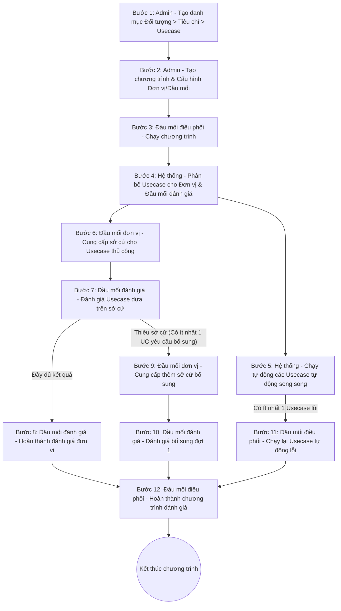

# TÀI LIỆU YÊU CẦU NGHIỆP VỤ (BRD) - CHỨC NĂNG QUẢN LÝ & CHẠY CHƯƠNG TRÌNH ĐÁNH GIÁ

---

## 1. Tổng quan tài liệu
Tài liệu này đặc tả các yêu cầu nghiệp vụ bổ sung cho phân hệ **Quản lý Đánh giá** thuộc hệ thống ISAAP. Tài liệu tập trung làm rõ luồng nghiệp vụ chạy chương trình đánh giá, các tác nhân tham gia, điều kiện thực hiện và danh sách các chức năng dự kiến được phát triển.

## 2. Bối cảnh & Mục tiêu (Hiện trạng & Mong muốn)
*   **Hiện trạng:** Hệ thống đã hỗ trợ các chức năng cơ bản của quản lý đánh giá bao gồm: Tìm kiếm danh sách chương trình đánh giá, Thêm mới chương trình và Sửa thông tin chương trình.
*   **Mong muốn:** Bổ sung các chức năng liên quan đến việc vận hành (chạy) chương trình đánh giá, phân bổ trách nhiệm, thu thập sở cứ, tự động/thủ công hóa việc đánh giá usecase, và tổng kết chương trình đánh giá.

---

## 3. Đối tượng người dùng & Phân quyền dữ liệu

Hệ thống phân chia quyền hạn truy cập và thao tác dữ liệu theo các vai trò cụ thể như sau:

| Vai trò | Mô tả quyền hạn | Phạm vi dữ liệu hiển thị |
| :--- | :--- | :--- |
| **Admin** | Thực hiện đầy đủ tất cả các chức năng trên hệ thống. | Truy cập toàn bộ dữ liệu hệ thống (Full Data). |
| **Đầu mối điều phối** | Có quyền truy cập chức năng quản lý đánh giá, thực hiện các thao tác nghiệp vụ điều phối chương trình. | Chỉ được xem và tương tác dữ liệu của các chương trình do mình làm đầu mối điều phối. |
| **Đầu mối đơn vị** | Có quyền truy cập chức năng quản lý đánh giá, thực hiện thao tác nghiệp vụ nộp sở cứ của đơn vị được phân bổ trong chương trình. | Chỉ được xem dữ liệu các chương trình của mình và chỉ hiển thị thông tin thuộc các đơn vị mình được phân bổ. |
| **Đầu mối đánh giá** | Có quyền truy cập chức năng quản lý đánh giá, thực hiện nghiệp vụ chấm điểm, đánh giá usecase của đơn vị được phân bổ. | Chỉ được xem dữ liệu các chương trình của mình và chỉ hiển thị thông tin thuộc các đơn vị mình được phân bổ đánh giá. |

---

## 4. Luồng nghiệp vụ chạy chương trình đánh giá

### Sơ đồ quy trình phối hợp

### Chi tiết các bước nghiệp vụ

| Bước | Tác nhân thực hiện | Mô tả nghiệp vụ | Bước tiếp theo |
| :---: | :--- | :--- | :---: |
| **1** | Admin (Người tạo) | **Tạo danh mục:** Khai báo các danh mục thông tin có thể có trong chương trình đánh giá theo phân cấp: `Đối tượng` > `Tiêu chí` > `Usecase`. | 2 |
| **2** | Admin | **Tạo chương trình đánh giá:** - Khai báo thông tin chung: Tên, thời gian, Đầu mối điều phối chương trình. - Khai báo phạm vi chương trình:   + *Đơn vị đánh giá:* Các đơn vị được đưa vào diện đánh giá.   + *Đầu mối đánh giá đơn vị:* Người chấm điểm dựa vào sở cứ.   + *Đầu mối đơn vị:* Người chịu trách nhiệm nộp sở cứ. - Cấu hình các `Đối tượng` > `Tiêu chí` > `Usecase` đánh giá chi tiết theo từng đơn vị. | 3 |
| **3** | Đầu mối điều phối | **Chạy chương trình:** Kích hoạt chương trình đánh giá chuyển sang trạng thái hoạt động. | 4 |
| **4** | Hệ thống | **Phân bổ usecase:** Tự động gửi/phân bổ các usecase thủ công & tự động cho Đầu mối đơn vị nộp sở cứ và Đầu mối đánh giá theo dõi. | 6 |
| **5** | Hệ thống | **Tự động chạy các Usecase tự động:** - Chạy tự động các usecase loại auto trong chương trình. - Chạy song song cùng các bước 6, 7, 8, 9, 10 trong toàn bộ thời gian diễn ra chương trình. - Sau khi chạy tất cả các usecase tự động, nếu có ít nhất 1 usecase bị lỗi hệ thống, kích hoạt luồng xử lý ở bước 11. | 11 (nếu lỗi) 12 (nếu hoàn thành) |
| **6** | Đầu mối đơn vị | **Cung cấp sở cứ:** Đính kèm tài liệu, bằng chứng (file hồ sơ) cho các usecase thủ công và gửi yêu cầu đánh giá. | 7 |
| **7** | Đầu mối đánh giá | **Đánh giá usecase thủ công:** Đánh giá dựa theo sở cứ đơn vị đã nộp. Kết quả có thể chọn: - *Đạt:* Nếu usecase đạt chuẩn. - *Không đạt:* Nếu usecase không đạt chuẩn (cần mô tả lý do). - *Yêu cầu nộp sở cứ:* Nếu sở cứ thiếu hoặc không đủ căn cứ để kết luận. | - 8 (nếu tất cả đều có kết quả Đạt/Không đạt) - 9 (nếu có ít nhất 1 UC yêu cầu bổ sung) |
| **8** | Đầu mối đánh giá | **Hoàn thành đánh giá đơn vị:** Thực hiện khi tất cả các usecase thủ công của đơn vị đó đều đã có kết quả cuối cùng (Đạt hoặc Không đạt). | 12 |
| **9** | Đầu mối đơn vị | **Cung cấp thêm sở cứ bổ sung:** Tiến hành đính kèm thêm tài liệu sở cứ mới cho các usecase có trạng thái yêu cầu bổ sung sở cứ. | 10 |
| **10** | Đầu mối đánh giá | **Đánh giá bổ sung (Đợt 1):** Đánh giá lại các usecase có yêu cầu bổ sung dựa trên sở cứ mới cập nhật. Kết quả lần này phải xác định rõ: - *Đạt:* Nếu bổ sung đủ sở cứ đạt chuẩn. - *Không đạt:* Nếu bổ sung sở cứ vẫn không đạt chuẩn (yêu cầu ghi rõ lý do). | 12 |
| **11** | Đầu mối điều phối | **Chạy lại Usecase tự động:** Thực hiện chạy lại các tác vụ tự động bị lỗi trong quá trình hệ thống tự động quét ở Bước 5. | 12 |
| **12** | Đầu mối điều phối | **Hoàn thành chương trình đánh giá:** Kích hoạt kết thúc chương trình khi tất cả các đơn vị và mọi usecase (thủ công + tự động) đã hoàn thành và có kết quả đánh giá cuối cùng. | Kết thúc |

---

## 5. Danh sách các chức năng hệ thống dự kiến

*   **Mã chức năng chung:** `EVALUATION_PROGRAM_MANAGEMENT` (Quản lý chương trình đánh giá)

### 5.1. Bảng ánh xạ Mã Chức năng & Mã Thao tác

| Chức năng chi tiết | Mã chức năng (Function Code) | Mã thao tác (Action Code) | Ý nghĩa nghiệp vụ |
| :--- | :--- | :--- | :--- |
| **Tìm kiếm / Xem danh sách** | `EVALUATION_PROGRAM_MANAGEMENT` | `SEARCH` | Tìm kiếm và hiển thị danh sách chương trình đánh giá. |
| **Thêm mới** | `EVALUATION_PROGRAM_MANAGEMENT` | `CREATE` | Khai báo, thêm mới chương trình đánh giá. |
| **Chỉnh sửa cấu hình** | `EVALUATION_PROGRAM_MANAGEMENT` | `EDIT` | Cập nhật cấu hình chương trình. |
| **Xóa chương trình** | `EVALUATION_PROGRAM_MANAGEMENT` | `DELETE` | Xóa chương trình đánh giá khi chưa chạy. |
| **Xem chi tiết chương trình** | `EVALUATION_PROGRAM_MANAGEMENT` | `VIEW` | Theo dõi tiến trình, kết quả chi tiết của chương trình. |
| **Bắt đầu đánh giá** | `EVALUATION_PROGRAM_MANAGEMENT` | `START` | Kích hoạt chạy chương trình đánh giá. |
| **Hủy đánh giá** | `EVALUATION_PROGRAM_MANAGEMENT` | `CANCEL` | Dừng và hủy bỏ chương trình đang chạy. |
| **Xử lý lỗi hệ thống** | `EVALUATION_PROGRAM_MANAGEMENT` | `RESOLVE_ERROR` | Chạy lại các usecase tự động bị lỗi. |
| **Hoàn thành đánh giá** | `EVALUATION_PROGRAM_MANAGEMENT` | `COMPLETE` | Kết thúc và đóng băng dữ liệu chương trình. |
| **Cung cấp sở cứ (Lần đầu / Bổ sung)** | `EVALUATION_PROGRAM_MANAGEMENT` | `representative` | Đơn vị đính kèm file tài liệu sở cứ. |
| **Đánh giá đơn vị (Đợt 1 / Bổ sung)** | `EVALUATION_PROGRAM_MANAGEMENT` | `REVIEW` | Thao tác chấm đạt/không đạt/yêu cầu bổ sung của Đội đánh giá. |

---

### 5.2. Đặc tả chi tiết các chức năng chạy chương trình

#### 5.2.1. Xem chi tiết chương trình đánh giá
| Thuộc tính | Chi tiết |
| :--- | :--- |
| **Mã thao tác** | `VIEW` |
| **Tác nhân thực hiện** | Admin, Đầu mối điều phối, Đầu mối đơn vị, Đầu mối đánh giá |
| **Điều kiện thực hiện** | Chương trình đã bắt đầu đánh giá (trừ trường hợp chưa bắt đầu chạy) |
| **Hành vi / Nghiệp vụ chi tiết** | Hiển thị màn hình theo dõi và xem kết quả quá trình chạy: - Thông tin tiến độ tổng thể (% hoàn thành) - Bảng trạng thái chi tiết của từng Đơn vị - Chi tiết kết quả từng `Đối tượng` > `Tiêu chí` > `Usecase` của đơn vị |

#### 5.2.2. Xóa chương trình đánh giá
| Thuộc tính | Chi tiết |
| :--- | :--- |
| **Mã thao tác** | `DELETE` |
| **Tác nhân thực hiện** | Admin |
| **Điều kiện thực hiện** | Chương trình ở trạng thái **Chưa đánh giá** (chưa bắt đầu chạy) |
| **Hành vi / Nghiệp vụ chi tiết** | Cho phép xóa vĩnh viễn chương trình đánh giá khỏi hệ thống |

#### 5.2.3. Bắt đầu đánh giá (Chạy chương trình)
| Thuộc tính | Chi tiết |
| :--- | :--- |
| **Mã thao tác** | `START` |
| **Tác nhân thực hiện** | Admin, Đầu mối điều phối |
| **Điều kiện thực hiện** | Chương trình ở trạng thái **Chưa đánh giá** |
| **Hành vi / Nghiệp vụ chi tiết** | - Chuyển trạng thái chương trình thành **Đang đánh giá** - Tự động sinh bản ghi kết quả cho Usecase thủ công (trạng thái chờ nộp sở cứ) - Khởi tạo phiên chạy tự động cho Usecase tự động (Auto) - Gửi thông báo đến Đầu mối đơn vị và Đầu mối đánh giá |

#### 5.2.4. Hoàn thành chương trình đánh giá
| Thuộc tính | Chi tiết |
| :--- | :--- |
| **Mã thao tác** | `COMPLETE` |
| **Tác nhân thực hiện** | Admin, Đầu mối điều phối |
| **Điều kiện thực hiện** | Tất cả Usecase thủ công và tự động của các đơn vị đều đã hoàn thành và có kết quả |
| **Hành vi / Nghiệp vụ chi tiết** | - Cập nhật trạng thái chương trình thành **Đã hoàn thành** (Hoàn thành đánh giá) - Đóng băng toàn bộ dữ liệu của chương trình (khóa các thao tác nộp sở cứ và chấm điểm) |

#### 5.2.5. Hủy đánh giá
| Thuộc tính | Chi tiết |
| :--- | :--- |
| **Mã thao tác** | `CANCEL` |
| **Tác nhân thực hiện** | Admin, Đầu mối điều phối |
| **Điều kiện thực hiện** | Chương trình đang ở trạng thái **Đang đánh giá** |
| **Hành vi / Nghiệp vụ chi tiết** | - Chuyển trạng thái chương trình thành **Đã hủy** - Hủy các tác vụ tự động của UC tự động chưa được chạy - Khóa chức năng nộp sở cứ và đánh giá thủ công của Đầu mối đơn vị và Đầu mối đánh giá |

#### 5.2.6. Xử lý lỗi hệ thống (Chạy lại Usecase tự động)
| Thuộc tính | Chi tiết |
| :--- | :--- |
| **Mã thao tác** | `RESOLVE_ERROR` |
| **Tác nhân thực hiện** | Đầu mối điều phối |
| **Điều kiện thực hiện** | Chương trình đang chạy và có ít nhất 1 usecase tự động gặp lỗi hệ thống |
| **Hành vi / Nghiệp vụ chi tiết** | Kích hoạt lại tiến trình chạy tự động cho các usecase bị lỗi |

#### 5.2.7. Đánh giá đơn vị (Đánh giá lần đầu)
| Thuộc tính | Chi tiết |
| :--- | :--- |
| **Mã thao tác** | `REVIEW` |
| **Tác nhân thực hiện** | Admin, Đầu mối đánh giá |
| **Điều kiện thực hiện** | Đơn vị thuộc phạm vi chương trình được phân bổ có trạng thái đánh giá thủ công là **Chờ đánh giá** |
| **Hành vi / Nghiệp vụ chi tiết** | - Hiển thị danh sách đơn vị và chi tiết usecase thủ công chờ đánh giá - Đánh giá từng usecase dựa vào sở cứ đã nộp:   + **Đạt:** Trạng thái hoàn thành.   + **Không đạt:** Trạng thái hoàn thành (bắt buộc nhập mô tả lý do).   + **Yêu cầu bổ sung sở cứ:** Chưa có kết quả (bắt buộc nhập mô tả lý do yêu cầu bổ sung). |

#### 5.2.8. Cung cấp sở cứ (Lần đầu)
| Thuộc tính | Chi tiết |
| :--- | :--- |
| **Mã thao tác** | `representative` |
| **Tác nhân thực hiện** | Admin, Đầu mối đơn vị |
| **Điều kiện thực hiện** | Chương trình đang chạy (Đang đánh giá), đơn vị có usecase thủ công chưa bổ sung sở cứ |
| **Hành vi / Nghiệp vụ chi tiết** | - Cung cấp sở cứ cho từng usecase chưa bổ sung sở cứ - **Ràng buộc:** Mỗi usecase bắt buộc đính kèm tối thiểu **1 sở cứ** - **Định dạng:** `.xlsx`, `.doc`, `.pdf` (hỗ trợ tải nhiều file cho 1 usecase) |

#### 5.2.9. Cung cấp sở cứ bổ sung
| Thuộc tính | Chi tiết |
| :--- | :--- |
| **Mã thao tác** | `representative` |
| **Tác nhân thực hiện** | Admin, Đầu mối đơn vị |
| **Điều kiện thực hiện** | Chương trình đang chạy (Đang đánh giá), đơn vị có usecase thủ công ở trạng thái **Yêu cầu bổ sung sở cứ** |
| **Hành vi / Nghiệp vụ chi tiết** | - Đính kèm thêm sở cứ mới cho từng usecase có yêu cầu bổ sung - **Ràng buộc:** Bắt buộc tải lên tối thiểu **1 sở cứ mới** - **Định dạng:** `.xlsx`, `.doc`, `.pdf` (hỗ trợ tải thêm nhiều file) |

#### 5.2.10. Đánh giá bổ sung
| Thuộc tính | Chi tiết |
| :--- | :--- |
| **Mã thao tác** | `REVIEW` |
| **Tác nhân thực hiện** | Admin, Đầu mối đánh giá |
| **Điều kiện thực hiện** | Đơn vị thuộc phạm vi phân bổ có trạng thái đánh giá thủ công là **Chờ đánh giá bổ sung** |
| **Hành vi / Nghiệp vụ chi tiết** | - Hiển thị danh sách đơn vị, chi tiết đánh giá các usecase thủ công có trạng thái **Yêu cầu bổ sung** để đánh giá lại (chỉ hiển thị các usecase chờ đánh giá bổ sung) - Xác định kết quả cuối cùng:   + **Đạt:** Bổ sung đủ sở cứ đạt chuẩn.   + **Không đạt:** Bổ sung sở cứ không đạt chuẩn (bắt buộc mô tả lý do). |
