# THIẾT KẾ CƠ SỞ DỮ LIỆU (CSDL) - PHÂN HỆ QUẢN LÝ & CHẠY CHƯƠNG TRÌNH ĐÁNH GIÁ

---

## Danh sách các bảng dữ liệu (Table Directory)

Dưới đây là danh sách toàn bộ các bảng trong hệ thống CSDL của phân hệ đánh giá. Các bảng/trường được thêm mới hoặc bổ sung thuộc đợt này được đánh dấu cờ hiệu để dễ nhận biết.

| STT | Tên bảng (Table Name) | Phân loại trạng thái | Ghi chú / Ý nghĩa nghiệp vụ |
| :---: | :--- | :--- | :--- |
| 1 | `user` | Hiện trạng | Người dùng hệ thống |
| 2 | `department` | Hiện trạng | Danh mục đơn vị / phòng ban |
| 3 | `evaluation_program` | Hiện trạng | Chương trình đánh giá chung |
| 4 | `program_department` | Hiện trạng | Bảng liên kết chương trình và đơn vị |
| 5 | `program_department_mapping` | 🚩 **[CÓ TRƯỜNG MỚI]** | Ánh xạ chi tiết chương trình - đơn vị (bổ sung trạng thái chạy tự động/thủ công, reviewer, representative) |
| 6 | `department_representative_mapping` | Hiện trạng | Người đại diện nộp sở cứ của đơn vị |
| 7 | `department_reviewer_mapping` | Hiện trạng | Người đánh giá (reviewer) được phân bổ cho đơn vị |
| 8 | `department_object_mapping` | Hiện trạng | Ánh xạ đối tượng đánh giá theo từng đơn vị |
| 9 | `evaluation_object` | Hiện trạng | Danh mục đối tượng đánh giá |
| 10 | `evaluation_criteria` | Hiện trạng | Danh mục tiêu chí đánh giá |
| 11 | `criteria_object_mapping` | Hiện trạng | Ánh xạ liên kết Tiêu chí - Đối tượng |
| 12 | `object_criteria_mapping` | Hiện trạng | Ánh xạ liên kết Đối tượng - Tiêu chí theo đơn vị |
| 13 | `rule` | Hiện trạng | Danh mục Luật (Usecase) đánh giá |
| 14 | `rule_version` | Hiện trạng | Phiên bản của Luật (Usecase) |
| 15 | `criteria_usecase_mapping` | Hiện trạng | Liên kết cấu hình Tiêu chí - Usecase |
| 16 | `usecase_manual_review_mapping` | 🚩 **[BẢNG THÊM MỚI]** | Kết quả đánh giá chi tiết các Usecase thủ công |
| 17 | `usecase_review_file` | 🚩 **[BẢNG THÊM MỚI]** | Quản lý tập tin minh chứng/sở cứ tải lên của Usecase |
| 18 | `rule_run` | 🚩 **[CÓ TRƯỜNG MỚI]** | Phiên chạy Usecase tự động (bổ sung kết quả và phiên chạy tương ứng) |
| 19 | `role` | Hiện trạng | Danh mục vai trò (phân quyền) |
| 20 | `features` | Hiện trạng | Danh mục các chức năng của hệ thống |
| 21 | `action` | Hiện trạng | Danh mục các thao tác (quyền truy cập) |
| 22 | `action_feature` | Hiện trạng | Ánh xạ Thao tác thuộc Chức năng |
| 23 | `role_permission` | Hiện trạng | Phân quyền thao tác chi tiết cho Vai trò |

---

## 1. Sơ đồ Quan hệ Thực thể (ERD)

Dưới đây là sơ đồ ERD mô tả các thực thể dữ liệu trong hệ thống ISAAP liên quan đến phân hệ Quản lý & Chạy chương trình đánh giá.

```mermaid
erDiagram
   user {
       int id PK
       varchar email UK
       int2 blocked
       text meta_data
       timestamp created_at
       timestamp updated_at
       int4 updated_by
       int8 dept_id FK
       text role_id
       int4 created_by
   }
   department {
       int8 id PK
       varchar code
       varchar name
       int4 parent_id
       int2 has_employee
       int2 org_level
       int4 org_order
       varchar english_name
       bpchar effective_start_date
       bpchar effective_end_date
       bpchar modified_time
       int2 status
       varchar path
       varchar org_code_path
       int2 org_level_manage
       varchar generate_org_order
       timestamp updated_at
   }
   evaluation_program {
       int id PK
       varchar name
       varchar description
       timestamp start_date
       timestamp end_date
       int2 status
       int4 program_auditor
       int4 evaluation_round
       text round_2_reason
       timestamp completed_at
       text cancel_reason
       int4 created_by
       timestamp created_at
       int4 updated_by
       timestamp updated_at
       timestamp canceled_at
       timestamp started_at
       int4 dept_id
   }
   program_department {
       int4 program_id PK,FK
       int4 department_id PK,FK
   }
   program_department_mapping {
       int id PK
       int4 program_id FK
       int4 dept_id FK
       int2 manual_review_status
       int2 auto_review_status
       int4 reviewer FK
       int4 sender FK
       timestamp manual_review_submitted_at
       int2 evaluation_result
       timestamp evaluated_at
       timestamp created_at
       int4 created_by
       timestamp updated_at
       int4 updated_by
   }
   department_representative_mapping {
       int id PK
       int4 program_department_id FK
       int4 representative_id FK
       timestamp created_at
       int4 created_by
   }
   department_reviewer_mapping {
       int id PK
       int4 program_department_id FK
       int4 reviewer_id FK
       timestamp created_at
       int4 created_by
   }
   department_object_mapping {
       int id PK
       int4 program_department_id FK
       int4 evaluation_object_id FK
       timestamp created_at
       int4 created_by
       timestamp updated_at
       int4 updated_by
   }
   evaluation_object {
       int id PK
       varchar name
       int4 created_by
       int4 updated_by
       timestamp created_at
       timestamp updated_at
       varchar description
   }
   evaluation_criteria {
       int id PK
       varchar name
       varchar description
       int2 status
       timestamp created_at
       timestamp updated_at
       int4 created_by
       int4 updated_by
       jsonb criteria_tag
   }
   criteria_object_mapping {
       int id PK
       int4 criteria_id FK
       int4 evaluation_object_id FK
   }
   object_criteria_mapping {
       int id PK
       int4 department_object_id FK
       int4 evaluation_criteria_id FK
       timestamp created_at
       int4 created_by
       timestamp updated_at
       int4 updated_by
   }
   rule {
       int id PK
       varchar name
       varchar description
       timestamp created_at
       timestamp updated_at
       int4 created_by
       int4 updated_by
       varchar cycle_type
       int4 dept_id
       text evaluation_guideline
       text scoring_guideline
       int2 status
       varchar type
       jsonb usecase_tag
       varchar code UK
   }
   rule_version {
       int id PK
       int4 rule_id FK
       int2 version
       timestamp created_at
       int4 created_by
       varchar description
       timestamp updated_at
       int4 updated_by
   }
   criteria_usecase_mapping {
       int id PK
       int4 object_criteria_id FK
       int4 usecase_id FK
       int4 rule_version_id FK
       jsonb criteria_tag
       int4 result_step_id
       jsonb result_field
       int4 detail_step_id
       timestamp created_at
       int4 created_by
       timestamp updated_at
       int4 updated_by
       jsonb detail_field
   }
   usecase_manual_review_mapping {
       int id PK
       int4 criteria_usecase_id FK
       int2 result
       int2 status
       varchar reason_fail
       varchar request_content
       varchar respond_content
       timestamp evaluated_at
       int4 created_by FK
       timestamp created_at
       int4 updated_by FK
       timestamp updated_at
       int4 version_program
       jsonb draft_content
   }
   usecase_review_file {
       int id PK
       int4 usecase_review_id FK
       varchar name
       text path
       int8 size
       int4 created_by FK
       timestamp created_at
       int2 round
       int2 draft_status
   }
   rule_run {
       int id PK
       varchar description
       int2 status
       text error
       timestamp created_at
       timestamp updated_at
       int4 created_by
       date cycle_value
       timestamp start_date
       timestamp end_date
       int4 rule_version_id
       varchar run_type
       int4 updated_by
       int4 rule_schedule_id
       varchar run_mode
       text cron_snapshot
       jsonb cron_field
       varchar run_key
       varchar worker_id
       int4 rerun_run_id
       timestamp scheduled_for
       int4 criteria_usecase_id FK
       int4 version_program
       int2 result
   }
   role {
       int id PK
       varchar code
       varchar description
       int2 status
       timestamp created_at
       timestamp updated_at
       int4 updated_by
       int4 created_by
   }
   features {
       int id PK
       varchar code
       varchar name
       varchar description
       int2 status
       timestamp created_at
       timestamp updated_at
       int4 created_by
       int4 updated_by
   }
   action {
       int id PK
       varchar code
       varchar name
   }
   action_feature {
       int id PK
       int4 feature_id FK
       int4 action_id FK
       varchar display_name
   }
   role_permission {
       int id PK
       int4 role_id FK
       int4 action_feature_id FK
       timestamp created_at
       int4 created_by
   }

   user }|--|| department : "belongs_to"
   user }|--|| role : "has_role"
   program_department }|--|| evaluation_program : "contains"
   program_department }|--|| department : "contains"
   program_department_mapping }|--|| evaluation_program : "maps"
   program_department_mapping }|--|| department : "maps"
   program_department_mapping ||--o{ department_representative_mapping : "has_representatives"
   program_department_mapping ||--o{ department_reviewer_mapping : "has_reviewers"
   program_department_mapping ||--o{ department_object_mapping : "has_objects"
   department_representative_mapping }|--|| user : "assigned_to"
   department_reviewer_mapping }|--|| user : "assigned_to"
   department_object_mapping }|--|| evaluation_object : "maps_to"
   criteria_object_mapping }|--|| evaluation_criteria : "maps"
   criteria_object_mapping }|--|| evaluation_object : "maps"
   object_criteria_mapping }|--|| department_object_mapping : "maps"
   object_criteria_mapping }|--|| evaluation_criteria : "maps"
   rule_version }|--|| rule : "version_of"
   criteria_usecase_mapping }|--|| object_criteria_mapping : "maps"
   criteria_usecase_mapping }|--|| rule : "maps_to_usecase"
   criteria_usecase_mapping }|--|| rule_version : "maps_to_version"
   usecase_manual_review_mapping }|--|| criteria_usecase_mapping : "evaluates"
   usecase_manual_review_mapping }|--|| user : "created/updated_by"
   usecase_review_file }|--|| usecase_manual_review_mapping : "attaches_to"
   usecase_review_file }|--|| user : "uploaded_by"
   rule_run }|--|| criteria_usecase_mapping : "executes"
   role_permission }|--|| role : "belongs_to"
   role_permission }|--|| action_feature : "maps"
   action_feature }|--|| features : "contains"
   action_feature }|--|| action : "contains"
```

---

## 2. Đặc tả chi tiết các bảng dữ liệu hiện trạng (Existing Tables)

### 2.1. Bảng `user`
*Mô tả: Lưu trữ thông tin người dùng hệ thống.*

| STT | Tên trường | Kiểu dữ liệu | Mô tả chi tiết |
| :---: | :--- | :--- | :--- |
| 1 | **id** | INT (PK) | Mã định danh người dùng |
| 2 | **email** | VARCHAR (UK) | Email đăng nhập hệ thống (Duy nhất) |
| 3 | **blocked** | INT2 | Trạng thái khóa tài khoản (0: Hoạt động, 1: Bị khóa) |
| 4 | **meta_data** | TEXT | Dữ liệu cấu hình mở rộng dạng Text |
| 5 | **created_at** | TIMESTAMP | Thời gian tạo tài khoản |
| 6 | **updated_at** | TIMESTAMP | Thời gian cập nhật tài khoản |
| 7 | **updated_by** | INT4 | ID người cập nhật cuối cùng |
| 8 | **dept_id** | INT8 (FK) | Mã đơn vị trực thuộc (Khóa ngoại sang `department.id`) |
| 9 | **role_id** | TEXT | Danh sách mã vai trò (Role) của người dùng |
| 10 | **created_by** | INT4 | ID người tạo tài khoản |

### 2.2. Bảng `department`
*Mô tả: Lưu trữ thông tin danh mục đơn vị/phòng ban.*

| STT | Tên trường | Kiểu dữ liệu | Mô tả chi tiết |
| :---: | :--- | :--- | :--- |
| 1 | **id** | INT8 (PK) | Mã định danh phòng ban/đơn vị |
| 2 | **code** | VARCHAR | Mã đơn vị |
| 3 | **name** | VARCHAR | Tên đơn vị |
| 4 | **parent_id** | INT4 | ID của đơn vị cấp cha |
| 5 | **has_employee** | INT2 | Có nhân viên trực thuộc hay không |
| 6 | **org_level** | INT2 | Cấp bậc trong mô hình tổ chức |
| 7 | **org_order** | INT4 | Thứ tự sắp xếp đơn vị |
| 8 | **english_name** | VARCHAR | Tên đơn vị bằng Tiếng Anh |
| 9 | **effective_start_date** | BPCHAR | Ngày bắt đầu có hiệu lực |
| 10 | **effective_end_date** | BPCHAR | Ngày hết hiệu lực |
| 11 | **modified_time** | BPCHAR | Thời gian chỉnh sửa đồng bộ |
| 12 | **status** | INT2 | Trạng thái hoạt động |
| 13 | **path** | VARCHAR | Đường dẫn phả hệ đơn vị dạng chuỗi (id) |
| 14 | **org_code_path** | VARCHAR | Đường dẫn phả hệ đơn vị dạng chuỗi (mã code) |
| 15 | **org_level_manage** | INT2 | Cấp bậc đơn vị quản lý |
| 16 | **generate_org_order** | VARCHAR | Chuỗi tự động sắp xếp thứ tự tổ chức |
| 17 | **updated_at** | TIMESTAMP | Thời gian cập nhật thông tin |

### 2.3. Bảng `evaluation_program`
*Mô tả: Lưu trữ thông tin chi tiết chương trình đánh giá.*

| STT | Tên trường | Kiểu dữ liệu | Mô tả chi tiết |
| :---: | :--- | :--- | :--- |
| 1 | **id** | INT (PK) | Mã định danh chương trình |
| 2 | **name** | VARCHAR | Tên chương trình đánh giá |
| 3 | **description** | VARCHAR | Mô tả chi tiết chương trình |
| 4 | **start_date** | TIMESTAMP | Ngày bắt đầu chương trình |
| 5 | **end_date** | TIMESTAMP | Ngày kết thúc dự kiến chương trình |
| 6 | **status** | INT2 | Trạng thái chương trình đánh giá: - `0`: Chưa đánh giá - `1`: Đang đánh giá - `2`: Hoàn thành - `3`: Hủy áp dụng - `4`: Chờ hoàn thành |
| 7 | **program_auditor** | INT4 | ID Kiểm toán viên / Điều phối viên chính của chương trình |
| 8 | **evaluation_round** | INT4 | Vòng đánh giá chương trình (Round) |
| 9 | **round_2_reason** | TEXT | Lý do phải chuyển sang đánh giá vòng 2 |
| 10 | **completed_at** | TIMESTAMP | Thời gian thực tế hoàn thành chương trình |
| 11 | **cancel_reason** | TEXT | Lý do hủy chương trình |
| 12 | **created_by** | INT4 | ID người tạo chương trình |
| 13 | **created_at** | TIMESTAMP | Thời gian tạo chương trình |
| 14 | **updated_by** | INT4 | ID người cập nhật chương trình |
| 15 | **updated_at** | TIMESTAMP | Thời gian cập nhật chương trình |
| 16 | **canceled_at** | TIMESTAMP | Thời gian hủy chương trình |
| 17 | **started_at** | TIMESTAMP | Thời gian thực tế bắt đầu chạy đánh giá |
| 18 | **dept_id** | INT4 | ID Đơn vị đầu mối quản lý chương trình |

### 2.4. Bảng `program_department`
*Mô tả: Bảng quan hệ liên kết Đơn vị tham gia trong Chương trình.*

| STT | Tên trường | Kiểu dữ liệu | Mô tả chi tiết |
| :---: | :--- | :--- | :--- |
| 1 | **program_id** | INT4 (PK, FK) | ID chương trình (Khóa ngoại sang `evaluation_program.id`) |
| 2 | **department_id**| INT4 (PK, FK) | ID đơn vị tham gia (Khóa ngoại sang `department.id`) |

### 2.5. Bảng `department_representative_mapping`
*Mô tả: Ánh xạ chỉ định Đầu mối nộp sở cứ của đơn vị trong phạm vi chương trình.*

| STT | Tên trường | Kiểu dữ liệu | Mô tả chi tiết |
| :---: | :--- | :--- | :--- |
| 1 | **id** | INT (PK) | Mã định danh bản ghi |
| 2 | **program_department_id** | INT4 (FK) | Liên kết sang bảng mapping chương trình - đơn vị |
| 3 | **representative_id** | INT4 (FK) | ID của người dùng làm đầu mối đơn vị (Khóa ngoại sang `user.id`) |
| 4 | **created_at** | TIMESTAMP | Thời gian gán vai trò |
| 5 | **created_by** | INT4 | ID người phân bổ gán vai trò |

### 2.6. Bảng `department_reviewer_mapping`
*Mô tả: Ánh xạ chỉ định Đầu mối đánh giá đơn vị trong phạm vi chương trình.*

| STT | Tên trường | Kiểu dữ liệu | Mô tả chi tiết |
| :---: | :--- | :--- | :--- |
| 1 | **id** | INT (PK) | Mã định danh bản ghi |
| 2 | **program_department_id** | INT4 (FK) | Liên kết sang bảng mapping chương trình - đơn vị |
| 3 | **reviewer_id** | INT4 (FK) | ID của người dùng làm đầu mối đánh giá (Khóa ngoại sang `user.id`) |
| 4 | **created_at** | TIMESTAMP | Thời gian gán vai trò |
| 5 | **created_by** | INT4 | ID người phân bổ gán vai trò |

### 2.7. Bảng `department_object_mapping`
*Mô tả: Danh sách các đối tượng đánh giá được áp dụng cho từng đơn vị trong chương trình.*

| STT | Tên trường | Kiểu dữ liệu | Mô tả chi tiết |
| :---: | :--- | :--- | :--- |
| 1 | **id** | INT (PK) | Mã định danh bản ghi |
| 2 | **program_department_id** | INT4 (FK) | Liên kết đến bảng chương trình - đơn vị |
| 3 | **evaluation_object_id** | INT4 (FK) | ID đối tượng đánh giá (Khóa ngoại sang `evaluation_object.id`) |
| 4 | **created_at** | TIMESTAMP | Thời gian gán đối tượng |
| 5 | **created_by** | INT4 | ID người gán |
| 6 | **updated_at** | TIMESTAMP | Thời gian cập nhật |
| 7 | **updated_by** | INT4 | ID người cập nhật |

### 2.8. Bảng `evaluation_object`
*Mô tả: Danh mục các Đối tượng đánh giá.*

| STT | Tên trường | Kiểu dữ liệu | Mô tả chi tiết |
| :---: | :--- | :--- | :--- |
| 1 | **id** | INT (PK) | Mã định danh đối tượng đánh giá |
| 2 | **name** | VARCHAR | Tên đối tượng đánh giá |
| 3 | **description** | VARCHAR | Mô tả chi tiết đối tượng |
| 4 | **created_by** | INT4 | ID người tạo đối tượng |
| 5 | **created_at** | TIMESTAMP | Thời gian tạo đối tượng |
| 6 | **updated_by** | INT4 | ID người cập nhật đối tượng |
| 7 | **updated_at** | TIMESTAMP | Thời gian cập nhật đối tượng |

### 2.9. Bảng `evaluation_criteria`
*Mô tả: Danh mục các Tiêu chí đánh giá.*

| STT | Tên trường | Kiểu dữ liệu | Mô tả chi tiết |
| :---: | :--- | :--- | :--- |
| 1 | **id** | INT (PK) | Mã định danh tiêu chí |
| 2 | **name** | VARCHAR | Tên tiêu chí đánh giá |
| 3 | **description** | VARCHAR | Mô tả chi tiết tiêu chí |
| 4 | **status** | INT2 | Trạng thái hoạt động (0: Không hoạt động, 1: Hoạt động) |
| 5 | **created_by** | INT4 | ID người tạo |
| 6 | **created_at** | TIMESTAMP | Thời gian tạo |
| 7 | **updated_by** | INT4 | ID người cập nhật |
| 8 | **updated_at** | TIMESTAMP | Thời gian cập nhật |
| 9 | **criteria_tag** | JSONB | Các thẻ tag đi kèm tiêu chí để phân loại |

### 2.10. Bảng `criteria_object_mapping`
*Mô tả: Bảng quan hệ gán Tiêu chí cho từng Đối tượng đánh giá.*

| STT | Tên trường | Kiểu dữ liệu | Mô tả chi tiết |
| :---: | :--- | :--- | :--- |
| 1 | **id** | INT (PK) | Mã định danh bản ghi |
| 2 | **criteria_id** | INT4 (FK) | ID tiêu chí (Khóa ngoại sang `evaluation_criteria.id`) |
| 3 | **evaluation_object_id**| INT4 (FK) | ID đối tượng (Khóa ngoại sang `evaluation_object.id`) |

### 2.11. Bảng `object_criteria_mapping`
*Mô tả: Ánh xạ liên kết cấu hình Đối tượng - Tiêu chí theo từng đơn vị cụ thể.*

| STT | Tên trường | Kiểu dữ liệu | Mô tả chi tiết |
| :---: | :--- | :--- | :--- |
| 1 | **id** | INT (PK) | Mã định danh bản ghi |
| 2 | **department_object_id** | INT4 (FK) | Liên kết sang bảng `department_object_mapping.id` |
| 3 | **evaluation_criteria_id**| INT4 (FK) | ID tiêu chí (Khóa ngoại sang `evaluation_criteria.id`) |
| 4 | **created_at** | TIMESTAMP | Thời gian tạo |
| 5 | **created_by** | INT4 | ID người tạo |
| 6 | **updated_at** | TIMESTAMP | Thời gian cập nhật |
| 7 | **updated_by** | INT4 | ID người cập nhật |

### 2.12. Bảng `rule`
*Mô tả: Danh mục định nghĩa các Luật/Usecase dùng để kiểm tra và đánh giá.*

| STT | Tên trường | Kiểu dữ liệu | Mô tả chi tiết |
| :---: | :--- | :--- | :--- |
| 1 | **id** | INT (PK) | Mã định danh Luật / Usecase |
| 2 | **code** | VARCHAR (UK) | Mã code của Usecase (Duy nhất) |
| 3 | **name** | VARCHAR | Tên Luật / Usecase |
| 4 | **description** | VARCHAR | Mô tả chi tiết chức năng luật |
| 5 | **cycle_type** | VARCHAR | Chu kỳ chạy (Hàng ngày, Hàng tuần, Hàng tháng...) |
| 6 | **dept_id** | INT4 | ID đơn vị quản lý luật |
| 7 | **evaluation_guideline**| TEXT | Hướng dẫn đánh giá kiểm tra luật |
| 8 | **scoring_guideline**| TEXT | Hướng dẫn cách thức chấm điểm đạt/không đạt |
| 9 | **status** | INT2 | Trạng thái hoạt động của luật |
| 10 | **type** | VARCHAR | Phân loại luật (Thủ công - Manual / Tự động - Auto) |
| 11 | **usecase_tag** | JSONB | Các thẻ tag đi kèm phân loại usecase |
| 12 | **created_by** | INT4 | ID người tạo |
| 13 | **created_at** | TIMESTAMP | Thời gian tạo |
| 14 | **updated_by** | INT4 | ID người cập nhật |
| 15 | **updated_at** | TIMESTAMP | Thời gian cập nhật |

### 2.13. Bảng `rule_version`
*Mô tả: Quản lý các phiên bản cấu hình của từng Luật/Usecase.*

| STT | Tên trường | Kiểu dữ liệu | Mô tả chi tiết |
| :---: | :--- | :--- | :--- |
| 1 | **id** | INT (PK) | ID định danh phiên bản |
| 2 | **rule_id** | INT4 (FK) | ID của Luật (Khóa ngoại sang `rule.id`) |
| 3 | **version** | INT2 | Số hiệu phiên bản (v1, v2, v3...) |
| 4 | **description** | VARCHAR | Mô tả các thay đổi trong phiên bản này |
| 5 | **created_by** | INT4 | ID người tạo phiên bản |
| 6 | **created_at** | TIMESTAMP | Thời gian tạo phiên bản |
| 7 | **updated_by** | INT4 | ID người cập nhật phiên bản |
| 8 | **updated_at** | TIMESTAMP | Thời gian cập nhật phiên bản |

### 2.14. Bảng `criteria_usecase_mapping`
*Mô tả: Liên kết các Usecase và Phiên bản luật tương ứng vào cấu hình Đối tượng - Tiêu chí của Đơn vị.*

| STT | Tên trường | Kiểu dữ liệu | Mô tả chi tiết |
| :---: | :--- | :--- | :--- |
| 1 | **id** | INT (PK) | Mã định danh bản ghi |
| 2 | **object_criteria_id** | INT4 (FK) | Khóa ngoại sang `object_criteria_mapping.id` |
| 3 | **usecase_id** | INT4 (FK) | Khóa ngoại sang `rule.id` |
| 4 | **rule_version_id** | INT4 (FK) | Khóa ngoại phiên bản luật hoạt động sang `rule_version.id` |
| 5 | **criteria_tag** | JSONB | Các cấu hình tag tiêu chí áp dụng cho usecase |
| 6 | **result_step_id** | INT4 | ID bước kết quả của usecase tự động |
| 7 | **result_field** | JSONB | Cấu hình các trường dữ liệu kết quả hiển thị |
| 8 | **detail_step_id** | INT4 | ID bước hiển thị chi tiết |
| 9 | **detail_field** | JSONB | Cấu hình các trường dữ liệu chi tiết |
| 10 | **created_by** | INT4 | ID người cấu hình |
| 11 | **created_at** | TIMESTAMP | Thời gian tạo cấu hình |
| 12 | **updated_by** | INT4 | ID người cập nhật cấu hình |
| 13 | **updated_at** | TIMESTAMP | Thời gian cập nhật cấu hình |

### 2.15. Bảng `role`
*Mô tả: Danh mục Vai trò phân quyền trong hệ thống.*

| STT | Tên trường | Kiểu dữ liệu | Mô tả chi tiết |
| :---: | :--- | :--- | :--- |
| 1 | **id** | INT (PK) | ID vai trò |
| 2 | **code** | VARCHAR | Mã vai trò (Ví dụ: `ADMIN`, `AUDITOR`...) |
| 3 | **description** | VARCHAR | Mô tả vai trò |
| 4 | **status** | INT2 | Trạng thái hoạt động (0: Khóa, 1: Hoạt động) |
| 5 | **created_by** | INT4 | ID người tạo |
| 6 | **created_at** | TIMESTAMP | Thời gian tạo |
| 7 | **updated_by** | INT4 | ID người cập nhật |
| 8 | **updated_at** | TIMESTAMP | Thời gian cập nhật |

### 2.16. Bảng `features`
*Mô tả: Danh sách các Chức năng lớn trong ứng dụng.*

| STT | Tên trường | Kiểu dữ liệu | Mô tả chi tiết |
| :---: | :--- | :--- | :--- |
| 1 | **id** | INT (PK) | ID chức năng |
| 2 | **code** | VARCHAR | Mã chức năng (Ví dụ: `EVALUATION_PROGRAM_MANAGEMENT`) |
| 3 | **name** | VARCHAR | Tên chức năng hiển thị |
| 4 | **description** | VARCHAR | Mô tả vai trò chức năng |
| 5 | **status** | INT2 | Trạng thái hoạt động |
| 6 | **created_by** | INT4 | ID người tạo |
| 7 | **created_at** | TIMESTAMP | Thời gian tạo |
| 8 | **updated_by** | INT4 | ID người cập nhật |
| 9 | **updated_at** | TIMESTAMP | Thời gian cập nhật |

### 2.17. Bảng `action`
*Mô tả: Danh mục Thao tác quyền hạn.*

| STT | Tên trường | Kiểu dữ liệu | Mô tả chi tiết |
| :---: | :--- | :--- | :--- |
| 1 | **id** | INT (PK) | ID thao tác |
| 2 | **code** | VARCHAR | Mã thao tác (Ví dụ: `SEARCH`, `CREATE`, `VIEW`...) |
| 3 | **name** | VARCHAR | Tên thao tác |

### 2.18. Bảng `action_feature`
*Mô tả: Định nghĩa các thao tác được phép trên từng chức năng cụ thể.*

| STT | Tên trường | Kiểu dữ liệu | Mô tả chi tiết |
| :---: | :--- | :--- | :--- |
| 1 | **id** | INT (PK) | ID bản ghi liên kết |
| 2 | **feature_id** | INT4 (FK) | Liên kết sang bảng chức năng `features.id` |
| 3 | **action_id** | INT4 (FK) | Liên kết sang bảng thao tác `action.id` |
| 4 | **display_name** | VARCHAR | Tên hiển thị quyền trên màn hình quản lý phân quyền |

### 2.19. Bảng `role_permission`
*Mô tả: Bảng phân quyền chi tiết cho từng Vai trò.*

| STT | Tên trường | Kiểu dữ liệu | Mô tả chi tiết |
| :---: | :--- | :--- | :--- |
| 1 | **id** | INT (PK) | ID bản ghi phân quyền |
| 2 | **role_id** | INT4 (FK) | Liên kết đến bảng Vai trò `role.id` |
| 3 | **action_feature_id**| INT4 (FK) | Liên kết đến bảng cấu hình thao tác chức năng `action_feature.id` |
| 4 | **created_by** | INT4 | ID người phân bổ |
| 5 | **created_at** | TIMESTAMP | Thời gian phân bổ quyền |

---

## 3. Đặc tả chi tiết các bảng dữ liệu bổ sung / cập nhật mới (New & Modified Tables)

### 3.1. Bảng `usecase_manual_review_mapping` 🚩 [BẢNG THÊM MỚI]
*Mô tả: Lưu trữ kết quả đánh giá các usecase thủ công của đơn vị khi chạy chương trình đánh giá.*

| STT | Tên trường | Kiểu dữ liệu | Mô tả chi tiết |
| :---: | :--- | :--- | :--- |
| 1 | **id** | INT (PK) | Mã định danh task UC khi chạy chương trình |
| 2 | **criteria_usecase_id** | INT (FK) | Liên kết sang bảng `criteria_usecase_mapping(id)` |
| 3 | **result** | INT | Kết quả đánh giá: - `0`: Không đạt - `1`: Đạt - `null`: Khởi tạo |
| 4 | **status** | INT | Trạng thái UC thủ công: - `0`: Chưa nộp sở cứ (Khởi tạo) - `1`: Chờ đánh giá - `2`: Hoàn thành - `3`: Yêu cầu bổ sung - `4`: Chờ đánh giá bổ sung |
| 5 | **reason_fail** | NVARCHAR(250) | Lý do không đạt |
| 6 | **request_content** | NVARCHAR(250) | Yêu cầu bổ sung sở cứ từ kiểm toán viên |
| 7 | **respond_content** | NVARCHAR(250) | Mô tả chi tiết của đơn vị khi nộp sở cứ bổ sung |
| 8 | **evaluated_at** | DATETIME | Thời gian chuyên gia thực hiện chấm điểm |
| 9 | **created_by** | INT (FK) | Người tạo bản ghi (Liên kết sang bảng `user(id)`) |
| 10 | **created_at** | DATETIME | Thời gian tạo bản ghi |
| 11 | **updated_by** | INT (FK) | Người cập nhật cuối cùng (Liên kết sang bảng `user(id)`) |
| 12 | **updated_at** | DATETIME | Thời gian cập nhật trạng thái cuối cùng |
| 13 | **version_program** | INT | Lần chạy chương trình đánh giá, tương ứng với `evaluation_program.evaluation_round`: - `1`: Lần 1 - `2`: Lần 2 |
| 14 | **draft_content** | JSONB | Lưu thông tin lưu nháp của Usecase khi người dùng lưu nháp: `{ "reason_fail": "", "request_content": "", "respond_content": "", "result": "" }` |

---

### 3.2. Bảng `usecase_review_file` 🚩 [BẢNG THÊM MỚI]
*Mô tả: Quản lý tập tin minh chứng đi kèm cho các phiên đánh giá, hỗ trợ quan hệ một-nhiều. Mỗi file tương ứng với một bản ghi.*

| STT | Tên trường | Kiểu dữ liệu | Mô tả chi tiết |
| :---: | :--- | :--- | :--- |
| 1 | **id** | INT (PK) | id định danh file sở cứ |
| 2 | **usecase_review_id** | INT (FK) | Liên kết sang bảng `usecase_manual_review_mapping(id)` |
| 3 | **name** | VARCHAR(255) | Tên hiển thị của file khi upload lên |
| 4 | **path** | TEXT | Đường dẫn vật lý của file lưu trên server |
| 5 | **size** | INT8 | Dung lượng file (Bytes) |
| 6 | **created_by** | INT (FK) | id người upload (Liên kết sang bảng `user(id)`) |
| 7 | **created_at** | DATETIME | Thời gian upload file lên hệ thống |
| 8 | **round** | INT | Lần nộp sở cứ tương ứng: - `1`: Lần 1 - `2`: Lần 2 (khi bổ sung) |
| 9 | **draft_status** | INT | Trạng thái bản nháp của file: - `0`: Không nháp (Chính thức) - `1`: Nháp |

---

### 3.3. Bảng `rule_run` 🚩 [CÓ TRƯỜNG BỔ SUNG MỚI]
*Mô tả: Lưu các phiên chạy của usecase tự động khi chạy chương trình đánh giá, tận dụng làm kết quả đánh giá cho các UC tự động.*

| STT | Tên trường | Kiểu dữ liệu | Mô tả chi tiết |
| :---: | :--- | :--- | :--- |
| 1 | **id** | INT (PK) | ID phiên chạy |
| 2 | **description** | VARCHAR | Mô tả chi tiết phiên chạy |
| 3 | **status** | INT2 | Trạng thái phiên chạy |
| 4 | **error** | TEXT | Chi tiết thông báo lỗi nếu có |
| 5 | **created_at** | TIMESTAMP | Thời gian tạo phiên |
| 6 | **updated_at** | TIMESTAMP | Thời gian cập nhật phiên |
| 7 | **created_by** | INT4 | ID người chạy |
| 9 | **start_date** | TIMESTAMP | Thời gian bắt đầu chạy thực tế |
| 10 | **end_date** | TIMESTAMP | Thời gian hoàn thành chạy thực tế |
| 11 | **rule_version_id** | INT4 | ID phiên bản luật chạy |
| 12 | **run_type** | VARCHAR | Kiểu chạy |
| 13 | **updated_by** | INT4 | ID người cập nhật |
| 14 | **rule_schedule_id**| INT4 | ID cấu hình lịch chạy tự động |
| 15 | **run_mode** | VARCHAR | Chế độ chạy |
| 16 | **cron_snapshot** | TEXT | Lưu trữ snapshot biểu thức cron |
| 17 | **cron_field** | JSONB | Lưu thông tin chi tiết các trường cron cấu hình |
| 18 | **run_key** | VARCHAR | Mã khóa định danh luồng chạy |
| 19 | **worker_id** | VARCHAR | ID máy chủ / worker thực thi |
| 20 | **rerun_run_id** | INT4 | ID phiên chạy gốc nếu là phiên chạy lại |
| 21 | **scheduled_for** | TIMESTAMP | Thời gian lập lịch dự kiến chạy |
| 22 | **criteria_usecase_id** 🚩 | INT (FK) | **[MỚI]** Liên kết đến criteria_usecase_mapping(id) |
| 23 | **version_program** 🚩 | INT | **[MỚI]** Lần chạy chương trình đánh giá (tương ứng evaluation_program.evaluation_round) - `1`: Lần 1 - `2`: Lần 2 |
| 24 | **result** 🚩 | INT | **[MỚI]** Kết quả đánh giá Usecase tự động: - `0`: Không đạt - `1`: Đạt - `2`: Không có kết quả - `null`: Khởi tạo |

---

### 3.4. Bảng `program_department_mapping` 🚩 [CÓ TRƯỜNG BỔ SUNG MỚI]
*Mô tả: Bảng trung gian liên kết đơn vị trong chương trình đánh giá, được bổ sung thêm các trường theo dõi trạng thái chung của đơn vị.*

| STT | Tên trường | Kiểu dữ liệu | Mô tả chi tiết |
| :---: | :--- | :--- | :--- |
| 1 | **id** | INT (PK) | Mã định danh bản ghi mapping |
| 2 | **program_id** | INT4 (FK) | ID chương trình (Khóa ngoại sang `evaluation_program.id`) |
| 3 | **dept_id** | INT4 (FK) | ID đơn vị phòng ban (Khóa ngoại sang `department.id`) |
| 4 | **manual_review_status** 🚩 | INT | **[MỚI]** Trạng thái đánh giá UC thủ công của đơn vị: - `0`: Khởi tạo - `1`: Chờ đánh giá - `2`: Hoàn thành - `3`: Yêu cầu bổ sung - `4`: Chờ đánh giá bổ sung |
| 5 | **auto_review_status** 🚩 | INT | **[MỚI]** Trạng thái chạy UC tự động của đơn vị: - `0`: Khởi tạo - `1`: Đang đánh giá - `2`: Hoàn thành - `3`: Lỗi hệ thống |
| 6 | **reviewer_id** 🚩 | INT (FK) | **[MỚI]** Người được phân bổ đánh giá đơn vị (Liên kết sang bảng `user(id)`) |
| 7 | **representative_id** 🚩 | INT (FK) | **[MỚI]** Người đại diện đơn vị gửi sở cứ (Liên kết sang bảng `user(id)`) |
| 8 | **manual_review_submitted_at** | TIMESTAMP | Thời gian nộp hồ sơ đánh giá thủ công của đơn vị |
| 9 | **evaluation_result** | INT2 | Kết quả đánh giá chung cho đơn vị |
| 10 | **evaluated_at** | TIMESTAMP | Thời gian đánh giá hoàn tất |
| 11 | **created_at** | TIMESTAMP | Thời gian tạo bản ghi |
| 12 | **created_by** | INT4 | ID người tạo bản ghi |
| 13 | **updated_at** | TIMESTAMP | Thời gian cập nhật gần nhất |
| 14 | **updated_by** | INT4 | ID người cập nhật gần nhất |
