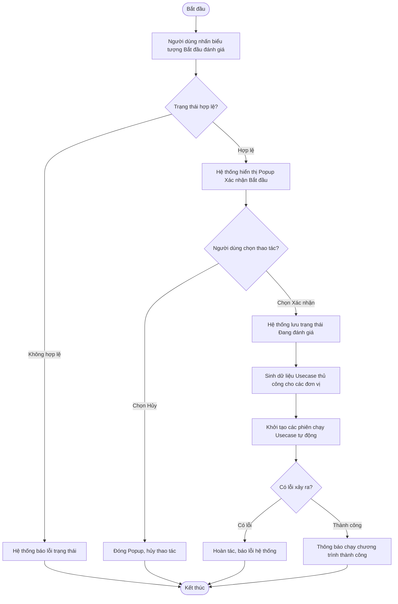

# ĐẶC TẢ YÊU CẦU PHẦN MỀM (SRS) - CHỨC NĂNG: BẮT ĐẦU ĐÁNH GIÁ (CHẠY CHƯƠNG TRÌNH)

**DỰ ÁN: NỀN TẢNG QUẢN LÝ TUÂN THỦ AN TOÀN THÔNG TIN (ISAAP)**
**PHÂN HỆ: QUẢN LÝ & CHẠY CHƯƠNG TRÌNH ĐÁNH GIÁ**

---

### Hà Nội, 06 - 2026

---

## BẢNG GHI NHẬN THAY ĐỔI

| Ngày thay đổi | Vị trí thay đổi | A/M/D (*) | Nguồn gốc | Phiên bản cũ | Mô tả thay đổi | Phiên bản mới |
| :--- | :--- | :---: | :--- | :--- | :--- | :--- |
| 05/06/2026 | Toàn bộ tài liệu | M | Yêu cầu người dùng | V1.0 | Cập nhật định dạng tài liệu, viết lại nội dung bằng ngôn ngữ nghiệp vụ, bổ sung xử lý sinh Usecase thủ công và kích hoạt Usecase tự động. | V2.0 |
| 09/06/2026 | Luồng nghiệp vụ | M | Yêu cầu người dùng | V2.0 | Cập nhật luồng xử lý chi tiết theo mẫu chuẩn mới. | V2.1 |

*Ghi chú ký hiệu (\*):*
- **A\***: Add (Tạo mới)
- **M**: Modify (Sửa đổi)
- **D**: Delete (Xóa bỏ)

### 3.1.1. Thông tin chung & Phân quyền
- **Tên chức năng cha**: Chương trình đánh giá
- **Mục đích**: Cho phép kích hoạt chạy chương trình đánh giá, phân bổ nhiệm vụ nộp sở cứ và kích hoạt các kịch bản đánh giá tự động.
- **Tác nhân**: Admin nghiệp vụ, nhân sự phụ trách ATTT của các đơn vị trong Tập đoàn. Chú ý, admin hệ thống có quyền thực hiện mọi hành động trong hệ thống nhưng không tham gia trực tiếp vào quy trình nghiệp vụ.
- **Phân quyền**: Người dùng được gán nhóm quyền với Mã chức năng và Mã thao tác như bảng dưới:

| Mã chức năng | Mã thao tác |
| :--- | :--- |
| EVALUATION_PROGRAM_MANAGEMENT | START |

---

### 3.1.4. Bắt đầu đánh giá (Chạy chương trình)

#### 3.1.4.1. Thông tin chung

| Thuộc tính | Mô tả chi tiết |
| :--- | :--- |
| **Tên chức năng** | Bắt đầu đánh giá |
| **Mô tả** | Chức năng cho phép người quản trị kích hoạt bắt đầu một chương trình đánh giá mới. Khi bắt đầu, hệ thống sẽ tự động giao việc thu thập sở cứ thủ công về cho các đơn vị, đồng thời khởi chạy các công cụ quét tự động để đánh giá các hệ thống của đơn vị đó. |
| **Tác nhân** | Người dùng thuộc nhóm Admin hệ thống hoặc Người dùng khác nhóm quyền admin hệ thống nhưng được phân bổ vai trò là Đầu mối điều phối của chương trình đánh giá đó |
| **Điều kiện trước** | Chương trình đánh giá đang ở trạng thái "Chưa đánh giá". |
| **Điều kiện sau** | - Trạng thái của chương trình được chuyển sang "Đang đánh giá". - Hệ thống tự động sinh danh sách các nhiệm vụ nộp sở cứ thủ công (Usecase thủ công) giao cho các Đầu mối đơn vị ở trạng thái "Chưa nộp sở cứ". - Hệ thống tự động khởi tạo các phiên chạy tự động (Usecase tự động) để quét dữ liệu. |
| **Ngoại lệ** | - Trạng thái chương trình đã bị thay đổi, không còn nằm ở trạng thái khởi tạo ("Chưa đánh giá"). - Hệ thống gặp lỗi trong quá trình khởi tạo dữ liệu hàng loạt. |
| **Các yêu cầu đặc biệt** | - Khối lượng sinh dữ liệu Usecase là rất lớn đối với các chương trình có nhiều đơn vị. Hệ thống cần đảm bảo tính đồng bộ (Transaction) - một là sinh thành công tất cả, hai là hoàn tác toàn bộ nếu có lỗi để tránh dư thừa rác dữ liệu. |

**Sơ đồ luồng xử lý chức năng:**

#### 3.1.4.2. Màn hình thiết kế (UI Layout)

#### 3.1.4.3. Đặc tả chi tiết các thành phần giao diện

| STT | Thành phần | Kiểu dữ liệu | I/O | Giá trị khởi tạo | Mô tả chi tiết (Mapping CSDL & Thao tác Button) |
| :---: | :--- | :--- | :---: | :--- | :--- |
| **I. Màn hình danh sách (Icon chức năng)** | | | | | |
| 1 | **Biểu tượng Bắt đầu đánh giá** | Icon | Input | Hiển thị/Ẩn | - Chỉ hiển thị/enable khi chương trình ở trạng thái Chưa đánh giá (`status` = 0) và người dùng có quyền thao tác. - Click icon để mở Popup Xác nhận bắt đầu. |
| **II. Popup Xác nhận Bắt đầu** | | | | | |
| 2 | **Nội dung cảnh báo** | Text | Output | N/A | - Tiêu đề: "Xác nhận bắt đầu đánh giá" - Nội dung: "Bạn có chắc chắn muốn bắt đầu đánh giá chương trình này? Hệ thống sẽ giao việc cho các đơn vị và bắt đầu chạy các tác vụ tự động." |
| 3 | **Nút Hủy** | Button | Input | Enable | - Click để đóng popup, hủy bỏ thao tác. |
| 4 | **Nút Xác nhận** | Button | Input | Enable | - Click để thực hiện gửi yêu cầu Bắt đầu chương trình lên máy chủ. - Xử lý CSDL đồng bộ:   + Cập nhật `evaluation_program.status` = 1 (Đang đánh giá).   + Khởi tạo bản ghi vào `usecase_manual_review_mapping` (status = 0: Chưa nộp sở cứ).   + Khởi tạo bản ghi vào `rule_run` (phiên chạy tự động). |

#### 3.1.4.4. Luồng nghiệp vụ
- **Bước 1**: Người dùng đăng nhập và truy cập theo đường dẫn: Menu chương trình đánh giá >> Bắt đầu đánh giá
- **Bước 2**: Hệ thống hiển thị popup Bắt đầu đánh giá chương trình
  - **TH1**: Người dùng click Hủy, hệ thống đóng popup, hủy bỏ thao tác
  - **TH2**: Người dùng click Xác nhận, hệ thống thực hiện kiểm tra trạng thái của chương trình đánh giá, phân quyền thao tác, vai trò của người dùng như sau:
    - Người dùng thuộc nhóm quyền Admin hệ thống hoặc không thuộc quyền Admin hệ thống nhưng:
      - Người dùng có quyền truy cập chức năng “Chương trình đánh giá”
      - Người dùng có quyền thao tác “Hoàn thành đánh giá”
      - Người dùng là đầu mối điều phối của chương trình
    - Chương trình đánh giá có trạng thái “Chưa đánh giá” `evaluation_program.status = 0`
    
    - **Nếu hợp lệ**: Hệ thống thực hiện xử lý đồng bộ: 
      - Cập nhật bảng `evaluation_program`:
        - `status` = 1 (Đang đánh giá)
        - `started_at` = sysdate
        - `updated_at` = sysdate
        - `updated_by` = currentUserId
      - Cập nhật bảng `program_department_mapping`:
        - Trạng thái đánh giá thủ công (`manual_review_status`):
          - **TH1**: Nếu đơn vị có ít nhất 01 usecase thủ công thì `manual_review_status` = 0 (Chưa nộp sở cứ)
          - **TH2**: Nếu đơn vị không có usecase thủ công thì `manual_review_status` = 2 (Đã xác nhận)
        - Trạng thái đánh giá tự động (`auto_review_status`):
          - **TH1**: Nếu đơn vị có ít nhất 01 usecase tự động thì `auto_review_status` = 1 (Đang đánh giá)
          - **TH2**: Nếu đơn vị không có usecase tự động thì `auto_review_status` = 2 (Đã xác nhận)
      - Khởi tạo bản ghi trong bảng `usecase_manual_review_mapping` tương ứng với số lượng usecase thủ công của chương trình đánh giá:
        - `id`: tăng tự động
        - `status` = 0 (Chưa nộp sở cứ)
        - `criteria_usecase_id` = `criteria_usecase_mapping.id`
        - `version_program` = `evaluation_program.evaluation_round`
        - `created_at` = sysdate
        - `updated_at` = sysdate
      - Khởi tạo bản ghi trong bảng `rule_run` tương ứng với số lượng usecase tự động của chương trình đánh giá:
        - `id`: tăng tự động
        - `status` = 1 (Đang chạy)
        - `version_program` = `evaluation_program.evaluation_round`
        - `created_at` = sysdate
        - `updated_at` = sysdate
        - `run_type` = manual
        - `rule_version_id` = `criteria_usecase_mapping.rule_version_id`
        - `start_date` = sysdate
      - Đóng popup xác nhận, trở về màn hình trước đó và trả về thông báo “Bắt đầu đánh giá chương trình thành công”
      
    - **Nếu không hợp lệ**:
      - Trường hợp người dùng không có quyền thì thực hiện đóng popup xác nhận và trả về thông báo “Bạn không có quyền Bắt đầu đánh giá chương trình”
      - Trường hợp trạng thái chương trình không hợp lệ thì thực hiện đóng popup xác nhận và trả về thông báo “Bắt đầu đánh giá chương trình không thành công”
        - đang đánh giá: `evaluation_program.status` = 1
        - đã hoàn thành đánh giá: `evaluation_program.status` = 2
        - đã hủy đánh giá: `evaluation_program.status` = 3
        - đang chờ hoàn thành: `evaluation_program.status` = 4
