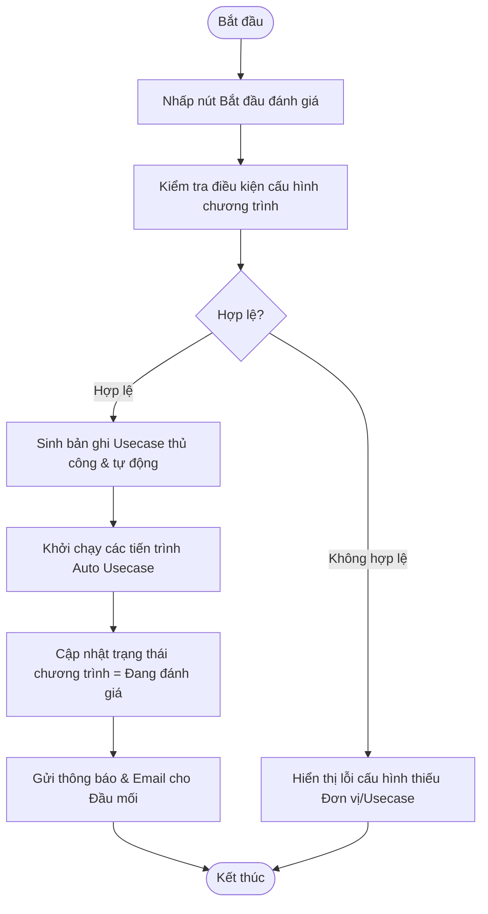

# ĐẶC TẢ YÊU CẦU PHẦN MỀM (SRS) - CHỨC NĂNG: Bắt đầu đánh giá (Chạy chương trình)

---

## 1. Thông tin chức năng

| Thuộc tính | Mô tả chi tiết |
| :--- | :--- |
| **Tên chức năng** | Bắt đầu đánh giá (Chạy chương trình) |
| **Mô tả** | Kích hoạt chương trình đánh giá, sinh các bản ghi usecase thủ công ở trạng thái chờ nộp sở cứ và bắt đầu các phiên chạy tự động cho usecase tự động. |
| **Tác nhân** | Admin, Đầu mối điều phối |
| **Tiền điều kiện** | Chương trình đang ở trạng thái Chưa đánh giá (status = 0). |
| **Hậu điều kiện** | Chương trình chuyển sang trạng thái Đang đánh giá. Sinh dữ liệu kết quả usecase ban đầu. |
| **Ngoại lệ** | Chương trình đã được kích hoạt trước đó hoặc cấu hình chương trình chưa hợp lệ. |
| **Yêu cầu nghiệp vụ** | - Cho phép Admin và Đầu mối điều phối click nút Bắt đầu. - Sinh tự động các bản ghi trong bảng `usecase_manual_review_mapping` với trạng thái 0 (Chưa nộp sở cứ). - Kích hoạt tiến trình quét tự động các usecase loại Auto. - Gửi thông báo đến các đơn vị và đầu mối đánh giá. |

### Luồng sự kiện chính

---

## 2. Mô tả chi tiết màn hình (Sườn khung giao diện)

### Giao diện thiết kế (Figma UI Export)

### Đặc tả các thành phần giao diện
*Ghi chú: Mô tả chi tiết các trường thông tin và thuộc tính điều khiển trên giao diện màn hình chức năng.*

| STT | Thành phần | Kiểu dữ liệu | I/O | Giá trị khởi tạo | Mô tả chi tiết (Mapping CSDL & Thao tác Button) |
| :---: | :--- | :--- | :---: | :--- | :--- |
| 1 | **Nút Bắt đầu đánh giá** | Button | INPUT | Enable/Disable | Chỉ hiển thị khi chương trình ở trạng thái Chưa đánh giá |
| 2 | **Popup Xác nhận bắt đầu** | Popup | OUTPUT | Ẩn | Tiêu đề: Xác nhận chạy chương trình. Nội dung: Bạn có chắc chắn muốn bắt đầu đánh giá chương trình này? Hệ thống sẽ sinh các bản ghi và kích hoạt đánh giá tự động. |
| 3 | **Nút Xác nhận** | Button | INPUT | Enable | Click để kích hoạt chương trình và đóng popup |
| 4 | **Nút Hủy** | Button | INPUT | Enable | Click để hủy lệnh và đóng popup |
