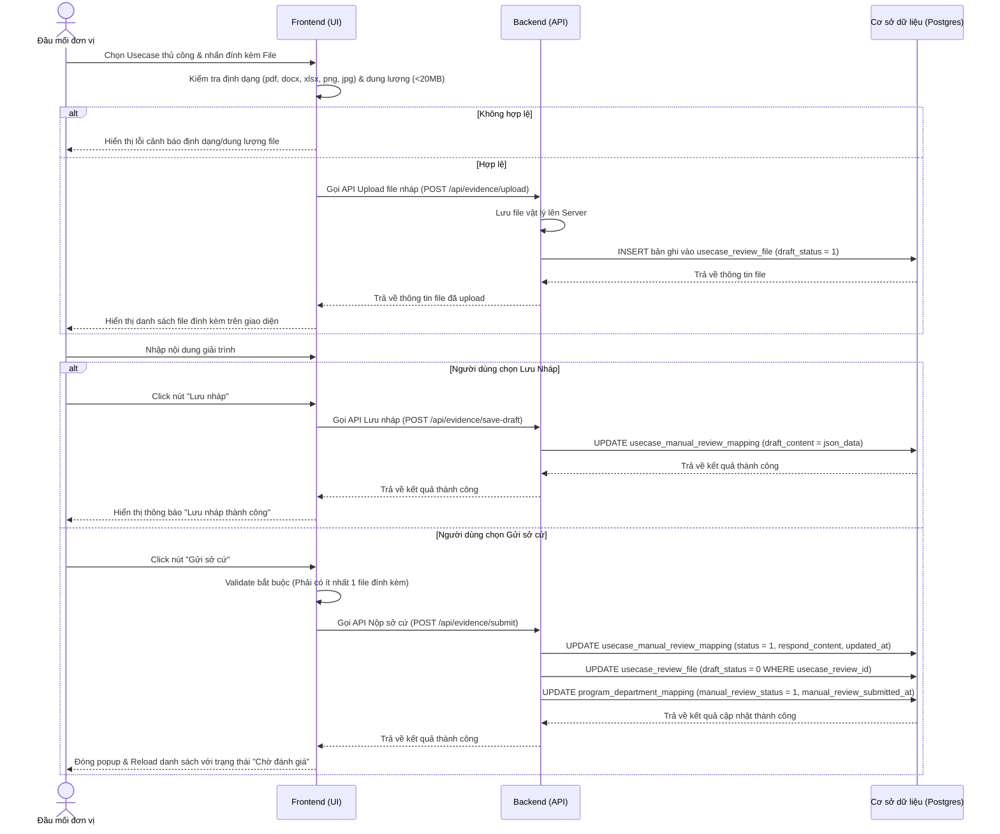

# ĐẶC TẢ YÊU CẦU PHẦN MỀM (SRS) - CHỨC NĂNG: CUNG CẤP SỞ CỨ (LẦN 1)

**DỰ ÁN: NỀN TẢNG QUẢN LÝ TUÂN THỦ AN TOÀN THÔNG TIN (ISAAP)**
**PHÂN HỆ: QUẢN LÝ & CHẠY CHƯƠNG TRÌNH ĐÁNH GIÁ**

---

### Hà Nội, 06 - 2026

---

## BẢNG GHI NHẬN THAY ĐỔI

| Ngày thay đổi | Vị trí thay đổi | A/M/D (*) | Nguồn gốc | Phiên bản cũ | Mô tả thay đổi | Phiên bản mới |
| :--- | :--- | :---: | :--- | :--- | :--- | :--- |
| 05/06/2026 | Toàn bộ tài liệu | M | Yêu cầu người dùng | V1.0 | Cập nhật cấu trúc tài liệu theo mẫu SRS_TEMPLATE mới và chi tiết hóa nghiệp vụ Cung cấp sở cứ lần 1. | V2.0 |

*Ghi chú ký hiệu (\*):*
- **A\***: Add (Tạo mới)
- **M**: Modify (Sửa đổi)
- **D**: Delete (Xóa bỏ)


### 3.1.1. Thông tin chung & Phân quyền
- **Tên chức năng cha**: Quản lý & Chạy chương trình đánh giá
- **Phân quyền**: Đầu mối đơn vị thực hiện nộp sở cứ được phân quyền với vai trò thao tác như sau:

| Tên chức năng | Thao tác | Mã chức năng | Mã thao tác |
| :--- | :--- | :--- | :--- |
| Chương trình đánh giá | Cung cấp sở cứ | EVALUATION_PROGRAM_MANAGEMENT | SEND |

---

### 3.1.2. Chức năng: Cung cấp sở cứ (Lần 1)

#### 3.1.2.1. Thông tin chức năng

| Thuộc tính | Nội dung mô tả chi tiết |
| :--- | :--- |
| **Tên chức năng** | Cung cấp sở cứ (Lần 1) |
| **Mô tả** | Cho phép Đầu mối đơn vị tải lên các tệp tin minh chứng (sở cứ) và viết nội dung giải trình lần đầu (Vòng 1) đối với các Usecase kiểm tra thủ công được áp dụng cho đơn vị mình trong chương trình đánh giá. |
| **Tác nhân** | Đầu mối đơn vị (Representative) |
| **Tiền điều kiện** | 1. Chương trình đánh giá đang ở trạng thái **Đang đánh giá** (`evaluation_program.status` = 1).<br>2. Người dùng đăng nhập thành công và được phân bổ vai trò là Đầu mối đơn vị của đơn vị tham gia chương trình đó (`user.id` = `program_department_mapping.representative_id`).<br>3. Trạng thái của Usecase thủ công cần nộp sở cứ ở trạng thái **Chưa nộp sở cứ** (`usecase_manual_review_mapping.status` = 0) và thuộc vòng đánh giá 1 (`usecase_manual_review_mapping.version_program` = 1). |
| **Hậu điều kiện** | **Trường hợp Lưu nháp:**<br>- Các tệp sở cứ được tải lên với cờ hiệu nháp (`usecase_review_file.draft_status` = 1).<br>- Nội dung giải trình được cập nhật tạm thời vào trường `usecase_manual_review_mapping.draft_content` dưới dạng JSON.<br>**Trường hợp Gửi sở cứ:**<br>- Trạng thái của Usecase thủ công chuyển sang **Chờ đánh giá** (`usecase_manual_review_mapping.status` = 1).<br>- Cập nhật nội dung giải trình chính thức vào trường `usecase_manual_review_mapping.respond_content`.<br>- Các tệp sở cứ liên quan được chuyển sang trạng thái chính thức (`usecase_review_file.draft_status` = 0).<br>- Trạng thái đánh giá thủ công chung của đơn vị (`program_department_mapping.manual_review_status`) được cập nhật thành **Chờ đánh giá** (1) và ghi nhận thời gian nộp (`manual_review_submitted_at`). |
| **Ngoại lệ** | 1. Kết nối máy chủ bị ngắt quãng khi đang upload file hoặc submit -> Hệ thống hiển thị thông báo lỗi "Kết nối máy chủ thất bại" và giữ nguyên thông tin đã nhập trên giao diện để tránh mất dữ liệu.<br>2. File tải lên không hợp lệ (sai định dạng hoặc vượt quá 20MB) -> Hệ thống từ chối tải và hiển thị thông báo lỗi cảnh báo người dùng. |
| **Yêu cầu nghiệp vụ** | 1. Cho phép đính kèm nhiều file minh chứng (file sở cứ) đối với mỗi Usecase thủ công.<br>2. Hỗ trợ các định dạng file phổ biến: PDF, DOCX, XLSX, PNG, JPG.<br>3. Dung lượng tối đa mỗi file tải lên không quá 20MB.<br>4. Đầu mối đơn vị có quyền xóa các file đã tải lên trước khi thực hiện nhấn nút Gửi sở cứ.<br>5. Bắt buộc phải ghi nhận chính xác định danh người dùng nộp (`created_by` / `sender`) và thời gian thực hiện thao tác gửi. |

**Sơ đồ luồng xử lý chức năng (Activity Diagram):**


#### 3.1.2.2. Màn hình thiết kế (UI Layout)
- **Hình ảnh giao diện popup Cung cấp sở cứ lần 1**:
  
- **Hình ảnh giao diện khi Upload file (Up sở cứ)**:
  .png>)

#### 3.1.2.3. Đặc tả chi tiết các thành phần giao diện

| STT | Thành phần giao diện | Kiểu dữ liệu | Input/Output | Giá trị khởi tạo | Mô tả chi tiết (Mapping CSDL & Thao tác hành động) |
| :---: | :--- | :--- | :---: | :--- | :--- |
| 1 | **Tên Usecase** | Label | OUTPUT | Tên Usecase từ DB | - Hiển thị tên Usecase cần nộp sở cứ.<br>- Mapping CSDL: `rule.name` thông qua liên kết `criteria_usecase_mapping` -> `usecase_manual_review_mapping`. |
| 2 | **Nút Chọn File (Đính kèm)** | Button/Upload | INPUT | Enable | - Click để mở hộp thoại chọn file tải lên từ thiết bị.<br>- Hệ thống kiểm tra định dạng và kích thước file trước khi gọi API tải lên.<br>- Giới hạn: Chỉ chấp nhận các đuôi file `.pdf, .docx, .xlsx, .png, .jpg`, kích thước tối đa 20MB/file. |
| 3 | **Danh sách File đã tải lên** | Grid / List | OUTPUT | Rỗng hoặc từ DB | - Hiển thị danh sách các file đã upload (gồm Tên file, Dung lượng file, Icon xóa).<br>- Mapping CSDL: Lấy ra các bản ghi từ bảng `usecase_review_file` có `usecase_review_id` = ID hiện tại và `round` = 1.<br>- Click icon **Xóa** [x] bên cạnh tên file: Gọi API xóa file nháp trên server và delete bản ghi tương ứng trong `usecase_review_file`. |
| 4 | **Trường Giải trình/Ghi chú** | Textarea | INPUT | Rỗng hoặc từ DB | - Nhập nội dung giải thích, mô tả về sở cứ nộp.<br>- Tối đa 1000 ký tự.<br>- Mapping CSDL: Lưu nháp vào `usecase_manual_review_mapping.draft_content`, lưu chính thức vào `usecase_manual_review_mapping.respond_content`. |
| 5 | **Nút Lưu Nháp** | Button | INPUT | Enable | - Click để lưu tạm thông tin giải trình và các file đã upload.<br>- Không thay đổi trạng thái của Usecase và tiến trình đánh giá chung.<br>- Gọi API `/api/evidence/save-draft`. |
| 6 | **Nút Gửi sở cứ** | Button | INPUT | Enable | - Click để nộp chính thức hồ sơ sở cứ.<br>- Ràng buộc bắt buộc (Validate): Phải có ít nhất 1 file đính kèm được tải lên.<br>- Sau khi gửi thành công, trạng thái Usecase chuyển thành **Chờ đánh giá** và đóng popup.<br>- Gọi API `/api/evidence/submit`. |
| 7 | **Nút Hủy** | Button | INPUT | Enable | - Đóng popup nộp sở cứ.<br>- Hiển thị popup xác nhận: "Thông tin chưa lưu sẽ bị mất, bạn có chắc chắn muốn hủy?". Nếu đồng ý, đóng popup và hủy các file tải nháp chưa lưu. |

#### 3.1.2.4. Luồng nghiệp vụ (Business Flow)

##### A. Đăng ký & Tải file sở cứ nháp
Khi người dùng chọn đính kèm file:
- **Hệ thống Frontend** thực hiện kiểm tra kiểm tra định dạng file và kích thước (kích thước <= 20MB, định dạng: PDF, DOCX, XLSX, PNG, JPG).
- Nếu hợp lệ, Frontend gọi API `POST /api/evidence/upload` truyền file dưới dạng multipart/form-data.
- **Hệ thống Backend** lưu file vào thư mục lưu trữ vật lý trên server (cấu trúc đường dẫn theo format: `/storage/evidence/program_{id}/dept_{id}/usecase_{id}/{filename}`).
- Backend thực hiện thêm mới 1 bản ghi vào bảng `usecase_review_file` với các giá trị:
  - `usecase_review_id` = ID của bản ghi `usecase_manual_review_mapping`.
  - `name` = Tên file.
  - `path` = Đường dẫn tương đối lưu file.
  - `size` = Dung lượng file tính bằng bytes.
  - `round` = 1 (Lần đầu).
  - `draft_status` = 1 (Trạng thái nháp).
  - `created_by` = ID người dùng hiện tại (`user.id`).
  - `created_at` = Thời gian hiện tại.

##### B. Lưu nháp thông tin giải trình
Khi người dùng click nút **Lưu nháp**:
- Frontend gọi API `POST /api/evidence/save-draft` kèm body chứa nội dung giải trình (`respond_content`).
- Backend thực hiện cập nhật trường `draft_content` của bảng `usecase_manual_review_mapping` với định dạng JSON chứa dữ liệu nháp:
  `{ "respond_content": "nội dung giải trình nháp" }`
- Trạng thái `status` của usecase vẫn giữ nguyên là `0` (Chưa nộp sở cứ).

**SQL Cập nhật lưu nháp:**
```sql
UPDATE usecase_manual_review_mapping
SET 
    draft_content = jsonb_build_object('respond_content', :respond_content),
    updated_at = NOW(),
    updated_by = :user_id
WHERE id = :usecase_review_id AND status = 0;
```

##### C. Gửi sở cứ chính thức
Khi người dùng click nút **Gửi sở cứ**:
- **Bước 1**: Frontend thực hiện validate: Kiểm tra xem danh sách file đính kèm của usecase này (có `draft_status` = 1 hoặc đã lưu trước đó) có ít nhất 1 file hay không. Nếu không có file nào, hiển thị cảnh báo: "Vui lòng tải lên ít nhất một file minh chứng trước khi gửi." và dừng xử lý.
- **Bước 2**: Frontend gọi API `POST /api/evidence/submit` kèm dữ liệu giải trình chính thức.
- **Bước 3**: Backend thực hiện cập nhật CSDL trong một Transaction để đảm bảo tính toàn vẹn dữ liệu:
  1. Cập nhật bảng `usecase_manual_review_mapping`:
     - `status` = 1 (Chờ đánh giá).
     - `respond_content` = nội dung giải trình người dùng gửi lên.
     - `draft_content` = NULL (Xóa nội dung nháp sau khi gửi chính thức).
     - `updated_by` = ID người dùng hiện tại.
     - `updated_at` = Thời điểm gửi.
  2. Cập nhật các file đính kèm thuộc usecase này trong bảng `usecase_review_file`:
     - `draft_status` = 0 (Chính thức) đối với các file có `round` = 1 và `draft_status` = 1.
  3. Cập nhật trạng thái đánh giá thủ công của đơn vị trong bảng `program_department_mapping`:
     - Xác định `program_department_id` của đơn vị.
     - Kiểm tra xem toàn bộ các Usecase thủ công thuộc đơn vị này trong chương trình đã được nộp sở cứ hay chưa (các bản ghi trong `usecase_manual_review_mapping` có `status` >= 1).
     - Nếu toàn bộ đã được nộp, cập nhật `program_department_mapping.manual_review_status` = 1 (Chờ đánh giá) và `manual_review_submitted_at` = NOW().

**SQL Cập nhật gửi sở cứ chính thức (Thực thi trong transaction):**
```sql
-- 1. Cập nhật trạng thái và nội dung giải trình của Usecase thủ công
UPDATE usecase_manual_review_mapping
SET 
    status = 1, -- Chờ đánh giá
    respond_content = :respond_content,
    draft_content = NULL,
    updated_at = NOW(),
    updated_by = :user_id
WHERE id = :usecase_review_id AND status = 0;

-- 2. Cập nhật trạng thái file đính kèm từ nháp thành chính thức
UPDATE usecase_review_file
SET 
    draft_status = 0
WHERE usecase_review_id = :usecase_review_id AND round = 1 AND draft_status = 1;

-- 3. Cập nhật trạng thái nộp sở cứ chung của đơn vị tham gia chương trình
UPDATE program_department_mapping pdm
SET 
    manual_review_status = 1, -- Chờ đánh giá
    manual_review_submitted_at = NOW(),
    updated_at = NOW(),
    updated_by = :user_id
WHERE 
    pdm.program_id = :program_id 
    AND pdm.dept_id = :dept_id
    -- Chỉ cập nhật khi toàn bộ các usecase thủ công của đơn vị đó đã được nộp sở cứ (status >= 1)
    AND NOT EXISTS (
        SELECT 1 
        FROM usecase_manual_review_mapping umrm
        JOIN criteria_usecase_mapping cum ON umrm.criteria_usecase_id = cum.id
        JOIN object_criteria_mapping ocm ON cum.object_criteria_id = ocm.id
        JOIN department_object_mapping dom ON ocm.department_object_id = dom.id
        WHERE dom.program_department_id = pdm.id AND umrm.status = 0
    );
```

#### 3.1.2.5. Đặc tả API

##### 1. API: Tải lên tập tin sở cứ (Upload File)
- **Endpoint**: `/api/evidence/upload`
- **Method**: `POST`
- **Content-Type**: `multipart/form-data`
- **Mô tả**: Tải file minh chứng lên server và tạo bản ghi file nháp trong CSDL.

**Request Parameters (Form Data):**

| STT | Tên trường | Kiểu dữ liệu | Bắt buộc | Mô tả |
| :---: | :--- | :--- | :---: | :--- |
| 1 | file | MultipartFile | Có | File tài liệu đính kèm (pdf, docx, xlsx, png, jpg) |
| 2 | usecaseReviewId | Integer | Có | ID của bản ghi `usecase_manual_review_mapping` |

**Response Body (JSON):**
```json
{
  "code": "SUCCESS",
  "message": "Upload file thành công",
  "data": {
    "fileId": 124,
    "fileName": "minh_chung_ho_so_ATTT.pdf",
    "fileSize": 1048576,
    "path": "/storage/evidence/program_1/dept_5/usecase_10/minh_chung_ho_so_ATTT.pdf"
  }
}
```

##### 2. API: Lưu nháp nội dung giải trình (Save Draft)
- **Endpoint**: `/api/evidence/save-draft`
- **Method**: `POST`
- **Content-Type**: `application/json`
- **Mô tả**: Lưu tạm thời nội dung giải trình vào trường `draft_content` của Usecase.

**Request Body (JSON):**

| STT | Tên trường | Kiểu dữ liệu | Bắt buộc | Mô tả |
| :---: | :--- | :--- | :---: | :--- |
| 1 | usecaseReviewId | Integer | Có | ID của bản ghi `usecase_manual_review_mapping` |
| 2 | respondContent | String | Không | Nội dung giải trình nháp |

```json
{
  "usecaseReviewId": 12,
  "respondContent": "Giải trình nháp: Đã thực hiện rà soát quyền trên thư mục chia sẻ."
}
```

**Response Body (JSON):**
```json
{
  "code": "SUCCESS",
  "message": "Lưu nháp thành công",
  "data": null
}
```

##### 3. API: Gửi nộp sở cứ chính thức (Submit Evidence)
- **Endpoint**: `/api/evidence/submit`
- **Method**: `POST`
- **Content-Type**: `application/json`
- **Mô tả**: Nộp chính thức sở cứ (nội dung giải trình và chuyển đổi các file nháp thành chính thức), đồng thời cập nhật tiến trình chung của đơn vị.

**Request Body (JSON):**

| STT | Tên trường | Kiểu dữ liệu | Bắt buộc | Mô tả |
| :---: | :--- | :--- | :---: | :--- |
| 1 | usecaseReviewId | Integer | Có | ID của bản ghi `usecase_manual_review_mapping` |
| 2 | respondContent | String | Có | Nội dung giải trình chính thức của đơn vị |
| 3 | programId | Integer | Có | ID của chương trình đánh giá |
| 4 | deptId | Integer | Có | ID của đơn vị nộp sở cứ |

```json
{
  "usecaseReviewId": 12,
  "respondContent": "Đơn vị gửi sở cứ lần 1: Đã rà soát và cấu hình giới hạn quyền truy cập thư mục dữ liệu.",
  "programId": 1,
  "deptId": 5
}
```

**Response Body (JSON):**
```json
{
  "code": "SUCCESS",
  "message": "Nộp sở cứ thành công",
  "data": null
}
```


