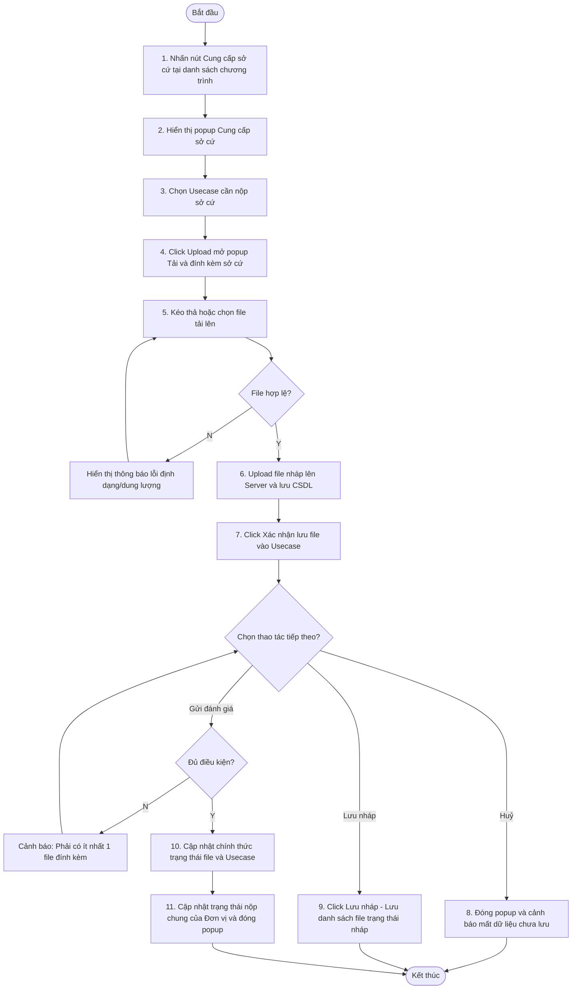

# ĐẶC TẢ YÊU CẦU PHẦN MỀM (SRS) - CHỨC NĂNG: CUNG CẤP SỞ CỨ (LẦN 1)

**DỰ ÁN: NỀN TẢNG QUẢN LÝ TUÂN THỦ AN TOÀN THÔNG TIN (ISAAP)**
**PHÂN HỆ: QUẢN LÝ & CHẠY CHƯƠNG TRÌNH ĐÁNH GIÁ**

---

### Hà Nội, 06 - 2026

---

## BẢNG GHI NHẬN THAY ĐỔI

| Ngày thay đổi | Vị trí thay đổi | A/M/D (*) | Nguồn gốc | Phiên bản cũ | Mô tả thay đổi | Phiên bản mới |
| :--- | :--- | :---: | :--- | :--- | :--- | :--- |
| 05/06/2026 | Toàn bộ tài liệu | M | Yêu cầu người dùng | V1.0 | Cập nhật cấu trúc tài liệu theo mẫu SRS_TEMPLATE mới và chi tiết hóa nghiệp vụ Cung cấp sở cứ lần 1. | V2.0 |
| 05/06/2026 | Phân quyền & Luồng nghiệp vụ | M | Yêu cầu người dùng | V2.0 | Cập nhật mã thao tác từ SEND thành REPRESENTATIVE, thay thế tham chiếu sender bằng representative_id. | V2.1 |

\*Ghi chú ký hiệu (\*):
- **A\***: Add (Tạo mới)
- **M**: Modify (Sửa đổi)
- **D**: Delete (Xóa bỏ)

| Mã chức năng | Mã thao tác |
| :--- | :--- |
| EVALUATION_PROGRAM_MANAGEMENT | REPRESENTATIVE |


---

### 3.1.2. Cung cấp sở cứ (Lần 1)

#### 3.1.2.1. Thông tin chung

| Thuộc tính | Mô tả chi tiết |
| :--- | :--- |
| **Tên chức năng** | Cung cấp sở cứ |
| **Mô tả** | Cho phép Đầu mối đơn vị đính kèm các tệp tin sở cứ cho các Usecase thủ công được áp dụng cho đơn vị mình trong chương trình đánh giá. |
| **Tác nhân** | Người dùng thuộc nhóm Admin hệ thống<br>hoặc<br>Người dùng khác nhóm quyền admin hệ thống nhưng được gán quyền thao tác cung cấp sở cứ trong chức năng quản lý chương trình đánh giá và là một đầu mối đơn vị trong đơn vị được đánh giá |
| **Điều kiện trước** | - Người dùng thuộc nhóm Admin hệ thống<br>hoặc<br>Người dùng khác nhóm quyền admin hệ thống nhưng được gán quyền thao tác cung cấp sở cứ trong chức năng quản lý chương trình đánh giá và là một đầu mối đơn vị trong đơn vị được đánh giá<br>- Trạng thái chương trình đánh giá là "Đang đánh giá" và trạng thái đánh giá thủ công của đơn vị là "Chưa nộp sở cứ" |
| **Điều kiện sau** | **Trường hợp Lưu nháp:**<br>- Các tệp sở cứ đính kèm được lưu nháp trên hệ thống. Usecase vẫn giữ nguyên trạng thái "Chưa nộp sở cứ".<br>**Trường hợp Gửi đánh giá:**<br>- Trạng thái của Usecase được chuyển sang "Chờ đánh giá".<br>- Các tệp sở cứ đính kèm được chuyển sang trạng thái chính thức.<br>- Khi tất cả gửi sở cứ, trạng thái đánh giá thủ công của đơn vị chuyển thành "Chờ đánh giá" và trạng thái Usecase chuyển thành "Chờ đánh giá" |
| **Ngoại lệ** | - Hệ thống gặp sự cố kết nối mạng<br>- Tệp tải lên không đúng định dạng cho phép hoặc vượt quá dung lượng tối đa (50MB) -> Hệ thống từ chối tải tệp và hiển thị cảnh báo lỗi tương ứng. |
| **Các yêu cầu đặc biệt** | - Định dạng tệp *.doc, *.pdf, *.xlsx<br>- Dung lượng tối đa mỗi tệp 50MB<br>- Chỉ cho phép "Gửi sở cứ" khi tất cả các Usecase thủ công của đơn vị đều có ít nhất 1 file sở cứ |

**Sơ đồ luồng xử lý chức năng:**



#### 3.1.2.2. Màn hình
- **Popup Cung cấp sở cứ**:
  
- **Popup Tải và đính kèm sở cứ**:
   copy.png>)
- **Popup Xem danh sách sở cứ đã tải**:
  

#### 3.1.2.3. Mô tả chi tiết màn hình

| TT | Tên | Kiểu dữ liệu [Max length] | Input/ Output | Giá trị khởi tạo | Mô tả (Mapping với CSDL nếu có) |
| :---: | :--- | :--- | :---: | :--- | :--- |
| **I. Popup chính** | | | | | |
| 1 | Tiêu đề popup | Label | Output | "CUNG CẤP SỞ CỨ" | Hiển thị tiêu đề của popup. |
| 2 | Nút đóng [X] | Button | Input | N/A | Click để đóng popup hiện tại. Hệ thống hiển thị cảnh báo xác nhận nếu có thay đổi chưa lưu. |
| 3 | Accordion Đối tượng đánh giá | Accordion/Panel | Output | "Con người (3 Usecases)" | - Tiêu đề panel gồm Tên đối tượng và tổng số lượng Usecase thủ công thuộc nhóm đối tượng đó.<br>- Nhấp vào tiêu đề để thu gọn hoặc mở rộng danh sách các tiêu chí và usecase bên dưới. |
| 4 | Tabs Tiêu chí đánh giá | Tabs/Pills | Input/Output | Tab đầu tiên | - Phân nhóm danh sách các Usecase theo từng Tiêu chí (ví dụ: `1`, `2` tương ứng với các tiêu chí `Tiêu chí 01_Chuyển đổi dữ liệu`, `Tiêu chí 02_Chuyển đổi dữ liệu`).<br>- Click chọn tab tương ứng để lọc danh sách Usecase thuộc Tiêu chí đó. |
| **II. Bảng Usecase** | | | | | |
| 5 | STT (#) | Label | Output | Số thứ tự tăng dần | Số thứ tự của Usecase trong bảng dữ liệu. |
| 6 | Tên usecase | Label / Icon | Output | `usecase.name` | - Hiển thị icon thông tin `(i)` và Tên usecase.<br>- Click vào icon `(i)` hoặc Tên usecase để mở popover/tooltip mô tả chi tiết cách đánh giá và cách chấm điểm của Usecase đó.<br>- Có hỗ trợ icon sắp xếp tăng/giảm theo cột tên Usecase. |
| 7 | Sở cứ * | Component File | Input/Output | "Chưa có tệp nào được tải lên" | - Bắt buộc đính kèm sở cứ.<br>- **Khi chưa có file**: hiển thị chuỗi ký tự `"Chưa có tệp nào được tải lên"` màu xám, và icon tải lên `[Upload]` ở góc phải dòng.<br>- **Khi đã có file**: hiển thị danh sách tên file dạng link liên kết màu xanh kèm nút Xóa `[Trash]`. Tối đa hiển thị 4 file. Nếu > 4 file sẽ hiển thị thêm link `"Xem thêm"`.<br>- **Popover Xem thêm**: Hover hoặc Click link `"Xem thêm"` hiển thị popover chứa danh sách đầy đủ các file đã tải (gồm icon định dạng, tên file, dung lượng, ngày upload, nút tải xuống `[Download]` và nút xóa `[Trash]`).<br>- Click icon tải lên `[Upload]` để mở popup **Tải và đính kèm sở cứ**. |
| **III. Popup Tải và đính kèm sở cứ** | | | | | |
| 8 | Vùng kéo thả file | Drag & Drop Zone | Input | N/A | - Click để chọn tệp từ máy tính hoặc kéo thả tệp trực tiếp vào vùng này.<br>- Text hướng dẫn: `"Nhấn để tải lên hoặc kéo và thả PDF, DOCX, JPG or XLSX (max. 50MB)"`. |
| 9 | Danh sách file upload trong popup | List | Output | N/A | - Hiển thị danh sách các file đang hoặc đã upload gồm: icon định dạng file, Tên file, thông tin dung lượng và tiến trình (`200 KB of 200 KB | Hoàn thành` hoặc `6.4 MB of 16 MB | Uploading...`), và icon `[Trash]` bên phải.<br>- Click icon `[Trash]`: hủy upload hoặc xóa file nháp vật lý khỏi server. |
| 10 | Nút Đóng | Button | Input | Enable | Click đóng popup upload, các file đang upload dở hoặc chưa được Xác nhận sẽ không được cập nhật vào màn hình chính. |
| 11 | Nút Xác nhận | Button | Input | Disable | - Click để lưu danh sách file đã tải lên thành công vào Usecase tương ứng ở màn hình chính.<br>- Chỉ enable khi có ít nhất 1 file đính kèm upload thành công.<br>- Khi nhấn, hệ thống đóng popup upload và hiển thị thông báo toast: `"Thành công. Tải lên X file cho usecase thành công"`. |
| **IV. Các nút chức năng ở dưới** | | | | | |
| 12 | Dòng ghi chú | Label | Output | "Nhấn ⓘ trước tên..." | Nhắc nhở người dùng cách xem hướng dẫn cách đánh giá và cách chấm điểm. |
| 13 | Nút Huỷ | Button | Input | Enable | Đóng modal Cung cấp sở cứ chính, hiển thị xác nhận mất dữ liệu chưa lưu nếu người dùng có thao tác thay đổi. |
| 14 | Nút Lưu nháp | Button | Input | Enable | Lưu tạm thời danh sách file đã đính kèm (giữ nguyên trạng thái `draft_status = 1` của file và `status = 0` của usecase). |
| 15 | Nút Gửi đánh giá | Button | Input | Disable | - Gửi chính thức sở cứ của các Usecase.<br>- Chỉ enable khi có ít nhất 1 file sở cứ được tải lên cho mỗi Usecase bắt buộc trong danh sách.<br>- Nhấn nút sẽ cập nhật trạng thái Usecase sang `1` (Chờ đánh giá), chuyển trạng thái file sang `0` (Chính thức) và đóng popup. |

#### 3.1.2.4. Luồng nghiệp vụ

##### A. Tải file sở cứ nháp
Khi người dùng kích hoạt upload file từ popup "Tải và đính kèm sở cứ":
- **Frontend** thực hiện validate định dạng file (PDF, DOCX, XLSX, PNG, JPG) và kích thước (kích thước <= 50MB).
- Nếu hợp lệ, Frontend gọi API `POST /api/evidence/upload` dưới dạng multipart/form-data.
- **Backend** lưu trữ file vật lý lên server (đường dẫn: `/storage/evidence/program_{id}/dept_{id}/usecase_{id}/{filename}`).
- Backend thực hiện thêm mới một bản ghi vào bảng `usecase_review_file` với các giá trị:
  - `usecase_review_id` = ID bản ghi `usecase_manual_review_mapping`.
  - `name` = Tên file.
  - `path` = Đường dẫn file.
  - `size` = Dung lượng file (bytes).
  - `round` = 1 (Lần đầu).
  - `draft_status` = 1 (Nháp).
  - `created_by` = `representative_id` (ID người dùng thực hiện nộp).
  - `created_at` = Thời gian hiện tại.
- Khi người dùng click nút **Xác nhận**: đóng popup upload và đưa thông tin file lên màn hình chính đồng thời hiển thị toast thông báo thành công.

##### B. Lưu nháp thông tin sở cứ
Khi người dùng click nút **Lưu nháp** ở modal chính:
- Frontend gọi API `POST /api/evidence/save-draft`.
- Hệ thống thực hiện lưu trữ thông tin, giữ nguyên trạng thái `status = 0` của các Usecase thủ công, đồng thời giữ nguyên `draft_status = 1` của các file trong bảng `usecase_review_file`.

##### C. Gửi đánh giá (Nộp sở cứ chính thức)
Khi người dùng click nút **Gửi đánh giá**:
- **Bước 1**: Frontend thực hiện kiểm tra xem tất cả các Usecase bắt buộc trong danh sách đã có ít nhất một file sở cứ được đính kèm hay chưa. Nếu chưa có, hiển thị cảnh báo: `"Vui lòng tải lên ít nhất một file minh chứng cho các Usecase bắt buộc trước khi gửi."` và dừng xử lý.
- **Bước 2**: Frontend gọi API `POST /api/evidence/submit` truyền lên danh sách Usecase cần gửi và thông tin định danh.
- **Bước 3**: Backend thực thi nghiệp vụ cập nhật CSDL trong một Transaction duy nhất để bảo toàn dữ liệu:
  1. Cập nhật bảng `usecase_manual_review_mapping`:
     - Chuyển `status` = 1 (Chờ đánh giá).
     - Cập nhật `updated_by` = `representative_id` (định danh Đầu mối đơn vị nộp).
     - Cập nhật `updated_at` = NOW().
  2. Cập nhật trạng thái các file đính kèm thuộc usecase này trong bảng `usecase_review_file`:
     - Chuyển `draft_status` = 0 (Chính thức) đối với các file có `round` = 1 và `draft_status` = 1.
  3. Cập nhật tiến độ đánh giá thủ công chung của đơn vị trong bảng `program_department_mapping`:
     - Kiểm tra nếu toàn bộ các Usecase thủ công thuộc đơn vị trong chương trình đã được nộp sở cứ (có `status` >= 1).
     - Nếu đã nộp đủ, cập nhật `program_department_mapping.manual_review_status` = 1 (Chờ đánh giá) và `manual_review_submitted_at` = NOW(), `updated_by` = `representative_id`.

**SQL tham khảo cập nhật gửi sở cứ chính thức (Thực thi trong transaction):**

```sql
-- 1. Cập nhật trạng thái của Usecase thủ công
UPDATE usecase_manual_review_mapping
SET 
    status = 1, -- Chờ đánh giá
    updated_at = NOW(),
    updated_by = :representative_id
WHERE id = :usecase_review_id AND status = 0;

-- 2. Cập nhật trạng thái file đính kèm từ nháp thành chính thức
UPDATE usecase_review_file
SET 
    draft_status = 0
WHERE usecase_review_id = :usecase_review_id AND round = 1 AND draft_status = 1;

-- 3. Cập nhật trạng thái nộp sở cứ chung của đơn vị tham gia chương trình
UPDATE program_department_mapping pdm
SET 
    manual_review_status = 1, -- Chờ đánh giá
    manual_review_submitted_at = NOW(),
    updated_at = NOW(),
    updated_by = :representative_id
WHERE 
    pdm.program_id = :program_id 
    AND pdm.dept_id = :dept_id
    -- Chỉ cập nhật khi toàn bộ các usecase thủ công của đơn vị đó đã được nộp sở cứ (status >= 1)
    AND NOT EXISTS (
        SELECT 1 
        FROM usecase_manual_review_mapping umrm
        JOIN criteria_usecase_mapping cum ON umrm.criteria_usecase_id = cum.id
        JOIN object_criteria_mapping ocm ON cum.object_criteria_id = ocm.id
        JOIN department_object_mapping dom ON ocm.department_object_id = dom.id
        WHERE dom.program_department_id = pdm.id AND umrm.status = 0
    );
```

#### 3.1.2.5. Đặc tả API

##### 1. API: Tải lên tập tin sở cứ (Upload File)
- **Endpoint**: `/api/evidence/upload`
- **Method**: `POST`
- **Content-Type**: `multipart/form-data`
- **Mô tả**: Tải file minh chứng lên server và tạo bản ghi file nháp trong CSDL.

**Request Parameters (Form Data):**

| STT | Tên trường | Kiểu dữ liệu | Bắt buộc | Mô tả |
| :---: | :--- | :--- | :---: | :--- |
| 1 | file | MultipartFile | Có | File tài liệu đính kèm (pdf, docx, xlsx, png, jpg) |
| 2 | usecaseReviewId | Integer | Có | ID của bản ghi `usecase_manual_review_mapping` |

**Response Body (JSON):**

```json
{
  "code": "SUCCESS",
  "message": "Upload file thành công",
  "data": {
    "fileId": 124,
    "fileName": "minh_chung_ho_so_ATTT.pdf",
    "fileSize": 1048576,
    "path": "/storage/evidence/program_1/dept_5/usecase_10/minh_chung_ho_so_ATTT.pdf"
  }
}
```

##### 2. API: Xóa tập tin sở cứ (Delete File)
- **Endpoint**: `/api/evidence/file/{fileId}`
- **Method**: `DELETE`
- **Mô tả**: Xóa file sở cứ khỏi CSDL và hệ thống lưu trữ vật lý.

**Request Path Variables:**

| STT | Tên trường | Kiểu dữ liệu | Bắt buộc | Mô tả |
| :---: | :--- | :--- | :---: | :--- |
| 1 | fileId | Integer | Có | ID của file trong bảng `usecase_review_file` cần xóa |

**Response Body (JSON):**

```json
{
  "code": "SUCCESS",
  "message": "Xóa file thành công",
  "data": null
}
```

##### 3. API: Lưu nháp sở cứ (Save Draft)
- **Endpoint**: `/api/evidence/save-draft`
- **Method**: `POST`
- **Content-Type**: `application/json`
- **Mô tả**: Lưu nháp danh sách file đã tải lên (trạng thái tệp tin và Usecase được giữ nguyên là nháp).

**Request Body (JSON):**

| STT | Tên trường | Kiểu dữ liệu | Bắt buộc | Mô tả |
| :---: | :--- | :--- | :---: | :--- |
| 1 | usecaseReviewId | Integer | Có | ID của bản ghi `usecase_manual_review_mapping` |

```json
{
  "usecaseReviewId": 12
}
```

**Response Body (JSON):**

```json
{
  "code": "SUCCESS",
  "message": "Lưu nháp thành công",
  "data": null
}
```

##### 4. API: Gửi đánh giá (Submit Evidence)
- **Endpoint**: `/api/evidence/submit`
- **Method**: `POST`
- **Content-Type**: `application/json`
- **Mô tả**: Nộp chính thức hồ sơ sở cứ (chuyển đổi các file nháp thành chính thức và chuyển đổi trạng thái Usecase/Đơn vị).

**Request Body (JSON):**

| STT | Tên trường | Kiểu dữ liệu | Bắt buộc | Mô tả |
| :---: | :--- | :--- | :---: | :--- |
| 1 | usecaseReviewId | Integer | Có | ID của bản ghi `usecase_manual_review_mapping` |
| 2 | programId | Integer | Có | ID của chương trình đánh giá |
| 3 | deptId | Integer | Có | ID của đơn vị nộp sở cứ |
| 4 | representative_id | Integer | Có | ID đầu mối đơn vị thực hiện nộp |

```json
{
  "usecaseReviewId": 12,
  "programId": 1,
  "deptId": 5,
  "representative_id": 1001
}
```

**Response Body (JSON):**

```json
{
  "code": "SUCCESS",
  "message": "Nộp sở cứ thành công",
  "data": null
}
```
