# �ẶC TẢ YÊU CẦU PHẦN MỀM (SRS) - CHỨC NĂNG: CUNG CẤP S� CỨ

**DỰ �N: NỀN TẢNG QUẢN L� TUÂN THỦ AN TOÀN THÔNG TIN (ISAAP)**
**PHÂN HỆ: QUẢN L� & CHẠY CHƯƠNG TRÌNH ��NH GI�**

---

### Hà Nội, 06 - 2026

---

## BẢNG GHI NHẬN THAY �ỔI

| Ngày thay đổi | Vị trí thay đổi | A/M/D (*) | Nguồn gốc | Phiên bản cũ | Mô tả thay đổi | Phiên bản mới |
| :--- | :--- | :---: | :--- | :--- | :--- | :--- |
| 05/06/2026 | Toàn bộ tài liệu | M | Yêu cầu ngư�i dùng | V1.0 | Cập nhật cấu trúc tài liệu theo mẫu SRS_TEMPLATE mới và chi tiết hóa nghiệp vụ Cung cấp sở cứ lần 1. | V2.0 |
| 05/06/2026 | Phân quy�n & Luồng nghiệp vụ | M | Yêu cầu ngư�i dùng | V2.0 | Cập nhật mã thao tác từ SEND thành REPRESENTATIVE, thay thế tham chiếu sender bằng representative_id. | V2.1 |
| 09/06/2026 | Toàn bộ tài liệu | M | Yêu cầu ngư�i dùng | V2.1 | Cập nhật giao diện Popup cung cấp sở cứ tích hợp cả hai trư�ng hợp: chưa nộp sở cứ (lần 1) và nộp sở cứ bổ sung. | V3.0 |
| 09/06/2026 | Luồng nghiệp vụ chi tiết | M | Yêu cầu ngư�i dùng | V3.0 | Tách chi tiết luồng nghiệp vụ Cung cấp sở cứ thành 2 trư�ng hợp: Chưa nộp sở cứ và Yêu cầu bổ sung cho các thao tác Lưu nháp và Gửi sở cứ. | V3.1 |
| 09/06/2026 | �ặc tả API | A | Yêu cầu ngư�i dùng | V3.1 | Bổ sung đặc tả API Get Popup Details trả v� cấu trúc dữ liệu cho Popup Cung cấp sở cứ. | V3.2 |
| 09/06/2026 | Luồng nghiệp vụ chi tiết | A | Yêu cầu ngư�i dùng | V3.2 | Bổ sung quy trình tải thông tin ban đầu khi mở Popup Cung cấp sở cứ trước bước gửi. | V3.3 |
| 09/06/2026 | Luồng nghiệp vụ chi tiết | A | Yêu cầu ngư�i dùng | V3.3 | Bổ sung phần ánh xạ dữ liệu CSDL cho giao diện Popup. | V3.4 |
| 09/06/2026 | Luồng nghiệp vụ chi tiết | A | Yêu cầu ngư�i dùng | V3.4 | Bổ sung sơ đồ liên kết và chi tiết quan hệ JOIN giữa các bảng CSDL. | V3.5 |

\*Ghi chú ký hiệu (\*):
- **A\***: Add (Tạo mới)
- **M**: Modify (Sửa đổi)
- **D**: Delete (Xóa b�)

| Mã chức năng | Mã thao tác |
| :--- | :--- |
| EVALUATION_PROGRAM_MANAGEMENT | REPRESENTATIVE |


---

### 3.1.2. Cung cấp sở cứ

#### 3.1.2.1. Thông tin chung

| Thuộc tính | Mô tả chi tiết |
| :--- | :--- |
| **Tên chức năng** | Cung cấp sở cứ / Cung cấp sở cứ bổ sung |
| **Mô tả** | Cho phép �ầu mối đơn vị đính kèm các tệp tin sở cứ cho các Usecase thủ công được áp dụng cho đơn vị mình trong chương trình đánh giá. Chức năng này được sử dụng cho cả nộp lần đầu (Chưa nộp sở cứ) và nộp bổ sung (Yêu cầu bổ sung) thông qua một popup động duy nhất. |
| **Tác nhân** | - Ngư�i dùng thuộc nhóm Admin hệ thống<br>- Ngư�i dùng khác nhóm quy�n admin hệ thống nhưng được gán quy�n thao tác cung cấp sở cứ (Mã thao tác: `REPRESENTATIVE` thuộc Chức năng: `EVALUATION_PROGRAM_MANAGEMENT`) và được phân công làm đầu mối đơn vị (`representative_id`) trong đơn vị được đánh giá. |
| **�i�u kiện trước** | - Chương trình đánh giá đang ở trạng thái **"�ang đánh giá"**.<br>- Trạng thái đánh giá thủ công của đơn vị (`manual_review_status`) là **"Chưa nộp sở cứ"** hoặc **"Yêu cầu bổ sung"**. |
| **�i�u kiện sau** | **Trư�ng hợp Lưu nháp:**<br>- Các tệp sở cứ đính kèm (và mô tả bổ sung nếu có) được lưu nháp trên hệ thống. Usecase và đơn vị giữ nguyên trạng thái cũ.<br>**Trư�ng hợp Gửi đánh giá (khi đơn vị ở trạng thái "Chưa nộp sở cứ"):**<br>- Trạng thái của Usecase được chuyển sang `1` (Ch� đánh giá).<br>- Các tệp sở cứ đính kèm được chuyển sang trạng thái chính thức (`draft_status = 0`, `round = 1`).<br>- Trạng thái đánh giá thủ công của đơn vị chuyển thành `1` (Ch� đánh giá).<br>**Trư�ng hợp Gửi bổ sung (khi đơn vị ở trạng thái "Yêu cầu bổ sung"):**<br>- Trạng thái của Usecase được chuyển sang `4` (Ch� đánh giá bổ sung).<br>- Các tệp sở cứ bổ sung được chuyển sang trạng thái chính thức (`draft_status = 0`, `round = 2`).<br>- Mô tả nộp bổ sung được cập nhật chính thức.<br>- Trạng thái đánh giá thủ công của đơn vị chuyển thành `4` (Ch� đánh giá bổ sung). |
| **Ngoại lệ** | - Lỗi kết nối mạng hoặc lỗi máy chủ.<br>- Tệp tải lên không đúng định dạng cho phép hoặc vượt quá dung lượng tối đa (50MB) -> Hệ thống từ chối tải tệp và hiển thị cảnh báo lỗi tương ứng. |
| **Các yêu cầu đặc biệt** | - �ịnh dạng tệp hợp lệ: `*.doc, *.docx, *.xls, *.xlsx, *.pdf`<br>- Dung lượng tối đa mỗi tệp: 50MB<br>- Cho phép kéo thả và upload nhi�u file cùng lúc.<br>- Cho phép sắp xếp danh sách Usecase theo Tên usecase. |

**Sơ đồ luồng xử lý chức năng:**

```mermaid
graph TD
    Start([Bắt đầu]) --> OpenPopup[1. Nhấn nút Cung cấp sở cứ tại danh sách chương trình]
    OpenPopup --> RenderPopup[2. Hiển thị popup Cung cấp sở cứ]
    RenderPopup --> CheckUnitStatus{3. Kiểm tra trạng thái đơn vị?}
    
    %% Trư�ng hợp 1
    CheckUnitStatus -- Chưa nộp sở cứ --> Case1[Hiển thị giao diện Trư�ng hợp 1: Chưa nộp sở cứ]
    Case1 --> SelectUsecase1[Ch�n Usecase cần nộp]
    SelectUsecase1 --> UploadPopup1[Mở popup Tải và đính kèm sở cứ]
    UploadPopup1 --> PerformUpload1[Kéo thả/ch�n file và tải lên]
    PerformUpload1 --> ConfirmUpload1[Xác nhận: Ghi nhận file trạng thái nháp vào Usecase]
    ConfirmUpload1 --> UserAction1{Hành động tiếp theo?}
    
    UserAction1 -- �óng/Hủy --> CheckChange1{Có thay đổi dữ liệu?}
    CheckChange1 -- Chưa thay đổi --> CloseNoConfirm[�óng popup trực tiếp] --> End([Kết thúc])
    CheckChange1 -- �ã thay đổi --> ShowExitConfirm1[Hiển thị Popup Xác nhận hủy b�]
    ShowExitConfirm1 --> ExitConfirmAction1{Ch�n thao tác?}
    ExitConfirmAction1 -- Xác nhận --> CancelAll1[Hủy toàn bộ dữ liệu chưa lưu & đóng popup] --> End
    ExitConfirmAction1 -- Hủy b� --> KeepPopup1[Giữ popup, tiếp tục nhập liệu] --> Case1
    
    UserAction1 -- Lưu nháp --> ClickDraft1[Click Lưu nháp: Lưu tạm file sở cứ vào DB] --> End
    UserAction1 -- Gửi sở cứ --> ValidateSubmit1{Tất cả Usecase có ít nhất 1 file sở cứ?}
    ValidateSubmit1 -- Không --> AlertErr1[Báo lỗi: Phải có ít nhất 1 file sở cứ/UC] --> Case1
    ValidateSubmit1 -- Có --> SubmitInfo1[Nộp chính thức sở cứ: status = 1, draft_status = 0] --> End
    
    %% Trư�ng hợp 2
    CheckUnitStatus -- Yêu cầu bổ sung --> Case2[Hiển thị giao diện Trư�ng hợp 2: Yêu cầu bổ sung]
    Case2 --> SelectUsecase2[Ch�n Usecase yêu cầu bổ sung]
    SelectUsecase2 --> UploadPopup2[Mở popup Tải và đính kèm sở cứ]
    UploadPopup2 --> PerformUpload2[Kéo thả/ch�n file và tải lên]
    PerformUpload2 --> ConfirmUpload2[Xác nhận: Ghi nhận file bổ sung nháp vào Usecase]
    ConfirmUpload2 --> InputDesc[Nhập Mô tả bổ sung nếu cần]
    InputDesc --> UserAction2{Hành động tiếp theo?}
    
    UserAction2 -- �óng/Hủy --> CheckChange2{Có thay đổi dữ liệu?}
    CheckChange2 -- Chưa thay đổi --> CloseNoConfirm
    CheckChange2 -- �ã thay đổi --> ShowExitConfirm2[Hiển thị Popup Xác nhận hủy b�]
    ShowExitConfirm2 --> ExitConfirmAction2{Ch�n thao tác?}
    ExitConfirmAction2 -- Xác nhận --> CancelAll2[Hủy toàn bộ dữ liệu chưa lưu & đóng popup] --> End
    ExitConfirmAction2 -- Hủy b� --> KeepPopup2[Giữ popup, tiếp tục nhập liệu] --> Case2
    
    UserAction2 -- Lưu nháp --> ClickDraft2[Click Lưu nháp: Lưu nháp file bổ sung & mô tả] --> End
    UserAction2 -- Gửi bổ sung --> ValidateSubmit2{Tất cả Usecase yêu cầu bổ sung có ít nhất 1 file sở cứ bổ sung?}
    ValidateSubmit2 -- Không --> AlertErr2[Báo lỗi: Bắt buộc tải lên ít nhất 1 file sở cứ bổ sung/UC] --> Case2
    ValidateSubmit2 -- Có --> SubmitInfo2[Nộp chính thức sở cứ bổ sung: status = 4, draft_status = 0, round = 2] --> End
```



#### 3.1.2.2. Màn hình thiết kế (UI Layout)
- **Popup Cung cấp sở cứ (Tổng quan)**:
  
- **Popup Tải và đính kèm sở cứ**:
   copy.png>)
- **Popup Xem danh sách sở cứ đã tải**:
  

#### 3.1.2.3. �ặc tả chi tiết các thành phần giao diện

##### A. Thành phần chung của Popup
Các thành phần này luôn hiển thị ở phần trên cùng và hành động thoát của Popup:

| STT | Thành phần | Kiểu thành phần | I/O | Giá trị mặc định / Quy tắc hiển thị | Mô tả chi tiết hành động |
| :---: | :--- | :--- | :---: | :--- | :--- |
| 1 | **Tiêu đ� popup** | Label | Output | "Cung cấp sở cứ" | Hiển thị ở góc trên bên trái của popup. |
| 2 | **�óng [X] / Hủy b�** | Button | Input | Luôn luôn hiển thị | - Click nút đóng `[X]` ở góc phải hoặc nút `Hủy b�` ở dưới cùng:<br>- Nếu ngư�i dùng **chưa thay đổi dữ liệu** (chưa upload file mới, chưa mô tả bổ sung, chưa xóa file): đóng popup trực tiếp.<br>- Nếu ngư�i dùng **đã thay đổi dữ liệu** (đã upload thêm file mới, đã xóa file hoặc đã chỉnh sửa trư�ng mô tả bổ sung): Hiển thị **Popup xác nhận thoát**. |
| 3 | **Popup xác nhận thoát** | Modal | Popup | Ẩn mặc định | - Tiêu đ�: “Xác nhận hủy b��<br>- Nội dung: “Dữ liệu đã thay đổi nhưng chưa được lưu. Bạn có chắc chắn muốn thoát không?�<br>- Nút **Xác nhận**: Thực hiện đóng popup xác nhận, đóng popup “Cung cấp sở cứ�, hủy toàn bộ dữ liệu chưa lưu và trở v� màn hình trước đó.<br>- Nút **Hủy b�**: �óng popup xác nhận, giữ nguyên trạng thái popup “Cung cấp sở cứ� để ngư�i dùng tiếp tục nhập liệu. |
| 4 | **Danh sách đơn vị** | Dropdown Menu | Input/Output | �ơn vị đầu tiên trong danh sách | - Hiển thị danh sách đơn vị mà ngư�i dùng hiện tại có quy�n truy cập.<br>- **Admin hệ thống**: Hiển thị tất cả các đơn vị trong chương trình có trạng thái đánh giá thủ công là `"Chưa nộp sở cứ"` hoặc `"Yêu cầu bổ sung"`.<br>- **Ngư�i dùng khác**: Chỉ hiển thị các đơn vị mà ngư�i dùng được phân công làm đầu mối đơn vị (`representative_id`) và đơn vị đó đang có trạng thái đánh giá thủ công là `"Chưa nộp sở cứ"` hoặc `"Yêu cầu bổ sung"`.<br>- **�ịnh dạng hiển thị**: `{tên đơn vị} {trạng thái đánh giá thủ công của đơn vị}` (Ví dụ: `Trung tâm hạ tầng - Yêu cầu bổ sung`).<br>- **Hành động click**: Khi ch�n một đơn vị trong danh sách, popup sẽ tải lại và hiển thị chi tiết nội dung gửi sở cứ tương ứng với trạng thái của đơn vị đó dưới dạng cây thư mục. |
| 5 | **Nội dung gửi sở cứ** | Tree Panel | Output | Dạng cây �ối tượng >> Tiêu chí >> Usecase | - Hiển thị phân cấp thông tin dạng cây theo cấu trúc: **�ối tượng đánh giá** >> **Tiêu chí đánh giá** >> **Danh sách Usecase**.<br>- Cho phép ngư�i dùng scroll d�c toàn bộ nội dung gửi sở cứ. |

---

##### B. Trư�ng hợp 1: �ơn vị có trạng thái “Chưa nộp sở cứ� (Nộp lần 1)

Khi đơn vị được ch�n có trạng thái đánh giá thủ công là "Chưa nộp sở cứ", giao diện sẽ áp dụng cấu trúc và hành vi dưới đây:

| STT | Thành phần | Kiểu thành phần | I/O | Quy tắc hiển thị & Giá trị | Mô tả chi tiết hành động / Mapping CSDL |
| :---: | :--- | :--- | :---: | :--- | :--- |
| 1 | **�ối tượng đánh giá** | Accordion Panel | Output | Tiêu đ�: `{tên đối tượng} {tổng số usecase thủ công cần nộp sở cứ}` và danh sách chỉ mục tiêu chí. | - Tiêu đ� hiển thị tên đối tượng cùng tổng số Usecase thủ công cần nộp. Kèm danh sách các ô số chỉ mục tiêu chí (1, 2, 3...) theo thứ tự.<br>- Click một ô số chỉ mục tiêu chí => Tự động mở rộng toàn bộ danh sách Usecase của tiêu chí đó và di chuyển màn hình (scroll) đến đầu tiêu chí.<br>- **Trư�ng hợp Usecase không hợp lệ**: Focus vào dòng usecase không hợp lệ đầu tiên, highlight màu đ� toàn bộ dòng đó và hiển thị thông báo lỗi dưới trư�ng sở cứ.<br>- **Quy tắc màu chỉ mục tiêu chí**:<br>  + **Màu xám**: Có ít nhất 1 usecase trong tiêu chí chưa được đính kèm sở cứ.<br>  + **Màu xanh**: Tất cả usecase trong tiêu chí có ít nhất 01 file sở cứ hợp lệ.<br>  + **Màu đ�**: Có ít nhất 1 usecase không hợp lệ khi bấm "Gửi sở cứ" và bị validate thất bại từ API. |
| 2 | **Tiêu chí đánh giá** | Sub-Panel | Output | Tiêu đ�: `{số chỉ mục theo thứ tự} {tên tiêu chí}` | - Chỉ hiển thị các tiêu chí có chứa usecase thủ công cần nộp sở cứ của đơn vị đó. |
| 3 | **Sắp xếp tên Usecase** | Column Header Icon | Input | Trạng thái mặc định | - Hỗ trợ icon sắp xếp bên cạnh cột Tên usecase.<br>- **Quy tắc sắp xếp**:<br>  + *Click lần 1*: Sắp xếp danh sách theo tên usecase tăng dần, icon mũi tên hướng lên hiển thị màu đ�.<br>  + *Click lần 2*: Sắp xếp danh sách theo tên usecase giảm dần, icon mũi tên hướng xuống hiển thị màu đ�.<br>  + *Click lần 3*: Danh sách trở lại trạng thái mặc định khi chưa nhấn sắp xếp. |
| 4 | **Tên Usecase** | Label / Tooltip | Output | �ịnh dạng: `[Icon xem chi tiết] {mã usecase} - {tên usecase}` | - Hover chuột vào `[Icon xem chi tiết]` hiển thị Tooltip chứa các thông tin: Mã usecase, tên usecase, mục tiêu đánh giá, hướng dẫn chấm điểm, hướng dẫn đánh giá. |
| 5 | **Sở cứ *** | File List | Input/Output | Bắt buộc (ít nhất 1 file/usecase) | - �ịnh dạng hiển thị file: mỗi file gồm `{tên file}` và icon xóa `[x]`. Nếu tên file quá dài thì hiển thị dạng rút g�n `(...).*đuôi file` (ví dụ: `minh_chung_he_thong_ba...pdf`).<br>- **Giới hạn hiển thị**: Hiển thị tối đa 5 file trực tiếp tại dòng. Nếu số lượng file > 5, hệ thống hiển thị 4 file đầu tiên và kèm hyperlink **“Xem thêm�**.<br>- **Click “Xem thêm�**: Mở **Popup danh sách sở cứ**.<br>- **Click xóa [x]**: Xóa file kh�i danh sách sở cứ. |
| 6 | **Icon upload file** | Button | Input | N/A | Click mở **Popup Tải và đính kèm sở cứ**. |
| 7 | **Nút Lưu nháp** | Button | Input | Luôn Enable | Click để lưu nháp thông tin vào CSDL, các file sở cứ mới upload được cập nhật trạng thái `draft_status = 1` và Usecase ở trạng thái `status = 0`. |
| 8 | **Nút Gửi sở cứ** | Button | Input | Disable mặc định | - Chỉ hiển thị đối với đơn vị có trạng thái `"Chưa nộp sở cứ"`.<br>- **Quy tắc kích hoạt (Enable)**: Chỉ enable khi tất cả các usecase trong danh sách đ�u có tối thiểu 1 file sở cứ hợp lệ.<br>- **Hành động click**: Tiến hành validate và gửi dữ liệu.<br>  + *Thành công*: Cập nhật trạng thái Usecase sang `1` (Ch� đánh giá), file sang `0` (Chính thức), cập nhật trạng thái đơn vị sang `1` (Ch� đánh giá), lưu vào CSDL và load lại popup.<br>  + *Thất bại*: Hiển thị lỗi chi tiết dưới usecase lỗi và cập nhật màu cho chỉ mục tiêu chí tương ứng sang Màu đ�. |

---

##### C. Trư�ng hợp 2: �ơn vị có trạng thái “Yêu cầu bổ sung�

Khi đơn vị được ch�n có trạng thái đánh giá thủ công là "Yêu cầu bổ sung", giao diện sẽ hiển thị các trư�ng thông tin bổ sung và l�c chỉ hiển thị các Usecase cần bổ sung:

| STT | Thành phần | Kiểu thành phần | I/O | Quy tắc hiển thị & Giá trị | Mô tả chi tiết hành động / Mapping CSDL |
| :---: | :--- | :--- | :---: | :--- | :--- |
| 1 | **�ối tượng đánh giá** | Accordion Panel | Output | Chỉ hiển thị đối tượng có ít nhất 1 usecase có trạng thái `"Yêu cầu bổ sung"` (`status = 3`). | - Tiêu đ�: `{tên đối tượng} {tổng số usecase thủ công cần nộp sở cứ}` và danh sách chỉ mục tiêu chí của đối tượng.<br>- Click một ô số chỉ mục tiêu chí => Tự động mở rộng danh sách Usecase của tiêu chí đó và di chuyển màn hình (scroll) đến đầu tiêu chí.<br>- Focus dòng lỗi đầu tiên, highlight đ� và báo lỗi dưới trư�ng sở cứ nếu validate thất bại.<br>- **Quy tắc màu chỉ mục tiêu chí**:<br>  + **Màu xám**: Chưa bổ sung file sở cứ bổ sung cho usecase bị yêu cầu.<br>  + **Màu xanh**: Tất cả usecase bị yêu cầu trong tiêu chí đã có ít nhất 1 file sở cứ bổ sung hợp lệ.<br>  + **Màu đ�**: Có ít nhất 1 usecase không hợp lệ khi bấm gửi bổ sung. |
| 2 | **Tiêu chí đánh giá** | Sub-Panel | Output | Chỉ hiển thị tiêu chí có ít nhất 1 usecase trạng thái `"Yêu cầu bổ sung"`. | - Tiêu đ�: `{số chỉ mục theo thứ tự} {tên tiêu chí}`. |
| 3 | **Danh sách Usecase** | Table | Output | Hỗ trợ cuộn ngang nếu quá nhi�u cột. Cố định cột Tên usecase và cột Thao tác. | - Hỗ trợ sắp xếp theo Tên usecase giống Trư�ng hợp 1 (3 lần click).<br>- Chỉ hiển thị các usecase có trạng thái `"Yêu cầu bổ sung"` (`status = 3`). |
| 4 | **Tên Usecase** | Label / Tooltip | Output | �ịnh dạng: `[Icon xem chi tiết] {mã usecase} - {tên usecase}` | - Hover chuột hiển thị tooltip gồm: mã usecase, tên usecase, mục tiêu đánh giá, hướng dẫn chấm điểm, hướng dẫn đánh giá. |
| 5 | **Sở cứ đã nộp** | File List | Output | Chỉ đ�c (Read-only) | - Hiển thị danh sách các file sở cứ đã nộp ở lần 1 (để đối chiếu). �ịnh dạng: `{tên file} [icon tải xuống]`. Không có nút xóa.<br>- �p dụng rút g�n tên file, hiển thị tối đa 5 file. Nếu > 5 file thì hiển thị 4 file + hyperlink **“Xem thêm�** để mở popup xem danh sách.<br>- Click `[icon tải xuống]` để lưu file v� thiết bị. |
| 6 | **Yêu cầu bổ sung** | Text | Output | Nội dung yêu cầu từ Kiểm toán viên | - Hiển thị lý do hoặc yêu cầu chi tiết từ KTV. Hỗ trợ scroll d�c nội dung nếu text quá dài. Mapping DB: `usecase_manual_review_mapping.request_content` |
| 7 | **Sở cứ bổ sung *** | File List | Input/Output | Bắt buộc (ít nhất 1 file/usecase) | - �ịnh dạng hiển thị file bổ sung mới: `{tên file}` và icon xóa `[x]`. Tự động rút g�n tên file nếu quá dài.<br>- Hiển thị tối đa 5 file. Nếu > 5 file thì hiển thị 4 file + hyperlink **“Xem thêm�** mở popup danh sách.<br>- Click xóa `[x]` để loại b� file kh�i danh sách bổ sung.<br>- Click `[Icon upload file]` để mở **Popup Tải và đính kèm sở cứ** để upload file bổ sung. |
| 8 | **Mô tả bổ sung** | Textarea | Input | Tối đa 500 ký tự | - Không bắt buộc.<br>- Chặn nhập từ ký tự thứ 501. Chi�u cao tự động giãn theo nội dung nhập, tối đa hiển thị 5 dòng, quá 5 dòng xuất hiện scroll d�c.<br>- �ịnh dạng hiển thị: `{Mô tả bổ sung}` kèm icon xóa nhanh `[x]`. Icon `[x]` chỉ hiển thị khi có ít nhất 1 ký tự trong textarea. Click `[x]` sẽ xóa sạch nội dung trong textarea.<br>- Placeholder: "Nhập mô tả bổ sung."<br>- Mapping DB: `usecase_manual_review_mapping.respond_content` |
| 9 | **Nút Lưu nháp** | Button | Input | Luôn Enable | Click để lưu nháp file sở cứ bổ sung đã tải lên và nội dung mô tả bổ sung vào CSDL. Usecase giữ nguyên trạng thái `status = 3`, file bổ sung ở trạng thái `draft_status = 1` và `round = 2`. |
| 10 | **Nút Gửi bổ sung** | Button | Input | Disable mặc định | - Chỉ hiển thị đối với đơn vị có trạng thái `"Yêu cầu bổ sung"`.<br>- **Quy tắc kích hoạt (Enable)**: Chỉ enable khi tất cả các usecase yêu cầu bổ sung trong danh sách đ�u có tối thiểu 1 file sở cứ bổ sung mới.<br>- **Hành động click**: Tiến hành validate dữ liệu.<br>  + *Thành công*: Cập nhật trạng thái Usecase sang `4` (Ch� đánh giá bổ sung), file bổ sung sang `0` (Chính thức), cập nhật trạng thái đơn vị sang `4` (Ch� đánh giá bổ sung), lưu mô tả bổ sung vào DB, đóng popup và tải lại trang.<br>  + *Thất bại*: Báo lỗi chi tiết, cập nhật màu chỉ mục tiêu chí lỗi thành Màu đ�. |

---

##### D. Popup danh sách sở cứ (Hiển thị khi click "Xem thêm")
Dùng chung cho hiển thị danh sách đầy đủ của Sở cứ lần 1, Sở cứ đã nộp, và Sở cứ bổ sung:
- **Giới hạn hiển thị**: Hiển thị tối đa 4 file cùng lúc. Nếu số lượng file > 4, hiển thị thanh cuộn d�c (scroll) để xem tiếp.
- **�ịnh dạng hiển thị dòng file**: `{loại file/icon định dạng} {tên file} {dung lượng}`.
- **Hành động**:
  - Click biểu tượng tải xuống `[Download]`: Tải và lưu file trực tiếp v� thiết bị của ngư�i dùng.
  - Click biểu tượng xóa `[Trash]` (chỉ hiển thị đối với danh sách file có quy�n chỉnh sửa - Sở cứ lần 1 và Sở cứ bổ sung): Xóa file kh�i danh sách. �ối với danh sách "Sở cứ đã nộp" ở Trư�ng hợp 2, không hiển thị icon xóa `[Trash]`.

---

##### E. Popup Tải và đính kèm sở cứ
Dùng chung để ngư�i dùng tải lên các file sở cứ mới:

| STT | Thành phần | Kiểu thành phần | I/O | Quy tắc hoạt động & Chi tiết kỹ thuật |
| :---: | :--- | :--- | :---: | :--- |
| 1 | **Vùng upload file** | Drag & Drop Zone | Input | - Cho phép ngư�i dùng click để mở hộp thoại ch�n tệp từ thiết bị hoặc kéo thả trực tiếp tệp tin vào vùng upload.<br>- **�ịnh dạng file hợp lệ**: `*.doc, *.docx, *.xls, *.xlsx, *.pdf`. (Tất cả định dạng khác bị từ chối và hiển thị báo lỗi).<br>- **Giới hạn dung lượng**: Mỗi file phải <= 50MB.<br>- **Tính năng**: Cho phép ch�n và tải lên nhi�u file cùng lúc. |
| 2 | **Danh sách file mới** | List | Output | - Hiển thị danh sách các file đang trong quá trình tải hoặc đã tải lên.<br>- �ịnh dạng: `{loại file/icon} {tên file} {dung lượng} {trạng thái upload} [icon xóa]`.<br>- Hiển thị tối đa 4 file. Nếu > 4 file hiển thị thanh cuộn d�c (scroll).<br>- Click icon xóa `[x]`: Hủy tiến trình upload hoặc xóa file kh�i danh sách nháp.<br>- **Quy tắc Trạng thái upload**:<br>  + `"Thành công"`: File đã tải lên server thành công. hiển thị chữ màu xanh.<br>  + `"�ang tải lên"`: File đang được truy�n lên server, có kèm thanh tiến trình upload.<br>  + `"Thất bại"`: File upload bị lỗi. File hiển thị trạng thái disabled và icon xóa chuyển sang màu đ�. |
| 3 | **Nút �óng** | Button | Input | - Luôn luôn enable.<br>- Click �óng: Dừng toàn bộ tiến trình tải file đang chạy (nếu có), đóng popup upload, không ghi nhận các file mới tải lên vào trư�ng sở cứ của màn hình chính. |
| 4 | **Nút Xác nhận** | Button | Input | - **Quy tắc kích hoạt (Enable)**: Chỉ enable khi tất cả các file trong danh sách upload hiện tại có trạng thái khác `"Ä�ang tải lên"` (tức là đã kết thúc upload, ở trạng thái Thành công hoặc Thất bại).<br>- **Hành Ä‘á»™ng click**: Ä�óng popup upload, ghi nhận toàn bá»™ các file má»›i có trạng thái `"Thành công"` vào trÆ°á»##### B. Ã�nh xạ dữ liệu CSDL cho giao diện Popup

###### B.1. �nh xạ giữa các trư�ng thông tin trên UI và CSDL
Dưới đây là chi tiết ánh xạ giữa các thành phần hiển thị trên giao diện của Popup Cung cấp sở cứ và các bảng/trư�ng thông tin trong Cơ sở dữ liệu khi khởi tạo tải dữ liệu:

| Cấp hiển thị trên giao diện | Trư�ng thông tin hiển thị | Bảng CSDL ánh xạ | Trư�ng CSDL ánh xạ | Ghi chú nghiệp vụ |
| :--- | :--- | :--- | :--- | :--- |
| **Thông tin chung** | Tên chương trình đánh giá | `evaluation_program` | `name` | Hiển thị tiêu đ� ngữ cảnh của chương trình đánh giá. |
| | �ầu mối đi�u phối | `user` | `email` | Liên kết từ `evaluation_program.program_auditor` sang `user.id` để hiển thị email KTV đi�u phối. |
| **Danh sách đơn vị** | Dropdown Danh sách đơn vị | `department` | `name` | Truy vấn các đơn vị tham gia chương trình thông qua bảng liên kết `program_department_mapping`. |
| | Trạng thái nộp của đơn vị | `program_department_mapping` | `manual_review_status` | Hiển thị trạng thái tương ứng (`0`: Chưa nộp sở cứ, `3`: Yêu cầu bổ sung). |
| **�ối tượng đánh giá** | Tên đối tượng đánh giá | `evaluation_object` | `name` | �nh xạ từ `department_object_mapping` của đơn vị sang danh mục đối tượng. |
| | Số lượng usecase thủ công cần nộp | `criteria_usecase_mapping` | �ếm bản ghi | Tổng số lượng usecase thủ công thuộc các tiêu chí nằm trong đối tượng đánh giá này. |
| **Tiêu chí đánh giá** | Tên tiêu chí đánh giá | `evaluation_criteria` | `name` | �nh xạ qua `object_criteria_mapping` liên kết với đối tượng đánh giá theo đơn vị. |
| | Số thứ tự chỉ mục | Giao diện tự tăng | N/A | Dùng để hiển thị ô số chỉ mục (1, 2, 3...) giúp đi�u hướng nhanh. |
| **Danh sách Usecase** | Mã usecase | `rule` | `code` | Mã duy nhất của usecase thủ công (Ví dụ: `UC-SEC-01`). |
| | Tên usecase | `rule` | `name` | Tên hiển thị của usecase. |
| | Hướng dẫn đánh giá | `rule` | `evaluation_guideline` | Hiển thị trong tooltip chi tiết usecase. |
| | Hướng dẫn chấm điểm | `rule` | `scoring_guideline` | Hiển thị trong tooltip chi tiết usecase. |
| | Trạng thái usecase | `usecase_manual_review_mapping` | `status` | Trạng thái xử lý của usecase (`0`: Chưa nộp, `1`: Ch� đánh giá, `3`: Yêu cầu bổ sung, `4`: Ch� đánh giá bổ sung). |
| | Nội dung yêu cầu bổ sung | `usecase_manual_review_mapping` | `request_content` | Lý do yêu cầu bổ sung sở cứ từ KTV (chỉ hiển thị ở TH2). |
| | Mô tả nộp bổ sung | `usecase_manual_review_mapping` | `respond_content` | Nội dung giải trình của đơn vị khi nộp bổ sung (chỉ hiển thị ở TH2). |
| **Danh sách file sở cứ**| Tên file sở cứ | `usecase_review_file` | `name` | Tên tệp tin đã tải lên hệ thống. |
| | Dung lượng file | `usecase_review_file` | `size` | �ịnh dạng hiển thị dung lượng (KB, MB). |
| | �ư�ng dẫn vật lý của file | `usecase_review_file` | `path` | �ư�ng dẫn để ngư�i dùng tải file v� thiết bị. |
| | Vòng nộp sở cứ | `usecase_review_file` | `round` | Phân biệt sở cứ nộp lần 1 (`round = 1`) và sở cứ bổ sung lần 2 (`round = 2`). |
| | Trạng thái bản nháp file | `usecase_review_file` | `draft_status` | Xác định file ở trạng thái nháp (`1`) hay đã nộp chính thức (`0`). |

###### B.2. Sơ đồ liên kết và mối quan hệ JOIN giữa các bảng CSDL
�ể truy vấn đầy đủ thông tin hiển thị cấu trúc cây cho Popup, hệ thống thực hiện kết nối (JOIN) qua chuỗi các bảng dữ liệu theo sơ đồ sau:

```mermaid
graph TD
    EP[evaluation_program<br>Chương trình đánh giá] 
    -->|1:N / program_id| PDM[program_department_mapping<br>�ơn vị trong chương trình]
    PDM -->|N:1 / dept_id| D[department<br>�ơn vị/Phòng ban]
    PDM -->|1:N / program_department_id| DOM[department_object_mapping<br>�ối tượng của đơn vị]
    DOM -->|N:1 / evaluation_object_id| EO[evaluation_object<br>�ối tượng đánh giá]
    DOM -->|1:N / department_object_id| OCM[object_criteria_mapping<br>Tiêu chí của đối tượng]
    OCM -->|N:1 / evaluation_criteria_id| EC[evaluation_criteria<br>Tiêu chí đánh giá]
    OCM -->|1:N / object_criteria_id| CUM[criteria_usecase_mapping<br>Usecase trong tiêu chí]
    CUM -->|N:1 / usecase_id| R[rule<br>Luật/Usecase]
    CUM -->|1:1 / id| UMRM[usecase_manual_review_mapping<br>Kết quả đánh giá thủ công]
    UMRM -->|1:N / usecase_review_id| URF[usecase_review_file<br>Tệp tin sở cứ]
```



**Bảng chi tiết các đi�u kiện liên kết (JOIN Conditions):**

| Bước JOIN | Bảng nguồn (Source) | Bảng đích (Target) | �i�u kiện liên kết (ON Clause) | Mục đích nghiệp vụ |
| :---: | :--- | :--- | :--- | :--- |
| **1** | `evaluation_program` (ep) | `program_department_mapping` (pdm) | `pdm.program_id = ep.id` | Xác định các đơn vị tham gia vào chương trình đánh giá hiện tại. |
| **2** | `program_department_mapping` (pdm) | `department` (d) | `d.id = pdm.dept_id` | Lấy tên đơn vị (`d.name`) để hiển thị trong Dropdown danh sách đơn vị. |
| **3** | `program_department_mapping` (pdm) | `department_object_mapping` (dom) | `dom.program_department_id = pdm.id` | Lấy danh sách các đối tượng đánh giá được phân bổ cho đơn vị đó. |
| **4** | `department_object_mapping` (dom) | `evaluation_object` (eo) | `eo.id = dom.evaluation_object_id` | Lấy tên đối tượng (`eo.name`) để hiển thị cấp 1 của cây thư mục. |
| **5** | `department_object_mapping` (dom) | `object_criteria_mapping` (ocm) | `ocm.department_object_id = dom.id` | Lấy danh sách tiêu chí được liên kết với đối tượng của đơn vị. |
| **6** | `object_criteria_mapping` (ocm) | `evaluation_criteria` (ec) | `ec.id = ocm.evaluation_criteria_id` | Lấy tên tiêu chí (`ec.name`) để hiển thị cấp 2 của cây thư mục. |
| **7** | `object_criteria_mapping` (ocm) | `criteria_usecase_mapping` (cum) | `cum.object_criteria_id = ocm.id` | Lấy danh sách cấu hình usecase thuộc tiêu chí. |
| **8** | `criteria_usecase_mapping` (cum) | `rule` (r) | `r.id = cum.usecase_id` | Lấy thông tin mã/tên usecase (`r.code`, `r.name`) và hướng dẫn để hiển thị cấp 3 (Usecase). *Lưu ý: Chỉ l�c các Usecase thủ công (`r.type = 'Manual'`).* |
| **9** | `criteria_usecase_mapping` (cum) | `usecase_manual_review_mapping` (umrm) | `umrm.criteria_usecase_id = cum.id` | Lấy trạng thái nộp sở cứ (`umrm.status`), ý kiến kiểm toán (`umrm.request_content`) và mô tả nộp bổ sung (`umrm.respond_content`). |
| **10** | `usecase_manual_review_mapping` (umrm) | `usecase_review_file` (urf) | `urf.usecase_review_id = umrm.id` | Lấy danh sách file sở cứ đính kèm thuộc usecase (tên file, dung lượng, đư�ng dẫn, vòng nộp, trạng thái nháp). |

---
ct_mapping` kết hợp `evaluation_object`.
     - Lấy thông tin Tên đối tượng và tính Tổng số lượng Usecase thủ công cần nộp sở cứ thuộc đối tượng đó.
     - *Lưu ý*: �ối với TH đơn vị đang ở trạng thái "Yêu cầu bổ sung" (`manual_review_status = 3`), chỉ lấy các đối tượng đánh giá có ít nhất 01 Usecase thủ công ở trạng thái `status = 3` (Yêu cầu bổ sung).
   - **Bước 4.2: Lấy danh sách Tiêu chí đánh giá**:
     - Với mỗi �ối tượng, truy vấn các Tiêu chí đánh giá được liên kết tại bảng `object_criteria_mapping` kết hợp `evaluation_criteria`.
     - Chỉ lấy các tiêu chí có chứa Usecase thủ công cần nộp sở cứ của đơn vị đó.
     - *Lưu ý*: �ối với TH đơn vị ở trạng thái "Yêu cầu bổ sung", chỉ lấy các tiêu chí có ít nhất 01 Usecase thủ công ở trạng thái `status = 3`.
   - **Bước 4.3: Lấy danh sách Usecase thủ công và File sở cứ đính kèm**:
     - Với mỗi Tiêu chí, truy vấn danh sách Usecase thủ công được ánh xạ tại bảng `criteria_usecase_mapping` kết hợp bảng `rule` (l�c loại usecase thủ công).
     - Kết nối với bảng `usecase_manual_review_mapping` của đơn vị trong chương trình để lấy thông tin kết quả, trạng thái (`status`), Hướng dẫn chấm điểm (`rule.scoring_guideline`), Hướng dẫn đánh giá (`rule.evaluation_guideline`), nội dung yêu cầu bổ sung (`request_content`) và mô tả nộp bổ sung (`respond_content`).
     - *Lưu ý*: �ối với TH đơn vị ở trạng thái "Yêu cầu bổ sung", chỉ lấy các Usecase có trạng thái `status = 3`.
     - Truy vấn danh sách các file sở cứ của usecase đó tại bảng `usecase_review_file`:
       - Nhóm các file sở cứ nộp lần 1 (`round = 1`, `draft_status` tùy thuộc để phân biệt đã lưu nháp hay chính thức).
       - Nhóm các file sở cứ nộp bổ sung (`round = 2`, `draft_status` tùy thuộc).
5. **Backend** tổng hợp tất cả thông tin trên thành một cấu trúc cây và trả v� Response Body cho Client (như đặc tả API Get Popup Details).
6. **Frontend** nhận dữ liệu, xử lý render giao diện:
   - Hiển thị danh sách đơn vị trong Dropdown và ch�n mặc định đơn vị hiện tại.
   - Render cấu trúc cây �ối tượng >> Tiêu chí >> Usecase.
   - Hiển thị danh sách file sở cứ tương ứng, lý do yêu cầu bổ sung, và khung nhập mô tả bổ sung (nếu có).
   - Thực hiện quy tắc tô màu cho các ô chỉ mục tiêu chí dựa trên trạng thái sở cứ của usecase (Màu xám, Màu xanh, Màu đ�).

---

##### B. �nh xạ dữ liệu CSDL cho giao diện Popup
Dưới đây là chi tiết ánh xạ giữa các thành phần hiển thị trên giao diện của Popup Cung cấp sở cứ và các bảng/trư�ng thông tin trong Cơ sở dữ liệu khi khởi tạo tải dữ liệu:

| Cấp hiển thị trên giao diện | Trư�ng thông tin hiển thị | Bảng CSDL ánh xạ | Trư�ng CSDL ánh xạ | Ghi chú nghiệp vụ |
| :--- | :--- | :--- | :--- | :--- |
| **Thông tin chung** | Tên chương trình đánh giá | `evaluation_program` | `name` | Hiển thị tiêu đ� ngữ cảnh của chương trình đánh giá. |
| | �ầu mối đi�u phối | `user` | `email` | Liên kết từ `evaluation_program.program_auditor` sang `user.id` để hiển thị email KTV đi�u phối. |
| **Danh sách đơn vị** | Dropdown Danh sách đơn vị | `department` | `name` | Truy vấn các đơn vị tham gia chương trình thông qua bảng liên kết `program_department_mapping`. |
| | Trạng thái nộp của đơn vị | `program_department_mapping` | `manual_review_status` | Hiển thị trạng thái tương ứng (`0`: Chưa nộp sở cứ, `3`: Yêu cầu bổ sung). |
| **�ối tượng đánh giá** | Tên đối tượng đánh giá | `evaluation_object` | `name` | �nh xạ từ `department_object_mapping` của đơn vị sang danh mục đối tượng. |
| | Số lượng usecase thủ công cần nộp | `criteria_usecase_mapping` | �ếm bản ghi | Tổng số lượng usecase thủ công thuộc các tiêu chí nằm trong đối tượng đánh giá này. |
| **Tiêu chí đánh giá** | Tên tiêu chí đánh giá | `evaluation_criteria` | `name` | �nh xạ qua `object_criteria_mapping` liên kết với đối tượng đánh giá theo đơn vị. |
| | Số thứ tự chỉ mục | Giao diện tự tăng | N/A | Dùng để hiển thị ô số chỉ mục (1, 2, 3...) giúp đi�u hướng nhanh. |
| **Danh sách Usecase** | Mã usecase | `rule` | `code` | Mã duy nhất của usecase thủ công (Ví dụ: `UC-SEC-01`). |
| | Tên usecase | `rule` | `name` | Tên hiển thị của usecase. |
| | Hướng dẫn đánh giá | `rule` | `evaluation_guideline` | Hiển thị trong tooltip chi tiết usecase. |
| | Hướng dẫn chấm điểm | `rule` | `scoring_guideline` | Hiển thị trong tooltip chi tiết usecase. |
| | Trạng thái usecase | `usecase_manual_review_mapping` | `status` | Trạng thái xử lý của usecase (`0`: Chưa nộp, `1`: Ch� đánh giá, `3`: Yêu cầu bổ sung, `4`: Ch� đánh giá bổ sung). |
| | Nội dung yêu cầu bổ sung | `usecase_manual_review_mapping` | `request_content` | Lý do yêu cầu bổ sung sở cứ từ KTV (chỉ hiển thị ở TH2). |
| | Mô tả nộp bổ sung | `usecase_manual_review_mapping` | `respond_content` | Nội dung giải trình của đơn vị khi nộp bổ sung (chỉ hiển thị ở TH2). |
| **Danh sách file sở cứ**| Tên file sở cứ | `usecase_review_file` | `name` | Tên tệp tin đã tải lên hệ thống. |
| | Dung lượng file | `usecase_review_file` | `size` | �ịnh dạng hiển thị dung lượng (KB, MB). |
| | �ư�ng dẫn vật lý của file | `usecase_review_file` | `path` | �ư�ng dẫn để ngư�i dùng tải file v� thiết bị. |
| | Vòng nộp sở cứ | `usecase_review_file` | `round` | Phân biệt sở cứ nộp lần 1 (`round = 1`) và sở cứ bổ sung lần 2 (`round = 2`). |
| | Trạng thái bản nháp file | `usecase_review_file` | `draft_status` | Xác định file ở trạng thái nháp (`1`) hay đã nộp chính thức (`0`). |

---

##### C. Tải file sở cứ nháp lên server (Dùng chung cho cả hai trư�ng hợp)
Khi ngư�i dùng thực hiện tải file lên từ popup "Tải và đính kèm sở cứ":
1. **Frontend** validate các định dạng file (`.doc`, `.docx`, `.xls`, `.xlsx`, `.pdf`) và kiểm tra dung lượng file (<= 50MB).
2. Nếu hợp lệ, Frontend g�i API `POST /api/evidence/upload` dạng `multipart/form-data`.
3. **Backend** nhận file và lưu trữ vật lý lên thư mục server:
   - �ư�ng dẫn lưu trữ: `/storage/evidence/program_{program_id}/dept_{dept_id}/usecase_{criteria_usecase_id}/{filename}`.
4. Backend thực hiện thêm mới một bản ghi vào bảng `usecase_review_file` với các giá trị:
   - `usecase_review_id` = ID bản ghi `usecase_manual_review_mapping`.
   - `name` = Tên file.
   - `path` = �ư�ng dẫn file vật lý trên server.
   - `size` = Dung lượng file (bytes).
   - `round` = `1` (nếu đơn vị có trạng thái "Chưa nộp sở cứ") hoặc `2` (nếu đơn vị có trạng thái "Yêu cầu bổ sung").
   - `draft_status` = `1` (Nháp).
   - `created_by` = ID ngư�i dùng đang thực hiện tải lên (`representative_id`).
   - `created_at` = NOW().
5. Khi ngư�i dùng click nút **Xác nhận**: �óng popup upload, đưa danh sách file thành công hiển thị lên giao diện popup chính và thông báo toast thành công: `"Tải lên X file cho usecase thành công"`.

---

##### D. TH1: Cung cấp sở cứ cho trạng thái "Chưa nộp sở cứ"

###### 1. Trư�ng hợp Lưu nháp
Khi ngư�i dùng click nút **Lưu nháp** ở popup chính:
1. **Frontend** g�i API `POST /api/evidence/save-draft` truy�n lên:
   - `usecaseReviewId`: ID bản ghi `usecase_manual_review_mapping`.
2. **Backend** thực hiện:
   - Giữ nguyên trạng thái `status = 0` (Chưa nộp sở cứ) trong bảng `usecase_manual_review_mapping`.
   - Giữ nguyên trạng thái `draft_status = 1` (Nháp) và `round = 1` của các file sở cứ mới tải lên trong bảng `usecase_review_file`.
3. Hệ thống phản hồi thành công, Frontend hiển thị toast thông báo: `"�ã lưu nháp thành công"`.

###### 2. Trư�ng hợp Gửi sở cứ
Khi ngư�i dùng click nút **Gửi sở cứ** ở popup chính:
1. **Bước 1 (Validate phía Client)**: Frontend duyệt qua tất cả các usecase thủ công của đơn vị xem đã có ít nhất một file sở cứ hay chưa. Nếu có ít nhất 1 usecase trống sở cứ, hiển thị thông báo lỗi và focus vào usecase đó, dừng gửi.
2. **Bước 2 (G�i API)**: Frontend g�i API `POST /api/evidence/submit` với request body chứa thông tin nộp.
3. **Bước 3 (Backend xử lý trong Transaction)**:
   - Cập nhật bảng `usecase_manual_review_mapping`:
     - Chuyển `status` = `1` (Ch� đánh giá).
     - Cập nhật `updated_by` = `representative_id`, `updated_at` = NOW().
   - Cập nhật bảng `usecase_review_file`:
     - Chuyển `draft_status` = `0` (Chính thức) đối với các file nháp thuộc usecase này có `round = 1`.
   - Cập nhật trạng thái nộp chung của đơn vị trong bảng `program_department_mapping`:
     - Kiểm tra nếu toàn bộ các usecase thủ công của đơn vị này trong chương trình đ�u đã có `status >= 1`.
     - Nếu đã nộp đủ, cập nhật `manual_review_status = 1` (Ch� đánh giá), `manual_review_submitted_at` = NOW(), `updated_by` = `representative_id`, `updated_at` = NOW().
4. **Bước 4 (Kết quả)**: Hệ thống đóng popup, tải lại danh sách chương trình và hiển thị thông báo thành công.

---

##### E. TH2: Cung cấp sở cứ cho trạng thái "Yêu cầu bổ sung"

###### 1. Trư�ng hợp Lưu nháp
Khi ngư�i dùng click nút **Lưu nháp** ở popup chính:
1. **Frontend** g�i API `POST /api/evidence/save-draft` truy�n lên:
   - `usecaseReviewId`: ID bản ghi `usecase_manual_review_mapping`.
   - `respondContent`: nội dung nhập mô tả bổ sung (nếu có).
2. **Backend** thực hiện:
   - Cập nhật trư�ng `respond_content` = `respondContent` trong bảng `usecase_manual_review_mapping` (ở trạng thái nháp).
   - Giữ nguyên trạng thái `status = 3` (Yêu cầu bổ sung) trong bảng `usecase_manual_review_mapping`.
   - Giữ nguyên trạng thái `draft_status = 1` (Nháp) và `round = 2` của các file sở cứ bổ sung mới tải lên trong bảng `usecase_review_file`.
3. Hệ thống phản hồi thành công, Frontend hiển thị toast thông báo: `"�ã lưu nháp thành công"`.

###### 2. Trư�ng hợp Gửi sở cứ (Gửi bổ sung)
Khi ngư�i dùng click nút **Gửi bổ sung** ở popup chính:
1. **Bước 1 (Validate phía Client)**: Frontend duyệt qua toàn bộ các usecase có trạng thái `status = 3` (Yêu cầu bổ sung), kiểm tra xem có ít nhất 1 file sở cứ bổ sung mới trong danh sách hay chưa. Nếu có usecase chưa đính kèm file bổ sung, hiển thị báo lỗi, highlight đ� dòng usecase đó, dừng gửi.
2. **Bước 2 (G�i API)**: Frontend g�i API `POST /api/evidence/submit` truy�n kèm thông tin nộp bổ sung và `respondContent`.
3. **Bước 3 (Backend xử lý trong Transaction)**:
   - Cập nhật bảng `usecase_manual_review_mapping` cho các usecase bị yêu cầu bổ sung:
     - Chuyển `status` = `4` (Ch� đánh giá bổ sung).
     - Cập nhật `respond_content` = Giá trị mô tả bổ sung mới nhập.
     - Cập nhật `updated_by` = `representative_id`, `updated_at` = NOW().
   - Cập nhật bảng `usecase_review_file`:
     - Chuyển `draft_status` = `0` (Chính thức) đối với các file nháp mới tải lên có `round = 2` thuộc usecase tương ứng.
   - Cập nhật trạng thái nộp chung của đơn vị trong bảng `program_department_mapping`:
     - Kiểm tra nếu toàn bộ các usecase bị yêu cầu bổ sung (`status = 3`) của đơn vị đã được nộp bổ sung đầy đủ (chuyển sang `status = 4`).
     - Cập nhật `manual_review_status = 4` (Ch� đánh giá bổ sung), `manual_review_submitted_at` = NOW(), `updated_by` = `representative_id`, `updated_at` = NOW().
4. **Bước 4 (Kết quả)**: Hệ thống đóng popup, tải lại trang và hiển thị thông báo thành công.

**SQL tham khảo cập nhật gửi bổ sung sở cứ (Thực thi trong transaction):**

```sql
-- 1. Cập nhật trạng thái của Usecase thủ công sang ch� đánh giá bổ sung
UPDATE usecase_manual_review_mapping
SET 
    status = 4, -- Ch� đánh giá bổ sung
    respond_content = :respond_content,
    updated_at = NOW(),
    updated_by = :representative_id
WHERE id = :usecase_review_id AND status = 3;

-- 2. Cập nhật trạng thái file đính kèm bổ sung từ nháp thành chính thức (round = 2)
UPDATE usecase_review_file
SET 
    draft_status = 0
WHERE usecase_review_id = :usecase_review_id AND round = 2 AND draft_status = 1;

-- 3. Cập nhật trạng thái nộp sở cứ chung của đơn vị sang ch� đánh giá bổ sung
UPDATE program_department_mapping pdm
SET 
    manual_review_status = 4, -- Ch� đánh giá bổ sung
    manual_review_submitted_at = NOW(),
    updated_at = NOW(),
    updated_by = :representative_id
WHERE 
    pdm.program_id = :program_id 
    AND pdm.dept_id = :dept_id
    -- Chỉ cập nhật khi toàn bộ các usecase yêu cầu bổ sung (status = 3) đã được nộp bổ sung (status >= 4)
    AND NOT EXISTS (
        SELECT 1 
        FROM usecase_manual_review_mapping umrm
        JOIN criteria_usecase_mapping cum ON umrm.criteria_usecase_id = cum.id
        JOIN object_criteria_mapping ocm ON cum.object_criteria_id = ocm.id
        JOIN department_object_mapping dom ON ocm.department_object_id = dom.id
        WHERE dom.program_department_id = pdm.id AND umrm.status = 3
    );
```

---

#### 3.1.2.5. �ặc tả API

##### 1. API: Tải lên tập tin sở cứ (Upload File)
- **Endpoint**: `/api/evidence/upload`
- **Method**: `POST`
- **Content-Type**: `multipart/form-data`
- **Mô tả**: Tải file minh chứng lên server và tạo bản ghi file nháp trong CSDL.

**Request Parameters (Form Data):**

| STT | Tên trư�ng | Kiểu dữ liệu | Bắt buộc | Mô tả |
| :---: | :--- | :--- | :---: | :--- |
| 1 | file | MultipartFile | Có | File tài liệu đính kèm (pdf, doc, docx, xls, xlsx) |
| 2 | usecaseReviewId | Integer | Có | ID của bản ghi `usecase_manual_review_mapping` |
| 3 | round | Integer | Không | Vòng nộp sở cứ (`1`: nộp lần đầu, `2`: nộp bổ sung). Nếu b� trống, hệ thống tự động xác định dựa trên trạng thái hiện tại của Usecase. |

**Response Body (JSON):**

```json
{
  "code": "SUCCESS",
  "message": "Upload file thành công",
  "data": {
    "fileId": 124,
    "fileName": "minh_chung_ho_so_ATTT.pdf",
    "fileSize": 1048576,
    "path": "/storage/evidence/program_1/dept_5/usecase_10/minh_chung_ho_so_ATTT.pdf",
    "round": 2
  }
}
```

##### 2. API: Xóa tập tin sở cứ (Delete File)
- **Endpoint**: `/api/evidence/file/{fileId}`
- **Method**: `DELETE`
- **Mô tả**: Xóa file sở cứ kh�i CSDL và hệ thống lưu trữ vật lý.

**Request Path Variables:**

| STT | Tên trư�ng | Kiểu dữ liệu | Bắt buộc | Mô tả |
| :---: | :--- | :--- | :---: | :--- |
| 1 | fileId | Integer | Có | ID của file trong bảng `usecase_review_file` cần xóa |

**Response Body (JSON):**

```json
{
  "code": "SUCCESS",
  "message": "Xóa file thành công",
  "data": null
}
```

##### 3. API: Lưu nháp sở cứ (Save Draft)
- **Endpoint**: `/api/evidence/save-draft`
- **Method**: `POST`
- **Content-Type**: `application/json`
- **Mô tả**: Lưu nháp danh sách file và nội dung mô tả bổ sung (giữ nguyên trạng thái nháp).

**Request Body (JSON):**

| STT | Tên trư�ng | Kiểu dữ liệu | Bắt buộc | Mô tả |
| :---: | :--- | :--- | :---: | :--- |
| 1 | usecaseReviewId | Integer | Có | ID của bản ghi `usecase_manual_review_mapping` |
| 2 | respondContent | String | Không | Mô tả chi tiết khi nộp sở cứ bổ sung (tối đa 500 ký tự). |

```json
{
  "usecaseReviewId": 12,
  "respondContent": "�ã đính kèm thêm biên bản phê duyệt cấu hình tư�ng lửa mới nhất."
}
```

**Response Body (JSON):**

```json
{
  "code": "SUCCESS",
  "message": "Lưu nháp thành công",
  "data": null
}
```

##### 4. API: Gửi đánh giá / Gửi bổ sung (Submit Evidence)
- **Endpoint**: `/api/evidence/submit`
- **Method**: `POST`
- **Content-Type**: `application/json`
- **Mô tả**: Nộp chính thức hồ sơ sở cứ (chuyển đổi các file nháp thành chính thức và cập nhật trạng thái Usecase/�ơn vị tương ứng với vòng nộp lần 1 hoặc nộp bổ sung).

**Request Body (JSON):**

| STT | Tên trư�ng | Kiểu dữ liệu | Bắt buộc | Mô tả |
| :---: | :--- | :--- | :---: | :--- |
| 1 | usecaseReviewId | Integer | Có | ID của bản ghi `usecase_manual_review_mapping` |
| 2 | programId | Integer | Có | ID của chương trình đánh giá |
| 3 | deptId | Integer | Có | ID của đơn vị nộp sở cứ |
| 4 | representative_id | Integer | Có | ID đầu mối đơn vị thực hiện nộp |
| 5 | respondContent | String | Không | Mô tả chi tiết khi nộp bổ sung (nếu có, tối đa 500 ký tự). |

```json
{
  "usecaseReviewId": 12,
  "programId": 1,
  "deptId": 5,
  "representative_id": 1001,
  "respondContent": "Nộp bổ sung biên bản phê duyệt cấu hình tư�ng lửa."
}
```

**Response Body (JSON):**

```json
{
  "code": "SUCCESS",
  "message": "Nộp sở cứ thành công",
  "data": null
}
```

##### 5. API: Lấy chi tiết thông tin popup Cung cấp sở cứ (Get Popup Details)
- **Endpoint**: `/api/evidence/popup-detail`
- **Method**: `GET`
- **Mô tả**: Lấy danh sách đơn vị mà ngư�i dùng hiện tại được phép truy cập và sơ đồ cây dữ liệu chi tiết đối tượng, tiêu chí, usecase (bao gồm sở cứ cũ, sở cứ bổ sung mới và các hướng dẫn, nội dung yêu cầu bổ sung) tương ứng với đơn vị được ch�n.

**Request Parameters (Query Params):**

| STT | Tên trư�ng | Kiểu dữ liệu | Bắt buộc | Mô tả |
| :---: | :--- | :--- | :---: | :--- |
| 1 | programId | Integer | Có | ID của chương trình đánh giá đang hoạt động |
| 2 | deptId | Integer | Không | ID đơn vị cần lấy dữ liệu. Nếu b� trống, mặc định trả v� đơn vị đầu tiên trong danh sách đơn vị được phép truy cập. |

**Response Body (JSON):**

```json
{
  "code": "SUCCESS",
  "message": "Lấy thông tin thành công",
  "data": {
    "units": [
      {
        "deptId": 5,
        "deptName": "Trung tâm hạ tầng",
        "manualReviewStatus": 3,
        "statusLabel": "Yêu cầu bổ sung"
      },
      {
        "deptId": 8,
        "deptName": "Trung tâm phần m�m",
        "manualReviewStatus": 0,
        "statusLabel": "Chưa nộp sở cứ"
      }
    ],
    "currentUnit": {
      "deptId": 5,
      "deptName": "Trung tâm hạ tầng",
      "manualReviewStatus": 3,
      "statusLabel": "Yêu cầu bổ sung"
    },
    "objects": [
      {
        "objectId": 1,
        "objectName": "Hạ tầng CNTT",
        "totalUsecases": 3,
        "criteria": [
          {
            "criteriaId": 10,
            "criteriaIndex": 1,
            "criteriaName": "Tiêu chí bảo mật mạng",
            "criteriaColor": "red",
            "usecases": [
              {
                "usecaseReviewId": 12,
                "usecaseId": 101,
                "usecaseCode": "UC-SEC-01",
                "usecaseName": "Cấu hình quy tắc tư�ng lửa Firewall chính xác",
                "status": 3,
                "statusLabel": "Yêu cầu bổ sung",
                "evaluationGuideline": "Kiểm tra danh sách quy tắc chặn cổng không cần thiết trên Firewall.",
                "scoringGuideline": "�ạt nếu chặn các cổng 21, 22, 23 từ ngoài Internet.",
                "requestContent": "Thiếu biên bản cấu hình được duyệt và ảnh chụp cấu hình cổng 22.",
                "respondContent": "�ã tải lên biên bản phê duyệt cấu hình tư�ng lửa mới nhất.",
                "submittedFiles": [
                  {
                    "fileId": 45,
                    "fileName": "anh_firewall_rule_lan_1.png",
                    "fileSize": 102400,
                    "path": "/storage/evidence/program_1/dept_5/usecase_12/anh_firewall_rule_lan_1.png",
                    "round": 1,
                    "draftStatus": 0
                  }
                ],
                "additionalFiles": [
                  {
                    "fileId": 124,
                    "fileName": "bien_ban_phe_duyet_Firewall_V2.pdf",
                    "fileSize": 1048576,
                    "path": "/storage/evidence/program_1/dept_5/usecase_12/bien_ban_phe_duyet_Firewall_V2.pdf",
                    "round": 2,
                    "draftStatus": 1
                  }
                ]
              }
            ]
          }
        ]
      }
    ]
  }
}
```
