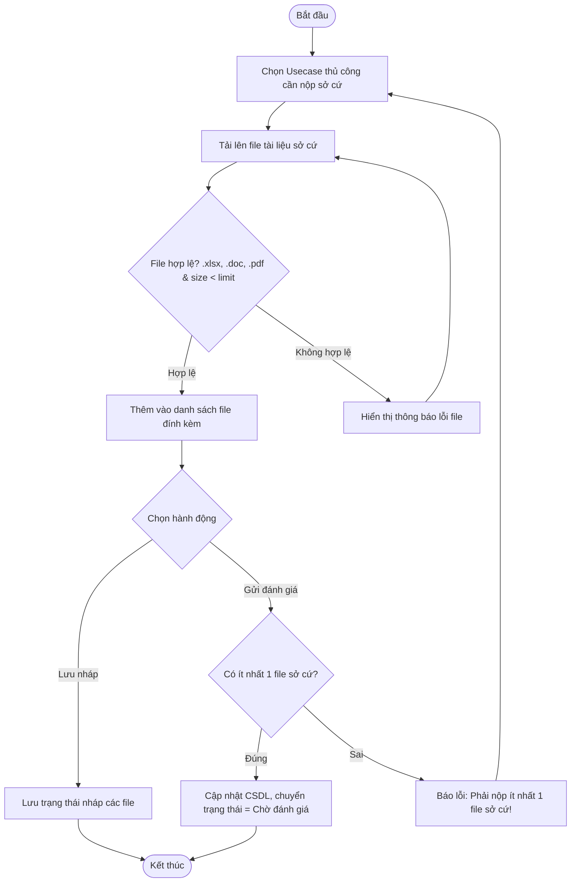

# ĐẶC TẢ YÊU CẦU PHẦN MỀM (SRS) - CHỨC NĂNG: Cung cấp sở cứ (Lần đầu)

---

## 1. Thông tin chức năng

| Thuộc tính | Mô tả chi tiết |
| :--- | :--- |
| **Tên chức năng** | Cung cấp sở cứ (Lần đầu) |
| **Mô tả** | Đầu mối đơn vị thực hiện tải lên các tài liệu minh chứng, sở cứ cho các usecase thủ công được phân bổ để gửi cho đội đánh giá chấm điểm. |
| **Tác nhân** | Admin, Đầu mối đơn vị |
| **Tiền điều kiện** | Chương trình ở trạng thái Đang đánh giá. Đơn vị có usecase thủ công ở trạng thái Chưa nộp sở cứ (status = 0). |
| **Hậu điều kiện** | Tài liệu sở cứ được tải lên thành công. Trạng thái usecase chuyển sang Chờ đánh giá (status = 1). |
| **Ngoại lệ** | File tải lên vượt quá dung lượng cho phép hoặc sai định dạng file. |
| **Yêu cầu nghiệp vụ** | - Cho phép chọn và tải lên nhiều file cho một usecase thủ công. - Ràng buộc định dạng file hỗ trợ: .xlsx, .doc, .pdf. - Ràng buộc bắt buộc: Mỗi usecase thủ công phải đính kèm tối thiểu 1 file sở cứ mới được phép Gửi đánh giá. - Hỗ trợ lưu nháp danh sách file trước khi gửi chính thức. |

### Luồng sự kiện chính

---

## 2. Mô tả chi tiết màn hình (Sườn khung giao diện)

*Ghi chú: Mô tả chi tiết các trường thông tin và thuộc tính điều khiển trên giao diện màn hình chức năng.*

| STT | Thành phần | Kiểu dữ liệu | I/O | Giá trị khởi tạo | Mô tả chi tiết (Mapping CSDL & Thao tác Button) |
| :---: | :--- | :--- | :---: | :--- | :--- |
| 1 | **Nút Chọn file** | Button | INPUT | Enable | Click để chọn file từ máy tính. Hỗ trợ chọn nhiều file cùng lúc |
| 2 | **Danh sách file đã chọn** | Table / List | OUTPUT | Trống | Hiển thị danh sách file đang chuẩn bị upload gồm: Tên file, dung lượng, nút Xóa file |
| 3 | **Nút Lưu nháp** | Button | INPUT | Enable | Lưu tạm thời danh sách file đã chọn dưới trạng thái draft_status = 1 |
| 4 | **Nút Gửi đánh giá** | Button | INPUT | Enable | Chuyển các file thành chính thức (draft_status = 0) và cập nhật trạng thái usecase thành Chờ đánh giá |
| 5 | **Nút Hủy** | Button | INPUT | Enable | Hủy bỏ toàn bộ file đã chọn và quay lại màn hình danh sách |
