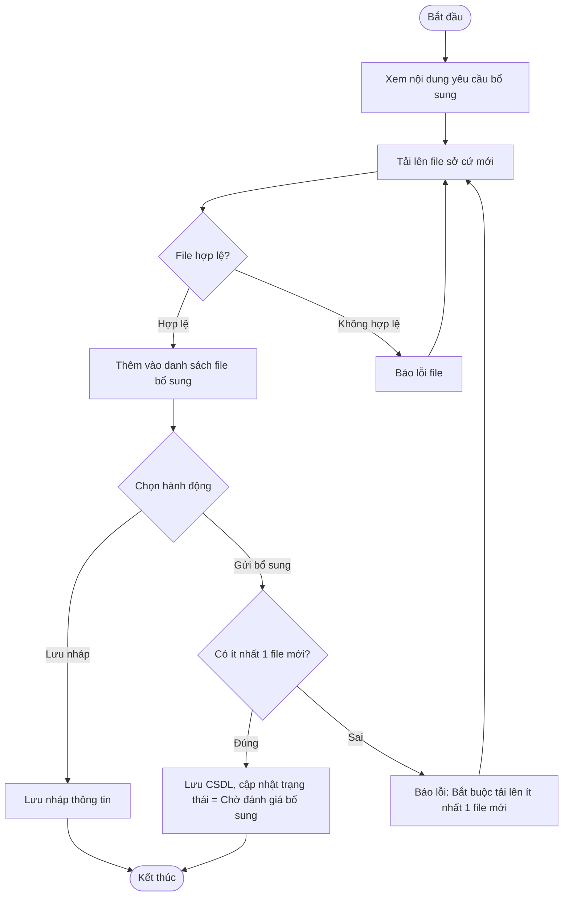

# ĐẶC TẢ YÊU CẦU PHẦN MỀM (SRS) - CHỨC NĂNG: Cung cấp sở cứ bổ sung

---

## 1. Thông tin chức năng

| Thuộc tính | Mô tả chi tiết |
| :--- | :--- |
| **Tên chức năng** | Cung cấp sở cứ bổ sung |
| **Mô tả** | Đầu mối đơn vị tải lên thêm các tài liệu minh chứng mới cho các usecase bị đội đánh giá yêu cầu bổ sung sở cứ để gửi đánh giá lại. |
| **Tác nhân** | Admin, Đầu mối đơn vị |
| **Tiền điều kiện** | Chương trình đang ở trạng thái Đang đánh giá. Usecase thủ công có trạng thái Yêu cầu bổ sung sở cứ (status = 3). |
| **Hậu điều kiện** | Sở cứ bổ sung được gửi đi. Trạng thái usecase chuyển sang Chờ đánh giá bổ sung (status = 4). |
| **Ngoại lệ** | Không tải lên file mới nào hoặc file tải lên không hợp lệ. |
| **Yêu cầu nghiệp vụ** | - Cho phép đầu mối đơn vị xem lý do yêu cầu bổ sung của đầu mối đánh giá. - Bắt buộc phải tải lên tối thiểu 1 file sở cứ mới. - Định dạng file hỗ trợ: .xlsx, .doc, .pdf. - Lưu nháp file sở cứ bổ sung trước khi gửi. |

### Luồng sự kiện chính

---

## 2. Giao diện người dùng (UI)

*Chi tiết thiết kế và thành phần giao diện màn hình xem tại:*
*   [Tài liệu thiết kế giao diện: UI_CUNG_CAP_SO_CU_BO_SUNG.md](file:///Users/whis/Anh/ISAAP/UI/UI_CUNG_CAP_SO_CU_BO_SUNG.md)
