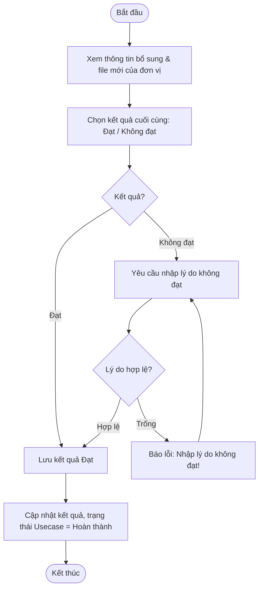

# ĐẶC TẢ YÊU CẦU PHẦN MỀM (SRS) - CHỨC NĂNG: Đánh giá bổ sung

---

## 1. Thông tin chức năng

| Thuộc tính | Mô tả chi tiết |
| :--- | :--- |
| **Tên chức năng** | Đánh giá bổ sung |
| **Mô tả** | Đầu mối đánh giá tiến hành thẩm định các hồ sơ sở cứ bổ sung của đơn vị và đưa ra kết quả kết luận cuối cùng (Đạt hoặc Không đạt) cho usecase. |
| **Tác nhân** | Admin, Đầu mối đánh giá |
| **Tiền điều kiện** | Đơn vị có trạng thái đánh giá thủ công là Chờ đánh giá bổ sung (manual_review_status = 4). Usecase có trạng thái Chờ đánh giá bổ sung (status = 4). |
| **Hậu điều kiện** | Usecase được cập nhật kết quả cuối cùng (Đạt/Không đạt). Trạng thái chuyển sang Hoàn thành (status = 2). |
| **Ngoại lệ** | Chưa chọn kết quả đánh giá cuối cùng hoặc lý do không đạt trống. |
| **Yêu cầu nghiệp vụ** | - Chỉ hiển thị các usecase có trạng thái Chờ đánh giá bổ sung để chấm điểm. - Cho phép xem lý do yêu cầu bổ sung cũ và tài liệu bổ sung mới nộp của đơn vị. - Kết quả đánh giá bổ sung bắt buộc phải là Đạt hoặc Không đạt (không cho phép yêu cầu bổ sung tiếp). - Yêu cầu nhập lý do nếu đánh giá Không đạt. |

### Luồng sự kiện chính

---

## 2. Giao diện người dùng (UI)

*Chi tiết thiết kế và thành phần giao diện màn hình xem tại:*
*   [Tài liệu thiết kế giao diện: UI_DANH_GIA_BO_SUNG.md](file:///Users/whis/Anh/ISAAP/UI/UI_DANH_GIA_BO_SUNG.md)
