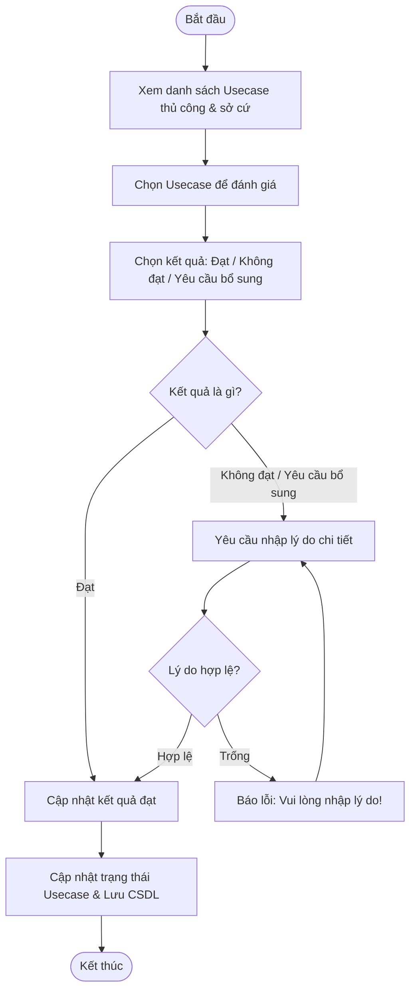

# ĐẶC TẢ YÊU CẦU PHẦN MỀM (SRS) - CHỨC NĂNG: Đánh giá đơn vị (Đánh giá lần đầu)

---

## 1. Thông tin chức năng

| Thuộc tính | Mô tả chi tiết |
| :--- | :--- |
| **Tên chức năng** | Đánh giá đơn vị (Đánh giá lần đầu) |
| **Mô tả** | Đầu mối đánh giá thực hiện xem hồ sơ sở cứ của đơn vị và đưa ra kết quả đánh giá (Đạt, Không đạt hoặc Yêu cầu bổ sung sở cứ) cho từng usecase thủ công. |
| **Tác nhân** | Admin, Đầu mối đánh giá |
| **Tiền điều kiện** | Đơn vị được phân bổ thuộc chương trình đang chạy. Trạng thái đánh giá thủ công của đơn vị là Chờ đánh giá (manual_review_status = 1) và Usecase có trạng thái là Chờ đánh giá. |
| **Hậu điều kiện** | Cập nhật kết quả và trạng thái của từng usecase thủ công. Đơn vị chuyển trạng thái sang Hoàn thành hoặc Yêu cầu bổ sung. |
| **Ngoại lệ** | Không tìm thấy sở cứ đính kèm, hoặc usecase đã được đánh giá trước đó. |
| **Yêu cầu nghiệp vụ** | - Hiển thị danh sách các Usecase thủ công cần chấm điểm của đơn vị. - Cho phép tải xuống các file sở cứ của đơn vị. - Yêu cầu nhập lý do nếu chọn kết quả Không đạt hoặc Yêu cầu bổ sung sở cứ. - Lưu nháp thông tin trước khi gửi kết quả chính thức. |

### Luồng sự kiện chính

---

## 2. Giao diện người dùng (UI)

*Chi tiết thiết kế và thành phần giao diện màn hình xem tại:*
*   [Tài liệu thiết kế giao diện: UI_DANH_GIA_DON_VI.md](file:///Users/whis/Anh/ISAAP/UI/UI_DANH_GIA_DON_VI.md)
