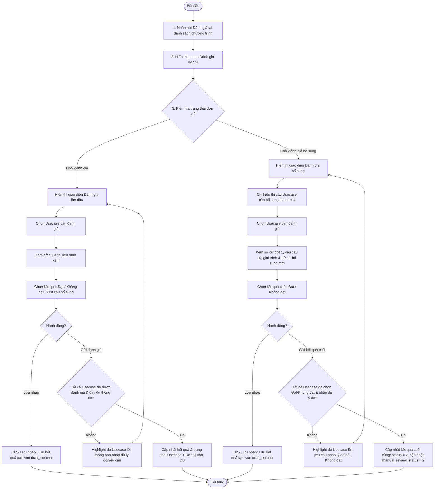
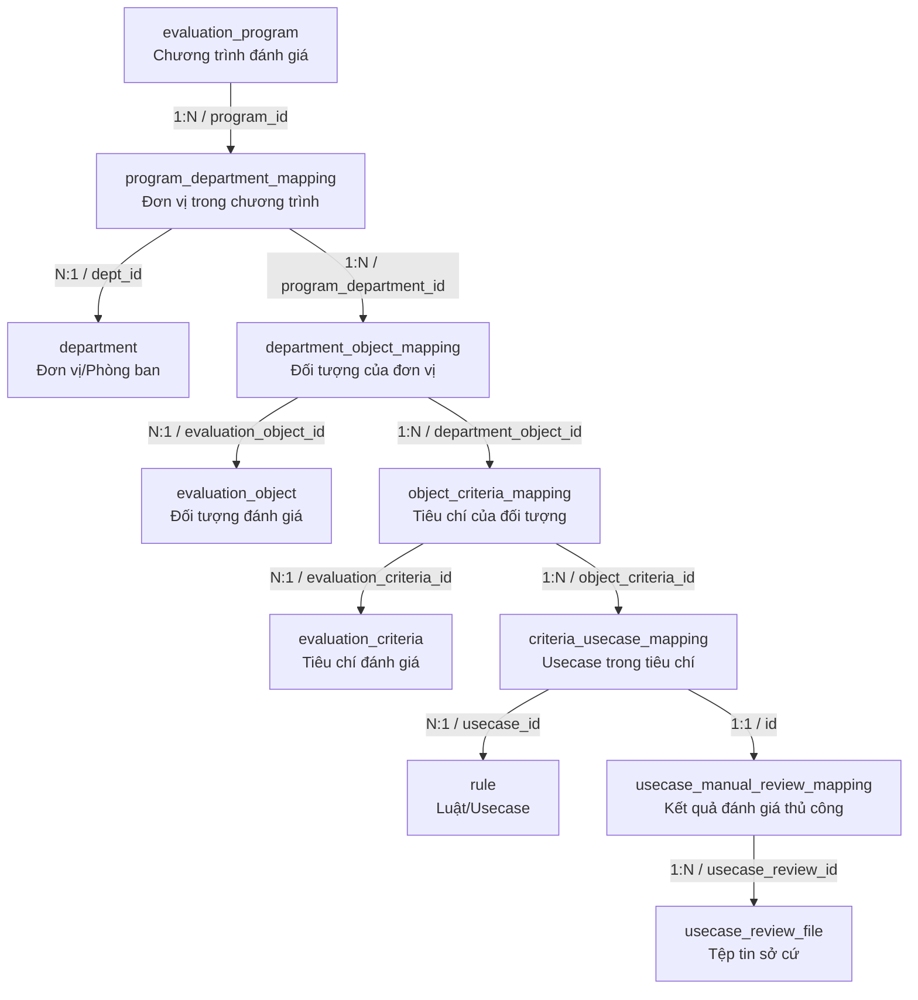

# ĐẶC TẢ YÊU CẦU PHẦN MỀM (SRS) - CHỨC NĂNG: ĐÁNH GIÁ ĐƠN VỊ

**DỰ ÁN: NỀN TẢNG QUẢN LÝ TUÂN THỦ AN TOÀN THÔNG TIN (ISAAP)**
**PHÂN HỆ: QUẢN LÝ & CHẠY CHƯƠNG TRÌNH ĐÁNH GIÁ**

---

### Hà Nội, 06 - 2026

---

## BẢNG GHI NHẬN THAY ĐỔI

| Ngày thay đổi | Vị trí thay đổi | A/M/D (*) | Nguồn gốc | Phiên bản cũ | Mô tả thay đổi | Phiên bản mới |
| :--- | :--- | :---: | :--- | :--- | :--- | :--- |
| 05/06/2026 | Toàn bộ tài liệu | M | Yêu cầu người dùng | V1.0 | Tạo sườn khung mô tả giao diện và các trường thông tin cơ bản cho chức năng Đánh giá đơn vị. | V1.1 |
| 10/06/2026 | Toàn bộ tài liệu | M | Yêu cầu người dùng | V1.1 | Chi tiết hóa nghiệp vụ Đánh giá đơn vị, tích hợp Đánh giá lần đầu và Đánh giá bổ sung vào một tài liệu duy nhất theo mẫu chuẩn mới. | V2.0 |

\*Ghi chú ký hiệu (\*):
- **A\***: Add (Tạo mới)
- **M**: Modify (Sửa đổi)
- **D**: Delete (Xóa bỏ)

| Mã chức năng | Mã thao tác |
| :--- | :--- |
| EVALUATION_PROGRAM_MANAGEMENT | REVIEW |

---

### 3.1.5. Đánh giá đơn vị

#### 3.1.5.1. Thông tin chung

| Thuộc tính | Mô tả chi tiết |
| :--- | :--- |
| **Tên chức năng** | Đánh giá đơn vị / Đánh giá bổ sung |
| **Mô tả** | Cho phép Đầu mối đánh giá (Reviewer) hoặc Admin xem xét các sở cứ (tệp minh chứng) và nội dung giải trình mà đơn vị đã cung cấp, sau đó tiến hành thẩm định đánh giá kết quả (Đạt / Không đạt) hoặc yêu cầu bổ sung sở cứ cho từng usecase thủ công của đơn vị được đánh giá. |
| **Tác nhân** | - Người dùng thuộc nhóm Admin hệ thống (toàn quyền xem và thực hiện nhưng không trực tiếp vận hành luồng nghiệp vụ).<br>- Người dùng khác nhóm quyền admin hệ thống nhưng được gán quyền thao tác Đánh giá đơn vị (Mã thao tác: `REVIEW` thuộc Chức năng: `EVALUATION_PROGRAM_MANAGEMENT`) và được phân công làm đầu mối đánh giá (`reviewer_id`) của đơn vị trong chương trình đánh giá. |
| **Điều kiện trước** | - Chương trình đánh giá đang ở trạng thái **"Đang đánh giá"** (`evaluation_program.status = 1`).<br>- Trạng thái đánh giá thủ công của đơn vị (`manual_review_status`) là **"Chờ đánh giá"** (mã 1) hoặc **"Chờ đánh giá bổ sung"** (mã 4). |
| **Điều kiện sau** | **Trường hợp Lưu nháp:**<br>- Các kết quả đánh giá tạm thời (Đạt/Không đạt/Yêu cầu bổ sung, lý do không đạt, nội dung yêu cầu bổ sung) được ghi nhận vào cột `draft_content` của bảng `usecase_manual_review_mapping`. Usecase và đơn vị giữ nguyên trạng thái cũ.<br>**Trường hợp Xác nhận kết quả Đánh giá lần đầu (khi đơn vị ở trạng thái "Chờ đánh giá"):**<br>- Với từng usecase thủ công:<br>  + Nếu chọn **Đạt**: `result = 1`, `status = 2` (Hoàn thành), `reason_fail = null`, `request_content = null`.<br>  + Nếu chọn **Không đạt**: `result = 0`, `status = 2` (Hoàn thành), `reason_fail = {lý do không đạt}`, `request_content = null`.<br>  + Nếu chọn **Yêu cầu bổ sung**: `result = null`, `status = 3` (Yêu cầu bổ sung), `request_content = {yêu cầu bổ sung}`, `reason_fail = null`.<br>- Trạng thái chung của đơn vị (`program_department_mapping.manual_review_status`):<br>  + Nếu có ít nhất 1 usecase có trạng thái `status = 3` (Yêu cầu bổ sung) -> cập nhật `manual_review_status = 3` (Yêu cầu bổ sung).<br>  + Nếu tất cả các usecase đều đạt hoặc không đạt (`status = 2`):<br>    * Cập nhật đơn vị sang trạng thái `manual_review_status = 2` (Hoàn thành).<br>    * Cập nhật kết quả đánh giá chung của đơn vị (`evaluation_result`): `0` (Không đạt) nếu có ít nhất 1 usecase bị đánh giá Không đạt (`result = 0`), ngược lại cập nhật `1` (Đạt) nếu toàn bộ usecase đều Đạt (`result = 1`).<br>**Trường hợp Xác nhận kết quả Đánh giá bổ sung (khi đơn vị ở trạng thái "Chờ đánh giá bổ sung"):**<br>- Với từng usecase thủ công đang ở trạng thái `status = 4` (Chờ đánh giá bổ sung):<br>  + Nếu chọn **Đạt**: `result = 1`, `status = 2` (Hoàn thành), `reason_fail = null`.<br>  + Nếu chọn **Không đạt**: `result = 0`, `status = 2` (Hoàn thành), `reason_fail = {lý do không đạt bổ sung}`.<br>- Trạng thái chung của đơn vị (`program_department_mapping.manual_review_status`):<br>  + Khi toàn bộ các usecase chờ đánh giá bổ sung (`status = 4`) được cập nhật sang `status = 2` (Hoàn thành):<br>    * Cập nhật đơn vị sang trạng thái `manual_review_status = 2` (Hoàn thành).<br>    * Cập nhật kết quả đánh giá chung của đơn vị (`evaluation_result`): `0` (Không đạt) nếu có ít nhất 1 usecase trong chương trình có `result = 0`, ngược lại cập nhật `1` (Đạt). |
| **Ngoại lệ** | - Lỗi kết nối mạng hoặc lỗi máy chủ.<br>- Chuyên gia không chọn kết quả đánh giá hoặc chọn kết quả nhưng bỏ trống các trường thông tin bắt buộc (như lý do không đạt, nội dung yêu cầu bổ sung) -> Hệ thống từ chối xác nhận và hiển thị cảnh báo lỗi tương ứng dưới từng usecase bị lỗi. |
| **Các yêu cầu đặc biệt** | - Hỗ trợ tính năng xem trước (Preview) trực tiếp nội dung các tệp tin sở cứ dạng phổ biến (`*.pdf`, `*.xlsx`, `*.docx`, `*.doc`) ngay trên giao diện popup.<br>- Đối với đánh giá bổ sung (lần 2), chuyên gia chỉ được chọn Đạt hoặc Không đạt (không cho phép tiếp tục Yêu cầu bổ sung). |

**Sơ đồ luồng xử lý chức năng:**



#### 3.1.5.2. Màn hình thiết kế (UI Layout)

- **Màn hình Đánh giá đơn vị lần 1 (Đánh giá lần đầu):**
  
- **Màn hình Đánh giá đơn vị lần 2 (Đánh giá bổ sung):**
  
- **Giao diện đánh giá chi tiết từng Usecase:**
  

#### 3.1.5.3. Đặc tả chi tiết các thành phần giao diện

##### A. Thành phần chung của Popup

| STT | Thành phần | Kiểu thành phần | I/O | Quy tắc hiển thị & Giá trị | Mô tả chi tiết hành động / Mapping CSDL |
| :---: | :--- | :--- | :---: | :--- | :--- |
| 1 | **Tiêu đề popup** | Label | Output | `"Đánh giá đơn vị"` | Hiển thị cố định ở phía trên cùng của popup. |
| 2 | **Đóng [X] / Hủy bỏ** | Button | Input | N/A | - Click để đóng popup và trở về màn hình trước.<br>- **Quy tắc xác nhận**: Nếu chuyên gia chưa thay đổi kết quả đánh giá nào thì đóng ngay. Nếu đã chỉnh sửa bất kỳ trường nào thì hiển thị **Popup xác nhận hủy bỏ**. |
| 3 | **Popup xác nhận hủy bỏ** | Modal Popup | Input | Tiêu đề: `"Xác nhận hủy bỏ"`<br>Nội dung: `"Dữ liệu đã thay đổi nhưng chưa được lưu. Bạn có chắc chắn muốn thoát không?"` | - Gồm 2 nút: `Hủy bỏ` và `Xác nhận`.<br>- Click `Xác nhận`: Đóng toàn bộ popup, hủy bỏ các thay đổi chưa lưu và quay lại màn hình trước.<br>- Click `Hủy bỏ`: Đóng popup xác nhận, giữ nguyên trạng thái popup Đánh giá đơn vị để chuyên gia tiếp tục làm việc. |
| 4 | **Danh sách đơn vị** | Dropdown Menu | Input | Hiển thị danh sách các đơn vị trong chương trình mà chuyên gia có quyền đánh giá. | - **Phân quyền truy cập**:<br>  + *Với Admin hệ thống*: Hiển thị tất cả các đơn vị có trạng thái đánh giá thủ công là `1` (Chờ đánh giá) hoặc `4` (Chờ đánh giá bổ sung).<br>  + *Với Reviewer*: Chỉ hiển thị các đơn vị mà reviewer đó được phân công (`reviewer_id` trong `program_department_mapping`) và đơn vị có trạng thái `1` hoặc `4`.<br>- **Định dạng hiển thị**: `{tên đơn vị} {trạng thái đánh giá thủ công}` (Ví dụ: `Ban Công nghệ thông tin (Chờ đánh giá)` hoặc `Trung tâm dữ liệu (Chờ đánh giá bổ sung)`).<br>- Mặc định: Chọn đơn vị đầu tiên trong danh sách hợp lệ.<br>- Click chọn đơn vị khác: Tải lại cấu trúc cây thông tin tương ứng. |
| 5 | **Nội dung đánh giá** | Tree Panel | Output | Dạng cây: **Đối tượng** >> **Tiêu chí** >> **Usecase** | Hiển thị cấu trúc phân cấp tương tự như màn hình cung cấp sở cứ, cho phép cuộn dọc (scroll) nội dung để duyệt qua danh sách các usecase thủ công của đơn vị. |

---

##### B. Trường hợp 1: Đơn vị có trạng thái “Chờ đánh giá” (Đánh giá lần đầu)

Khi đơn vị được chọn có trạng thái đánh giá thủ công là "Chờ đánh giá" (`manual_review_status = 1`), giao diện hiển thị toàn bộ các Usecase thủ công cần thẩm định:

| STT | Thành phần | Kiểu thành phần | I/O | Quy tắc hiển thị & Giá trị | Mô tả chi tiết hành động / Mapping CSDL |
| :---: | :--- | :--- | :---: | :--- | :--- |
| 1 | **Đối tượng đánh giá** | Accordion Panel | Output | Tiêu đề: `{tên đối tượng} {tổng số usecase thủ công cần đánh giá}` kèm danh sách chỉ mục tiêu chí. | - Click chọn chỉ mục tiêu chí (1, 2, 3...) để di chuyển nhanh (scroll) đến đầu tiêu chí đó.<br>- **Quy tắc màu sắc chỉ mục**:<br>  + **Màu xám**: Có ít nhất 1 usecase trong tiêu chí chưa được chuyên gia chọn kết quả đánh giá.<br>  + **Màu xanh**: Tất cả các usecase trong tiêu chí đã được đánh giá hợp lệ.<br>  + **Màu đỏ**: Có ít nhất 1 usecase bị phát hiện lỗi validate khi thực hiện "Gửi đánh giá". |
| 2 | **Tiêu chí đánh giá** | Sub-Panel | Output | Tiêu đề: `{số thứ tự} {tên tiêu chí}` | Chỉ hiển thị các tiêu chí có chứa usecase thủ công của đơn vị được đánh giá. |
| 3 | **Danh sách Usecase** | Table | Output | Danh sách usecase thủ công thuộc tiêu chí. | Hỗ trợ icon sắp xếp tăng/giảm dần theo cột Tên usecase (3 lần click: tăng, giảm, mặc định). |
| 4 | **Tên Usecase** | Label / Tooltip | Output | Định dạng: `[Icon xem chi tiết] {mã usecase} - {tên usecase}` | Hover chuột vào `[Icon xem chi tiết]` hiển thị Tooltip chứa các thông tin hướng dẫn của usecase (`rule.evaluation_guideline`, `rule.scoring_guideline`, mục tiêu đánh giá). |
| 5 | **Sở cứ đã nộp** | File List | Output | Danh sách file minh chứng đơn vị đã tải lên ở lần 1. | - Định dạng hiển thị: `{tên file}`. Tên file dài hiển thị dạng rút gọn `(...).*đuôi file`. Hỗ trợ click để xem trước (Preview) hoặc tải về thiết bị.<br>- Giới hạn hiển thị: Tối đa 5 file trực tiếp trên dòng. Nếu >5 file hiển thị 4 file + hyperlink **"Xem thêm"** (mở popup danh sách sở cứ). |
| 6 | **Kết quả đánh giá** | Radio Group | Input | Gồm 3 tùy chọn: **Đạt**, **Không đạt**, **Yêu cầu bổ sung**. | - Giá trị khởi tạo: Chưa chọn (hoặc load từ bản nháp `draft_content` nếu có).<br>- Bắt buộc phải chọn 1 trong 3 kết quả đối với mỗi usecase.<br>- **Quy tắc động**:<br>  + Nếu chọn *Không đạt*: Hiển thị trường nhập **Lý do không đạt**.<br>  + Nếu chọn *Yêu cầu bổ sung*: Hiển thị trường nhập **Yêu cầu bổ sung**. |
| 7 | **Lý do không đạt** | Textarea | Input | Tối đa 500 ký tự. Placeholder: `"Nhập lý do không đạt."` | - Chỉ bắt buộc nhập và hiển thị khi kết quả đánh giá chọn là "Không đạt". Hỗ trợ tự giãn chiều cao, tối đa 5 dòng, quá 5 dòng xuất hiện scroll.<br>- Có icon xóa nhanh `[x]`. |
| 8 | **Yêu cầu bổ sung** | Textarea | Input | Tối đa 500 ký tự. Placeholder: `"Nhập yêu cầu bổ sung sở cứ."` | - Chỉ bắt buộc nhập và hiển thị khi kết quả đánh giá chọn là "Yêu cầu bổ sung". Hỗ trợ tự giãn chiều cao, tối đa 5 dòng, quá 5 dòng xuất hiện scroll.<br>- Có icon xóa nhanh `[x]`. |

---

##### C. Trường hợp 2: Đơn vị có trạng thái “Chờ đánh giá bổ sung” (Đánh giá bổ sung)

Khi đơn vị được chọn có trạng thái đánh giá thủ công là "Chờ đánh giá bổ sung" (`manual_review_status = 4`), giao diện được tinh gọn, **chỉ hiển thị các Usecase cần đánh giá bổ sung** (là các usecase có `status = 4` trong CSDL):

| STT | Thành phần | Kiểu thành phần | I/O | Quy tắc hiển thị & Giá trị | Mô tả chi tiết hành động / Mapping CSDL |
| :---: | :--- | :--- | :---: | :--- | :--- |
| 1 | **Đối tượng đánh giá** | Accordion Panel | Output | Chỉ hiển thị đối tượng có chứa ít nhất 1 usecase đang ở trạng thái `status = 4`. | Quy tắc hoạt động tương tự như Trường hợp 1 nhưng số liệu thống kê chỉ tính trên các usecase cần bổ sung. |
| 2 | **Tiêu chí đánh giá** | Sub-Panel | Output | Chỉ hiển thị các tiêu chí có chứa ít nhất 1 usecase ở trạng thái `status = 4`. | Hiển thị tiêu đề `{số thứ tự} {tên tiêu chí}`. |
| 3 | **Danh sách Usecase** | Table | Output | Chỉ hiển thị các usecase của đơn vị có trạng thái `status = 4`. | Tên usecase, mã usecase, tooltip hướng dẫn. |
| 4 | **Sở cứ đã nộp đợt 1** | File List | Output | Danh sách file minh chứng nộp lần đầu (`round = 1`). | Hiển thị dạng text, chỉ cho phép tải xuống hoặc xem trước, không có nút xóa. |
| 5 | **Yêu cầu bổ sung cũ** | Label | Output | Nội dung text yêu cầu bổ sung từ đợt 1. | Lấy từ `usecase_manual_review_mapping.request_content` (chỉ hiển thị dạng read-only). |
| 6 | **Sở cứ bổ sung mới** | File List | Output | Danh sách file minh chứng đơn vị mới nộp bổ sung (`round = 2`). | Chỉ cho phép tải xuống hoặc xem trước. Không cho phép xóa. |
| 7 | **Ý kiến giải trình của đơn vị** | Label | Output | Nội dung giải trình đơn vị nhập khi nộp bổ sung. | Lấy từ `usecase_manual_review_mapping.respond_content` (chỉ hiển thị dạng read-only, hỗ trợ scroll dọc nếu text quá dài). |
| 8 | **Kết quả đánh giá bổ sung** | Radio Group | Input | Chỉ gồm 2 tùy chọn: **Đạt** và **Không đạt**. | - **Không có tùy chọn "Yêu cầu bổ sung"** ở vòng này.<br>- Giá trị khởi tạo: Chưa chọn (hoặc load từ bản nháp `draft_content` nếu có).<br>- Bắt buộc phải chọn kết quả. |
| 9 | **Lý do không đạt bổ sung** | Textarea | Input | Tối đa 500 ký tự. Placeholder: `"Nhập lý do không đạt bổ sung."` | - Bắt buộc hiển thị và nhập khi chọn kết quả là "Không đạt". |

---

##### D. Popup danh sách sở cứ (Hiển thị khi click "Xem thêm")

- Khi click vào hyperlink `"Xem thêm"` tại danh sách sở cứ của một usecase, hệ thống hiển thị popup chứa toàn bộ danh sách tệp đính kèm.
- **Bố cục hiển thị file**: `{loại file - icon} {tên file} ({dung lượng})` kèm icon Tải xuống `[Download]`. Đối với giao diện Đánh giá của chuyên gia, **không hiển thị icon xóa file** (chuyên gia chỉ có quyền đọc sở cứ, không được xóa).
- Định dạng hiển thị cuộn: Nếu danh sách có >4 file, popup hiển thị scroll dọc.

---

##### E. Thao tác ở thanh điều khiển chân trang (Footer Actions)

| STT | Thành phần | Kiểu thành phần | I/O | Trạng thái mặc định | Mô tả chi tiết hành động |
| :---: | :--- | :--- | :---: | :--- | :--- |
| 1 | **Lưu nháp** | Button | Input | Luôn Enable | Click gửi toàn bộ kết quả đã chọn/nhập (ở trạng thái hiện tại) lên server để lưu vào trường `draft_content` của bảng `usecase_manual_review_mapping`. Trạng thái của đơn vị và usecase không thay đổi. |
| 2 | **Gửi đánh giá / Gửi kết quả** | Button | Input | Disable mặc định | - Trường hợp 1: Hiển thị chữ `"Gửi đánh giá"`. Chỉ hiển thị đối với đơn vị đang có trạng thái `"Chờ đánh giá"`. Enable khi tất cả các usecase hiển thị trên cây thông tin đều đã được chọn kết quả đánh giá và nhập thông tin bổ trợ đầy đủ.<br>- Trường hợp 2: Hiển thị chữ `"Gửi kết quả bổ sung"`. Chỉ hiển thị đối với đơn vị có trạng thái `"Chờ đánh giá bổ sung"`. Enable khi tất cả các usecase hiển thị (usecase cần bổ sung) đã chọn kết quả Đạt hoặc Không đạt. |

---

#### 3.1.5.4. Ánh xạ dữ liệu CSDL cho giao diện Popup

##### B.1. Ánh xạ chi tiết giữa UI và các bảng/trường CSDL

| Giao diện thành phần | Tên thuộc tính UI | Bảng CSDL | Trường dữ liệu | Mô tả ánh xạ nghiệp vụ |
| :--- | :--- | :--- | :--- | :--- |
| **Thông tin chung đơn vị**| Tên đơn vị | `department` | `name` | Hiển thị trong Dropdown đơn vị. |
| | Trạng thái nộp của đơn vị | `program_department_mapping` | `manual_review_status` | Phân biệt Trường hợp 1 (`1`: Chờ đánh giá) và Trường hợp 2 (`4`: Chờ đánh giá bổ sung). |
| **Đối tượng đánh giá** | Tên đối tượng đánh giá | `evaluation_object` | `name` | Cấp 1 của cây thư mục. |
| | Tổng số usecase thủ công cần nộp | `criteria_usecase_mapping` | Đếm bản ghi | Tổng số lượng usecase thủ công thuộc đối tượng đó (ở TH2 chỉ tính các usecase có `status = 4`). |
| **Tiêu chí đánh giá** | Tên tiêu chí đánh giá | `evaluation_criteria` | `name` | Cấp 2 của cây thư mục. |
| **Danh sách Usecase** | Mã usecase | `rule` | `code` | Mã duy nhất của usecase thủ công (Ví dụ: `UC-SEC-01`). |
| | Tên usecase | `rule` | `name` | Tên hiển thị của usecase. |
| | Hướng dẫn đánh giá | `rule` | `evaluation_guideline` | Hiển thị trong tooltip chi tiết. |
| | Hướng dẫn chấm điểm | `rule` | `scoring_guideline` | Hiển thị trong tooltip chi tiết. |
| | Trạng thái usecase | `usecase_manual_review_mapping` | `status` | Trạng thái xử lý của usecase (`1`: Chờ đánh giá, `4`: Chờ đánh giá bổ sung). |
| | Nội dung yêu cầu bổ sung | `usecase_manual_review_mapping` | `request_content` | Lưu yêu cầu từ chuyên gia (ở TH2 hiển thị dạng read-only). |
| | Mô tả nộp bổ sung | `usecase_manual_review_mapping` | `respond_content` | Nội dung giải trình của đơn vị (ở TH2 hiển thị dạng read-only). |
| | Kết quả đánh giá | `usecase_manual_review_mapping` | `result` | Kết quả (`1`: Đạt, `0`: Không đạt, `null`: Khởi tạo). |
| | Nội dung lưu nháp | `usecase_manual_review_mapping` | `draft_content` | JSONB chứa thông tin lưu nháp của chuyên gia: `{ "result": 1/0/null, "reason_fail": "", "request_content": "" }`. |
| **Danh sách file sở cứ**| Tên file sở cứ | `usecase_review_file` | `name` | Tên tệp tin đã tải lên hệ thống. |
| | Dung lượng file | `usecase_review_file` | `size` | Định dạng hiển thị dung lượng (KB, MB). |
| | Đường dẫn vật lý của file | `usecase_review_file` | `path` | Đường dẫn để người dùng tải file hoặc preview. |
| | Vòng nộp sở cứ | `usecase_review_file` | `round` | Phân biệt sở cứ lần 1 (`round = 1`) và sở cứ bổ sung lần 2 (`round = 2`). |

##### B.2. Sơ đồ liên kết và mối quan hệ JOIN giữa các bảng CSDL

Để truy xuất cấu trúc cây đánh giá cho đơn vị được chọn, Backend thực hiện JOIN các bảng dữ liệu theo sơ đồ dưới đây:



**Bảng chi tiết các điều kiện liên kết (JOIN Conditions):**

| Bước JOIN | Bảng nguồn (Source) | Bảng đích (Target) | Điều kiện liên kết (ON Clause) | Mục đích nghiệp vụ |
| :---: | :--- | :--- | :--- | :--- |
| **1** | `evaluation_program` (ep) | `program_department_mapping` (pdm) | `pdm.program_id = ep.id` | Xác định các đơn vị tham gia chương trình. |
| **2** | `program_department_mapping` (pdm) | `department` (d) | `d.id = pdm.dept_id` | Lấy tên đơn vị để hiển thị dropdown chọn đơn vị. |
| **3** | `program_department_mapping` (pdm) | `department_object_mapping` (dom) | `dom.program_department_id = pdm.id` | Lấy các đối tượng đánh giá phân bổ cho đơn vị. |
| **4** | `department_object_mapping` (dom) | `evaluation_object` (eo) | `eo.id = dom.evaluation_object_id` | Lấy tên đối tượng đánh giá để hiển thị cấp 1 của cây thư mục. |
| **5** | `department_object_mapping` (dom) | `object_criteria_mapping` (ocm) | `ocm.department_object_id = dom.id` | Lấy các tiêu chí được liên kết. |
| **6** | `object_criteria_mapping` (ocm) | `evaluation_criteria` (ec) | `ec.id = ocm.evaluation_criteria_id` | Lấy tên tiêu chí để hiển thị cấp 2 của cây thư mục. |
| **7** | `object_criteria_mapping` (ocm) | `criteria_usecase_mapping` (cum) | `cum.object_criteria_id = ocm.id` | Lấy danh sách cấu hình usecase thuộc tiêu chí. |
| **8** | `criteria_usecase_mapping` (cum) | `rule` (r) | `r.id = cum.usecase_id` | Lấy thông tin mã/tên usecase, hướng dẫn. *Lọc loại usecase thủ công (`r.type = 'Manual'`).* |
| **9** | `criteria_usecase_mapping` (cum) | `usecase_manual_review_mapping` (umrm) | `umrm.criteria_usecase_id = cum.id` | Lấy trạng thái, kết quả hiện tại, nội dung giải trình, yêu cầu và nội dung nháp của usecase. |
| **10** | `usecase_manual_review_mapping` (umrm) | `usecase_review_file` (urf) | `urf.usecase_review_id = umrm.id` | Lấy danh sách tệp tin sở cứ đính kèm thuộc usecase (chỉ lấy các file đã chính thức `draft_status = 0`). |

---

#### 3.1.5.5. Luồng nghiệp vụ chi tiết

##### A. Quy trình tải thông tin ban đầu khi mở Popup Đánh giá đơn vị
1. Khi chuyên gia click chọn nút Đánh giá đơn vị trên danh sách chương trình, Frontend gửi request `GET /api/evaluation/details` kèm tham số `programId` và `deptId` được chọn.
2. Backend thực hiện truy vấn cơ sở dữ liệu dựa theo sơ đồ JOIN ở mục 3.1.5.4:
   - **TH1: Đơn vị có trạng thái `manual_review_status = 1` (Chờ đánh giá):**
     - Trả về toàn bộ các Đối tượng, Tiêu chí và Usecase thủ công thuộc đơn vị.
     - Lấy kèm danh sách file sở cứ có `draft_status = 0` và `round = 1`.
     - Lấy kèm dữ liệu trong trường `draft_content` (nếu có) để Frontend phục hồi các dữ liệu đã lưu nháp trước đó lên form đánh giá.
   - **TH2: Đơn vị có trạng thái `manual_review_status = 4` (Chờ đánh giá bổ sung):**
     - Chỉ trả về các Đối tượng, Tiêu chí chứa Usecase thủ công có trạng thái `status = 4` (Chờ đánh giá bổ sung). Các usecase khác ở trạng thái `status = 2` (Đã hoàn thành đánh giá ở vòng 1) không hiển thị trên giao diện đánh giá bổ sung.
     - Lấy kèm danh sách file sở cứ đợt 1 (`round = 1`), yêu cầu bổ sung đợt 1 (`request_content`), file sở cứ bổ sung mới (`round = 2`), giải trình bổ sung của đơn vị (`respond_content`), và dữ liệu nháp của reviewer (`draft_content`).
3. Frontend nhận dữ liệu và hiển thị lên giao diện tương ứng theo từng trường hợp.

---

##### B. TH1: Đánh giá lần đầu (Cho đơn vị có trạng thái "Chờ đánh giá")

###### 1. Trường hợp Lưu nháp
Khi người dùng click nút **Lưu nháp**:
1. Frontend tổng hợp danh sách kết quả đánh giá tạm thời của các usecase đang hiển thị trên form và gọi API `POST /api/evaluation/save-draft` truyền lên:
   - `programId`, `deptId`.
   - Mảng `evaluations`: danh sách đối tượng chứa `criteriaUsecaseId`, `result` (1/0/null), `reasonFail` (nếu chọn Không đạt), `requestContent` (nếu chọn Yêu cầu bổ sung).
2. Backend thực hiện cập nhật cột `draft_content` của bảng `usecase_manual_review_mapping` tương ứng với mỗi Usecase bằng JSONB:
   - `draft_content = { "result": :result, "reason_fail": :reasonFail, "request_content": :requestContent }`
   - Cập nhật `updated_by = currentUserId`, `updated_at = NOW()`.
   - Giữ nguyên trạng thái `status = 1` của Usecase và `manual_review_status = 1` của đơn vị.
3. Hệ thống phản hồi thành công, Frontend hiển thị toast thông báo: `"Đã lưu nháp kết quả đánh giá thành công"`.

###### 2. Trường hợp Xác nhận đánh giá (Gửi kết quả)
Khi người dùng click nút **Gửi đánh giá**:
1. **Bước 1 (Validate phía Client)**: Frontend kiểm tra toàn bộ các usecase xem đã được chọn kết quả chưa.
   - Nếu có usecase chưa chọn kết quả -> hiển thị thông báo lỗi, highlight dòng usecase đó bằng màu đỏ, focus và scroll màn hình đến dòng đó, dừng luồng gửi.
   - Nếu có usecase chọn "Không đạt" nhưng bỏ trống "Lý do không đạt" -> hiển thị báo lỗi dưới ô nhập liệu và dừng gửi.
   - Nếu có usecase chọn "Yêu cầu bổ sung" nhưng bỏ trống "Yêu cầu bổ sung" -> hiển thị báo lỗi dưới ô nhập liệu và dừng gửi.
2. **Bước 2 (Gọi API)**: Frontend gọi API `POST /api/evaluation/submit` với request body chứa toàn bộ thông tin kết quả đánh giá chính thức của các usecase.
3. **Bước 3 (Backend xử lý trong Transaction)**:
   - Với mỗi Usecase thủ công:
     - Cập nhật dữ liệu bảng `usecase_manual_review_mapping`:
       - **TH chọn Đạt**: Ghi nhận `result = 1`, `status = 2` (Hoàn thành), `reason_fail = null`, `request_content = null`.
       - **TH chọn Không đạt**: Ghi nhận `result = 0`, `status = 2` (Hoàn thành), `reason_fail = :reasonFail`, `request_content = null`.
       - **TH chọn Yêu cầu bổ sung**: Ghi nhận `result = null`, `status = 3` (Yêu cầu bổ sung), `request_content = :requestContent`, `reason_fail = null`.
       - Cập nhật `draft_content = null` (Xóa nội dung nháp).
       - Cập nhật `updated_by = currentUserId`, `updated_at = NOW()`, `evaluated_at = NOW()`.
   - Cập nhật trạng thái chung của đơn vị tại bảng `program_department_mapping`:
     - **TH1**: Có ít nhất một Usecase thủ công có trạng thái `status = 3` (Yêu cầu bổ sung):
       - Cập nhật `manual_review_status = 3` (Yêu cầu bổ sung), `updated_by = currentUserId`, `updated_at = NOW()`.
     - **TH2**: Toàn bộ các Usecase thủ công đều ở trạng thái `status = 2` (Hoàn thành - đã đạt hoặc không đạt):
       - Cập nhật `manual_review_status = 2` (Hoàn thành), `evaluated_at = NOW()`, `updated_by = currentUserId`, `updated_at = NOW()`.
       - Tính toán kết quả chung của đơn vị (`evaluation_result`):
         - Nếu có ít nhất 1 usecase có `result = 0` (Không đạt) -> Cập nhật `evaluation_result = 0` (Không đạt).
         - Nếu toàn bộ các usecase đều đạt `result = 1` -> Cập nhật `evaluation_result = 1` (Đạt).
4. **Bước 4 (Kết quả)**: Hệ thống đóng popup, tải lại danh sách chương trình và hiển thị thông báo thành công: `"Đã hoàn thành đánh giá đơn vị thành công"`.

---

##### C. TH2: Đánh giá bổ sung (Cho đơn vị có trạng thái "Chờ đánh giá bổ sung")

###### 1. Trường hợp Lưu nháp
Khi người dùng click nút **Lưu nháp**:
1. Frontend gọi API `POST /api/evaluation/save-draft` truyền lên danh sách kết quả tạm thời của các usecase đang ở trạng thái `status = 4`.
2. Backend cập nhật cột `draft_content` của bảng `usecase_manual_review_mapping` bằng JSONB:
   - `draft_content = { "result": :result, "reason_fail": :reasonFail }` (Không có trường `request_content` do vòng này không cho phép yêu cầu bổ sung tiếp).
   - Cập nhật `updated_by = currentUserId`, `updated_at = NOW()`.
   - Giữ nguyên trạng thái `status = 4` của Usecase và `manual_review_status = 4` của đơn vị.
3. Hệ thống trả về thành công, Frontend hiển thị toast thông báo lưu nháp thành công.

###### 2. Trường hợp Xác nhận đánh giá bổ sung (Gửi kết quả cuối)
Khi người dùng click nút **Gửi kết quả bổ sung**:
1. **Bước 1 (Validate phía Client)**: Frontend kiểm tra toàn bộ các usecase hiển thị trên form (Usecase có `status = 4` cần đánh giá bổ sung):
   - Phải chọn kết quả Đạt hoặc Không đạt cho tất cả các Usecase.
   - Nếu chọn Không đạt, bắt buộc phải nhập lý do không đạt bổ sung.
   - Nếu vi phạm validate, hiển thị cảnh báo tương ứng dưới usecase lỗi, dừng gửi.
2. **Bước 2 (Gọi API)**: Frontend gọi API `POST /api/evaluation/submit` gửi dữ liệu kết quả đánh giá bổ sung lên server.
3. **Bước 3 (Backend xử lý trong Transaction)**:
   - Với mỗi Usecase thủ công có trạng thái `status = 4`:
     - Cập nhật dữ liệu bảng `usecase_manual_review_mapping`:
       - **TH chọn Đạt**: `result = 1`, `status = 2` (Hoàn thành), `reason_fail = null`.
       - **TH chọn Không đạt**: `result = 0`, `status = 2` (Hoàn thành), `reason_fail = :reasonFail`.
       - Cập nhật `draft_content = null`.
       - Cập nhật `updated_by = currentUserId`, `updated_at = NOW()`, `evaluated_at = NOW()`.
   - Cập nhật trạng thái chung của đơn vị tại bảng `program_department_mapping`:
     - Kiểm tra nếu toàn bộ các usecase cần bổ sung của đơn vị trong chương trình đã được đánh giá xong (chuyển từ `status = 4` sang `status = 2`).
     - Khi đã hoàn tất:
       - Cập nhật `manual_review_status = 2` (Hoàn thành), `evaluated_at = NOW()`, `updated_by = currentUserId`, `updated_at = NOW()`.
       - Tính toán cập nhật kết quả chung của đơn vị (`evaluation_result`):
         - Nếu có ít nhất 1 usecase bất kỳ (bao gồm cả các usecase hoàn thành ở vòng 1 và các usecase vừa hoàn thành ở vòng 2) có kết quả `result = 0` (Không đạt) -> Cập nhật `evaluation_result = 0` (Không đạt).
         - Nếu tất cả các usecase trong chương trình đều đạt `result = 1` -> Cập nhật `evaluation_result = 1` (Đạt).
4. **Bước 4 (Kết quả)**: Đóng popup, reload màn hình danh sách và hiển thị toast thông báo thành công.

**SQL tham khảo cập nhật đánh giá bổ sung của chuyên gia (Thực thi trong transaction):**

```sql
-- 1. Cập nhật kết quả cuối cùng cho Usecase thủ công chờ đánh giá bổ sung
UPDATE usecase_manual_review_mapping
SET 
    result = :result, 
    status = 2, -- Hoàn thành
    reason_fail = CASE WHEN :result = 0 THEN :reason_fail ELSE NULL END,
    draft_content = NULL,
    evaluated_at = NOW(),
    updated_at = NOW(),
    updated_by = :reviewer_id
WHERE id = :usecase_review_id AND status = 4;

-- 2. Cập nhật trạng thái nộp sở cứ và kết quả chung của đơn vị sang Hoàn thành (khi không còn usecase nào chưa hoàn thành)
UPDATE program_department_mapping pdm
SET 
    manual_review_status = 2, -- Hoàn thành
    evaluated_at = NOW(),
    updated_at = NOW(),
    updated_by = :reviewer_id,
    evaluation_result = CASE 
        -- Nếu có bất kỳ usecase thủ công nào của đơn vị bị Không đạt (result = 0), kết quả chung là Không đạt (0)
        WHEN EXISTS (
            SELECT 1 
            FROM usecase_manual_review_mapping umrm
            JOIN criteria_usecase_mapping cum ON umrm.criteria_usecase_id = cum.id
            JOIN object_criteria_mapping ocm ON cum.object_criteria_id = ocm.id
            JOIN department_object_mapping dom ON ocm.department_object_id = dom.id
            WHERE dom.program_department_id = pdm.id AND umrm.result = 0
        ) THEN 0 
        ELSE 1 -- Ngược lại là Đạt (1)
    END
WHERE 
    pdm.program_id = :program_id 
    AND pdm.dept_id = :dept_id
    -- Chỉ cập nhật trạng thái chung sang Hoàn thành khi toàn bộ usecase của đơn vị đã ở trạng thái status = 2
    AND NOT EXISTS (
        SELECT 1 
        FROM usecase_manual_review_mapping umrm
        JOIN criteria_usecase_mapping cum ON umrm.criteria_usecase_id = cum.id
        JOIN object_criteria_mapping ocm ON cum.object_criteria_id = ocm.id
        JOIN department_object_mapping dom ON ocm.department_object_id = dom.id
        WHERE dom.program_department_id = pdm.id AND umrm.status != 2
    );
```

---

#### 3.1.5.6. Đặc tả API

##### 1. API: Lấy chi tiết thông tin popup Đánh giá đơn vị (Get Evaluation Details)

- **Url**: `/api/evaluation/details`
- **Method**: `GET`
- **Mô tả**: Tải thông tin chi tiết các usecase và sở cứ của đơn vị để hiển thị popup Đánh giá.

**Request Parameters:**

| STT | Tên tham số | Kiểu dữ liệu | Bắt buộc | Mô tả |
| :---: | :--- | :--- | :---: | :--- |
| 1 | programId | Integer | Có | ID của chương trình đánh giá hiện tại. |
| 2 | deptId | Integer | Có | ID của đơn vị được đánh giá. |

**Response Body Structure:**

```json
{
  "code": "SUCCESS",
  "message": "Lấy thông tin đánh giá đơn vị thành công",
  "data": {
    "programId": 12,
    "deptId": 5,
    "deptName": "Ban Công nghệ thông tin",
    "manualReviewStatus": 1, // 1: Chờ đánh giá, 4: Chờ đánh giá bổ sung
    "objects": [
      {
        "objectId": 1,
        "objectName": "Hạ tầng kỹ thuật mạng",
        "totalUsecases": 3,
        "criteriaList": [
          {
            "criteriaId": 101,
            "criteriaName": "Bảo mật kênh truyền",
            "usecases": [
              {
                "criteriaUsecaseId": 450,
                "usecaseCode": "UC-NET-01",
                "usecaseName": "Mã hóa dữ liệu truyền tải",
                "status": 1, // Trạng thái usecase hiện tại
                "evaluationGuideline": "Kiểm tra cấu hình VPN, SSL/TLS...",
                "scoringGuideline": "Đạt nếu sử dụng thuật toán mã hóa mạnh AES-256...",
                "result": null,
                "reasonFail": null,
                "requestContent": null,
                "respondContent": null,
                "draftContent": {
                  "result": 0,
                  "reason_fail": "Sở cứ đính kèm chưa chứng minh được cấu hình mã hóa.",
                  "request_content": null
                },
                "evidenceFiles": [
                  {
                    "fileId": 1001,
                    "fileName": "vpn_config_sso.pdf",
                    "fileSize": 245030,
                    "filePath": "/storage/evidence/program_12/dept_5/usecase_450/vpn_config_sso.pdf",
                    "round": 1
                  }
                ]
              }
            ]
          }
        ]
      }
    ]
  }
}
```

##### 2. API: Lưu nháp kết quả đánh giá đơn vị (Save Draft Evaluation)

- **Url**: `/api/evaluation/save-draft`
- **Method**: `POST`
- **Mô tả**: Lưu tạm kết quả đánh giá (Đạt/Không đạt/Yêu cầu bổ sung) của chuyên gia vào trường `draft_content`.

**Request Body Structure:**

| STT | Tên trường | Kiểu dữ liệu | Bắt buộc | Mô tả |
| :---: | :--- | :--- | :---: | :--- |
| 1 | programId | Integer | Có | ID chương trình đánh giá. |
| 2 | deptId | Integer | Có | ID đơn vị được đánh giá. |
| 3 | evaluations | Array[Object] | Có | Danh sách kết quả đánh giá nháp của các usecase. |
| 4 | evaluations[].criteriaUsecaseId | Integer | Có | ID cấu hình usecase trong tiêu chí. |
| 5 | evaluations[].result | Integer | Không | Kết quả nháp (`1`: Đạt, `0`: Không đạt, `null`: Chưa đánh giá/Yêu cầu bổ sung). |
| 6 | evaluations[].reasonFail | String | Không | Lý do không đạt nháp. |
| 7 | evaluations[].requestContent | String | Không | Nội dung yêu cầu bổ sung nháp. |

**Response Body Structure:**

```json
{
  "code": "SUCCESS",
  "message": "Đã lưu nháp kết quả đánh giá thành công",
  "data": null
}
```

##### 3. API: Xác nhận kết quả đánh giá đơn vị (Submit Evaluation)

- **Url**: `/api/evaluation/submit`
- **Method**: `POST`
- **Mô tả**: Nộp chính thức kết quả đánh giá cho đơn vị. Xử lý cập nhật trạng thái Usecase và Đơn vị trong cùng một Transaction CSDL.

**Request Body Structure:**

| STT | Tên trường | Kiểu dữ liệu | Bắt buộc | Mô tả |
| :---: | :--- | :--- | :---: | :--- |
| 1 | programId | Integer | Có | ID chương trình đánh giá. |
| 2 | deptId | Integer | Có | ID đơn vị được đánh giá. |
| 3 | evaluations | Array[Object] | Có | Danh sách kết quả đánh giá chính thức. |
| 4 | evaluations[].criteriaUsecaseId | Integer | Có | ID cấu hình usecase trong tiêu chí. |
| 5 | evaluations[].result | Integer | Không | Kết quả chính thức (`1`: Đạt, `0`: Không đạt, `null`: Nếu chọn Yêu cầu bổ sung). |
| 6 | evaluations[].reasonFail | String | Không | Lý do không đạt (bắt buộc nếu `result = 0`). |
| 7 | evaluations[].requestContent | String | Không | Nội dung yêu cầu bổ sung (bắt buộc nếu chọn Yêu cầu bổ sung - status = 3 ở lần 1). |

**Response Body Structure:**

```json
{
  "code": "SUCCESS",
  "message": "Đã hoàn thành đánh giá đơn vị thành công",
  "data": null
}
```
