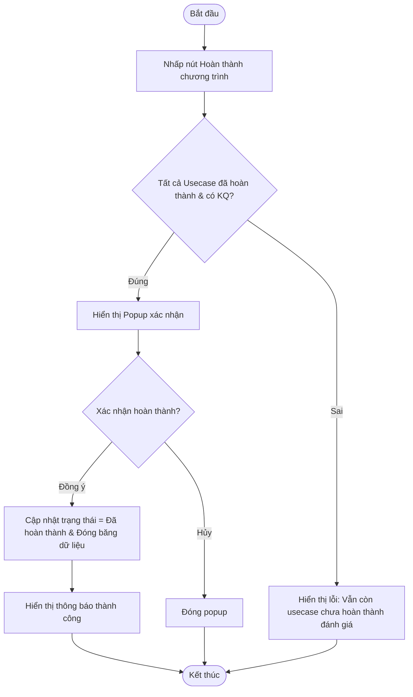

# ĐẶC TẢ YÊU CẦU PHẦN MỀM (SRS) - CHỨC NĂNG: Hoàn thành chương trình đánh giá

---

## 1. Thông tin chức năng

| Thuộc tính | Mô tả chi tiết |
| :--- | :--- |
| **Tên chức năng** | Hoàn thành chương trình đánh giá |
| **Mô tả** | Kết thúc chương trình đánh giá và đóng băng dữ liệu sau khi tất cả các usecase của mọi đơn vị đã hoàn thành chấm điểm và có kết quả cuối cùng. |
| **Tác nhân** | Admin, Đầu mối điều phối |
| **Tiền điều kiện** | Chương trình đang ở trạng thái Đang đánh giá. Tất cả usecase thủ công và tự động của tất cả đơn vị đã có kết quả cuối cùng (Đạt/Không đạt). |
| **Hậu điều kiện** | Chương trình chuyển sang trạng thái Đã hoàn thành (status = Hoàn thành). Khóa toàn bộ dữ liệu. |
| **Ngoại lệ** | Vẫn còn usecase chưa hoàn thành đánh giá hoặc chưa có kết quả. |
| **Yêu cầu nghiệp vụ** | - Kiểm tra điều kiện hoàn thành: Tất cả các bản ghi trong `usecase_manual_review_mapping` có status = 2 (Hoàn thành) và tất cả `rule_run` có kết quả khác null. - Cập nhật trạng thái chương trình thành Đã hoàn thành (completed_at = Hiện tại). - Đóng băng dữ liệu, khóa mọi quyền chỉnh sửa sở cứ hoặc đánh giá. |

### Luồng sự kiện chính

---

## 2. Giao diện người dùng (UI)

*Chi tiết thiết kế và thành phần giao diện màn hình xem tại:*
*   [Tài liệu thiết kế giao diện: UI_HOAN_THANH_CHUONG_TRINH.md](file:///Users/whis/Anh/ISAAP/UI/UI_HOAN_THANH_CHUONG_TRINH.md)
