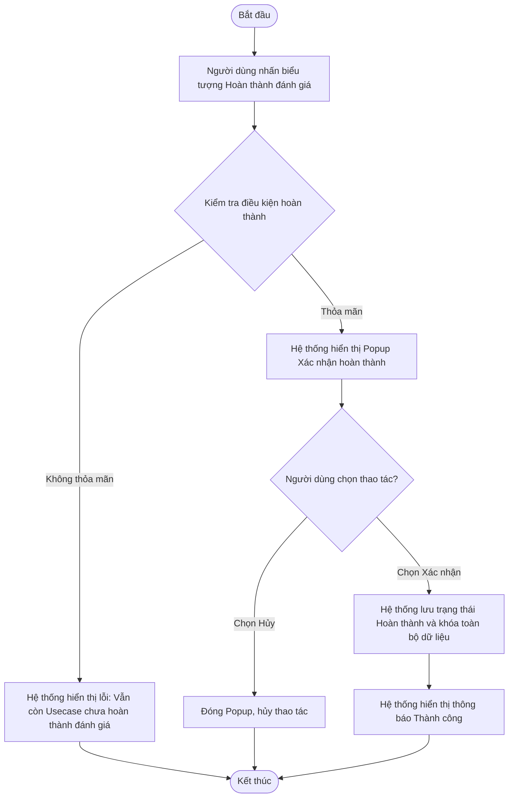

# ĐẶC TẢ YÊU CẦU PHẦN MỀM (SRS) - CHỨC NĂNG: HOÀN THÀNH CHƯƠNG TRÌNH ĐÁNH GIÁ

**DỰ ÁN: NỀN TẢNG QUẢN LÝ TUÂN THỦ AN TOÀN THÔNG TIN (ISAAP)**
**PHÂN HỆ: QUẢN LÝ & CHẠY CHƯƠNG TRÌNH ĐÁNH GIÁ**

---

### Hà Nội, 06 - 2026

---

## BẢNG GHI NHẬN THAY ĐỔI

| Ngày thay đổi | Vị trí thay đổi | A/M/D (*) | Nguồn gốc | Phiên bản cũ | Mô tả thay đổi | Phiên bản mới |
| :--- | :--- | :---: | :--- | :--- | :--- | :--- |
| 05/06/2026 | Toàn bộ tài liệu | M | Yêu cầu người dùng | V1.0 | Cập nhật định dạng tài liệu, viết lại nội dung nghiệp vụ (không dùng kỹ thuật/CSDL) và bổ sung chi tiết giao diện. | V2.0 |

*Ghi chú ký hiệu (\*):*
- **A\***: Add (Tạo mới)
- **M**: Modify (Sửa đổi)
- **D**: Delete (Xóa bỏ)

### 3.1.1. Thông tin chung & Phân quyền
- **Tên chức năng cha**: Chương trình đánh giá
- **Mục đích**: Cho phép kết thúc chương trình đánh giá sau khi đã được chốt toàn bộ dữ liệu.
- **Tác nhân**: Admin nghiệp vụ, nhân sự phụ trách ATTT của các đơn vị trong Tập đoàn. Chú ý, admin hệ thống có quyền thực hiện mọi hành động trong hệ thống nhưng không tham gia trực tiếp vào quy trình nghiệp vụ.
- **Phân quyền**: Người dùng được gán nhóm quyền với Mã chức năng và Mã thao tác như bảng dưới:

| Mã chức năng | Mã thao tác |
| :--- | :--- |
| EVALUATION_PROGRAM_MANAGEMENT | COMPLETE |

---

### 3.1.5. Hoàn thành chương trình đánh giá

#### 3.1.5.1. Thông tin chung

| Thuộc tính | Mô tả chi tiết |
| :--- | :--- |
| **Tên chức năng** | Hoàn thành chương trình đánh giá |
| **Mô tả** | Chức năng cho phép kết thúc toàn bộ chương trình đánh giá sau khi tất cả các hạng mục kiểm tra của mọi đơn vị tham gia đã được đánh giá xong và có kết quả cuối cùng. Sau khi hoàn thành, hệ thống sẽ chốt toàn bộ dữ liệu của chương trình. |
| **Tác nhân** | Người dùng thuộc nhóm Admin hệ thống hoặc Người dùng khác nhóm quyền admin hệ thống nhưng được phân bổ vai trò là Đầu mối điều phối của chương trình đánh giá đó |
| **Điều kiện trước** | - Trạng thái chương trình đánh giá là "Đang đánh giá". - Tất cả các hạng mục kiểm tra (Usecase) thủ công và tự động của tất cả các đơn vị tham gia đều đã được đánh giá và có kết quả cuối cùng (Đạt hoặc Không đạt). |
| **Điều kiện sau** | - Trạng thái của chương trình đánh giá được chuyển sang "Hoàn thành". - Toàn bộ dữ liệu hồ sơ, kết quả chấm điểm của chương trình bị khóa lại, không cho phép bất kỳ người dùng nào chỉnh sửa hay nộp thêm sở cứ. |
| **Ngoại lệ** | - Hệ thống gặp sự cố kết nối mạng. - Vẫn còn tồn tại các hạng mục kiểm tra chưa hoàn thành quy trình đánh giá hoặc chưa có kết quả cuối cùng -> Hệ thống hiển thị thông báo lỗi cảnh báo và ngăn chặn việc hoàn thành. |
| **Các yêu cầu đặc biệt** | Việc hoàn thành chương trình là thao tác chốt dữ liệu, không thể hoàn tác trên giao diện người dùng. |

**Sơ đồ luồng xử lý chức năng:**

#### 3.1.5.2. Màn hình thiết kế (UI Layout)

#### 3.1.5.3. Đặc tả chi tiết các thành phần giao diện

| STT | Thành phần | Kiểu dữ liệu | I/O | Giá trị khởi tạo | Mô tả chi tiết (Mapping CSDL & Thao tác Button) |
| :---: | :--- | :--- | :---: | :--- | :--- |
| **I. Màn hình danh sách (Icon chức năng)** | | | | | |
| 1 | **Biểu tượng Hoàn thành đánh giá** | Icon | Input | Hiển thị/Ẩn | - Chỉ hiển thị/enable khi chương trình ở trạng thái Đang đánh giá, người dùng có quyền và tất cả các đơn vị đều ở trạng thái Chờ hoàn thành. - Click icon để mở Popup Xác nhận hoàn thành chương trình. |
| **II. Popup Xác nhận hoàn thành** | | | | | |
| 2 | **Nội dung cảnh báo** | Text | Output | N/A | - Tiêu đề: "Xác nhận hoàn thành chương trình" - Nội dung: "Bạn có chắc chắn muốn hoàn thành chương trình đánh giá này? Dữ liệu sẽ bị khóa và không thể chỉnh sửa." |
| 3 | **Nút Hủy** | Button | Input | Enable | - Click để đóng popup, hủy bỏ thao tác hoàn thành. |
| 4 | **Nút Xác nhận** | Button | Input | Enable | - Click để thực hiện lưu hoàn thành chương trình. - Xử lý DB:   + Cập nhật `evaluation_program.status` = 2 (Hoàn thành).   + Ghi nhận thời gian hoàn thành vào `evaluation_program.completed_at`. - Hiển thị thông báo thành công và load lại danh sách chương trình. |

#### 3.1.5.4. Luồng nghiệp vụ
- **Bước 1**: Người dùng đăng nhập và truy cập vào màn hình Danh sách chương trình đánh giá.
- **Bước 2**: Tại dòng dữ liệu của một chương trình, người dùng nhấn vào biểu tượng **[Hoàn thành đánh giá]**.
- **Bước 3**: Hệ thống (Frontend) và API gọi kiểm tra tiền điều kiện để xử lý thao tác hoàn thành:
  - **Trường hợp lỗi 1 (Trạng thái chương trình không hợp lệ)**: Nếu chương trình không ở trạng thái "Đang đánh giá" (ví dụ đã bị một admin khác thao tác Hủy hoặc Hoàn thành ngay trước đó), hệ thống hiển thị thông báo lỗi (Toast đỏ): `"Chương trình đánh giá không ở trạng thái cho phép hoàn thành. Vui lòng tải lại trang."` và chặn thao tác.
  - **Trường hợp lỗi 2 (Thiếu quyền hạn thao tác)**: Nếu người dùng bị đổi phân quyền đột xuất, hệ thống hiển thị lỗi: `"Bạn không có quyền thực hiện thao tác hoàn thành chương trình này."`
  - **Trường hợp lỗi 3 (Chưa chấm điểm xong Usecase)**: Hệ thống phát hiện vẫn còn hạng mục kiểm tra (Usecase thủ công hoặc Usecase tự động) chưa có kết quả đánh giá cuối cùng (Đạt/Không đạt). Hệ thống sẽ chặn lại và hiển thị lỗi cụ thể: `"Không thể hoàn thành chương trình. Vẫn còn [Số lượng] Usecase của đơn vị [Tên đơn vị] chưa có kết quả đánh giá cuối cùng."`
  - **Trường hợp Hợp lệ**: Nếu vượt qua tất cả các kiểm tra trên, hệ thống hiển thị Popup Xác nhận hoàn thành.
- **Bước 4**: Tại Popup Xác nhận hoàn thành:
  - Nếu người dùng chọn nút **[Hủy]**, hệ thống đóng Popup và không làm gì thêm.
  - Nếu người dùng chọn nút **[Xác nhận]**, hệ thống gửi yêu cầu hoàn thành (Submit) lên máy chủ.
- **Bước 5**: Hệ thống xử lý chốt dữ liệu và phản hồi:
  - **Trường hợp lỗi 4 (Gián đoạn máy chủ)**: Nếu mất kết nối mạng hoặc lỗi server bất ngờ, hệ thống không đóng giao diện mà giữ nguyên và báo lỗi: `"Hệ thống đang bận hoặc gián đoạn kết nối. Vui lòng thử lại sau."`
  - **Thành công**: Cập nhật trạng thái chương trình thành "Hoàn thành" (`status` = 2), lưu lại thời điểm hoàn thành hiện tại, chốt và khóa toàn bộ dữ liệu hồ sơ liên quan (freeze data). Cuối cùng, hệ thống tự động đóng popup, tải lại danh sách chương trình và hiển thị thông báo (Toast xanh): `"Thành công. Chương trình đánh giá đã được chốt hoàn thành."`
