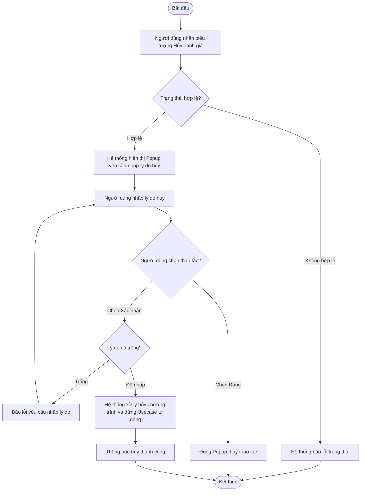

# ĐẶC TẢ YÊU CẦU PHẦN MỀM (SRS) - CHỨC NĂNG: HỦY CHƯƠNG TRÌNH ĐÁNH GIÁ

**DỰ ÁN: NỀN TẢNG QUẢN LÝ TUÂN THỦ AN TOÀN THÔNG TIN (ISAAP)**
**PHÂN HỆ: QUẢN LÝ & CHẠY CHƯƠNG TRÌNH ĐÁNH GIÁ**

---

### Hà Nội, 06 - 2026

---

## BẢNG GHI NHẬN THAY ĐỔI

| Ngày thay đổi | Vị trí thay đổi | A/M/D (*) | Nguồn gốc | Phiên bản cũ | Mô tả thay đổi | Phiên bản mới |
| :--- | :--- | :---: | :--- | :--- | :--- | :--- |
| 05/06/2026 | Toàn bộ tài liệu | M | Yêu cầu người dùng | V1.0 | Cập nhật định dạng tài liệu, viết lại nội dung bằng ngôn ngữ nghiệp vụ, bổ sung xử lý lỗi chi tiết và nghiệp vụ tự động dừng các Usecase. | V2.0 |

*Ghi chú ký hiệu (\*):*
- **A\***: Add (Tạo mới)
- **M**: Modify (Sửa đổi)
- **D**: Delete (Xóa bỏ)

### 3.1.1. Thông tin chung & Phân quyền
- **Tên chức năng cha**: Chương trình đánh giá
- **Mục đích**: Cho phép hủy bỏ một chương trình đang hoạt động giữa chừng.
- **Tác nhân**: Admin nghiệp vụ, nhân sự phụ trách ATTT của các đơn vị trong Tập đoàn. Chú ý, admin hệ thống có quyền thực hiện mọi hành động trong hệ thống nhưng không tham gia trực tiếp vào quy trình nghiệp vụ.
- **Phân quyền**: Người dùng được gán nhóm quyền với Mã chức năng và Mã thao tác như bảng dưới:

| Mã chức năng | Mã thao tác |
| :--- | :--- |
| EVALUATION_PROGRAM_MANAGEMENT | CANCEL |

---

### 3.1.6. Hủy đánh giá chương trình

#### 3.1.6.1. Thông tin chung

| Thuộc tính | Mô tả chi tiết |
| :--- | :--- |
| **Tên chức năng** | Hủy đánh giá chương trình |
| **Mô tả** | Chức năng cho phép người điều phối hoặc quản trị viên hủy ngang một chương trình đánh giá đang trong quá trình thực thi. Khi hủy, hệ thống sẽ dừng toàn bộ các tác vụ đánh giá tự động đang chạy, đồng thời khóa các chức năng nộp sở cứ hay chấm điểm thủ công của các đơn vị tham gia. |
| **Tác nhân** | Người dùng thuộc nhóm Admin hệ thống hoặc Người dùng khác nhóm quyền admin hệ thống nhưng được phân bổ vai trò là Đầu mối điều phối của chương trình đánh giá đó |
| **Điều kiện trước** | Chương trình đánh giá đang ở trạng thái "Đang đánh giá". |
| **Điều kiện sau** | - Trạng thái của chương trình được chuyển thành "Hủy áp dụng". - Toàn bộ tiến trình đánh giá tự động của hệ thống bị buộc dừng lại và bị đánh dấu hủy. - Các chức năng nộp sở cứ và chấm điểm của chương trình này bị vô hiệu hóa hoàn toàn. |
| **Ngoại lệ** | - Trạng thái chương trình không còn hợp lệ (ví dụ đã bị hoàn thành hoặc hủy trước đó). - Người dùng không nhập lý do hủy. |
| **Các yêu cầu đặc biệt** | - Bắt buộc nhập lý do hủy. - Khi hủy, lý do dừng các Usecase tự động phải ghi rõ theo cú pháp: `[Email người dùng] đã hủy chương trình đánh giá`. |

**Sơ đồ luồng xử lý chức năng:**

#### 3.1.6.2. Màn hình thiết kế (UI Layout)

#### 3.1.6.3. Đặc tả chi tiết các thành phần giao diện

| STT | Thành phần | Kiểu dữ liệu | I/O | Giá trị khởi tạo | Mô tả chi tiết (Mapping CSDL & Thao tác Button) |
| :---: | :--- | :--- | :---: | :--- | :--- |
| **I. Màn hình danh sách (Icon chức năng)** | | | | | |
| 1 | **Biểu tượng Hủy đánh giá** | Icon | Input | Hiển thị/Ẩn | - Chỉ hiển thị/enable khi chương trình ở trạng thái Đang đánh giá và người dùng có quyền. - Click icon để mở Popup Yêu cầu hủy chương trình. |
| **II. Popup Nhập lý do hủy** | | | | | |
| 2 | **Nội dung cảnh báo** | Text | Output | N/A | - Tiêu đề: "Hủy đánh giá chương trình" - Nội dung hướng dẫn yêu cầu người dùng nhập lý do hủy chương trình đang chạy. |
| 3 | **Trường nhập Lý do hủy** | Textarea | Input | Rỗng | - Yêu cầu bắt buộc nhập (Required). - Tối đa 500 ký tự. - Placeholder: "Nhập lý do hủy chương trình..." |
| 4 | **Nút Quay lại** | Button | Input | Enable | - Click để đóng popup, hủy bỏ thao tác. |
| 5 | **Nút Xác nhận hủy** | Button | Input | Enable | - Click để thực hiện gửi yêu cầu hủy chương trình lên máy chủ. - Xử lý DB:   + Cập nhật `evaluation_program.status` = 3 (Hủy áp dụng).   + Lưu nội dung hủy vào `evaluation_program.cancel_reason`.   + Lưu thời gian vào `evaluation_program.canceled_at`.   + Cập nhật các phiên chạy tự động chưa hoàn tất. |

#### 3.1.6.4. Luồng nghiệp vụ
- **Bước 1**: Người dùng đăng nhập và truy cập vào màn hình Danh sách chương trình đánh giá.
- **Bước 2**: Tại dòng dữ liệu của một chương trình, người dùng nhấn vào biểu tượng **[Hủy đánh giá]**.
- **Bước 3**: Hệ thống gọi kiểm tra tiền điều kiện để xử lý thao tác hủy:
  - **Trường hợp lỗi 1 (Trạng thái chương trình không hợp lệ)**: Nếu chương trình không ở trạng thái "Đang đánh giá" (ví dụ đã bị thao tác Hoàn thành hoặc Hủy ngay trước đó), hệ thống hiển thị thông báo lỗi (Toast đỏ): `"Chương trình đánh giá không ở trạng thái cho phép hủy. Vui lòng tải lại trang."` và chặn thao tác.
  - **Trường hợp lỗi 2 (Thiếu quyền hạn thao tác)**: Nếu người dùng bị mất phân quyền đột xuất, hệ thống hiển thị lỗi: `"Bạn không có quyền thực hiện thao tác hủy chương trình này."`
  - **Trường hợp Hợp lệ**: Nếu thỏa mãn các kiểm tra trên, hệ thống hiển thị Popup Yêu cầu nhập lý do hủy.
- **Bước 4**: Tại Popup Yêu cầu nhập lý do hủy:
  - Người dùng tiến hành nhập lý do vào ô văn bản.
  - Nếu người dùng chọn nút **[Quay lại]**, hệ thống đóng Popup và không làm gì thêm.
  - Nếu người dùng chọn nút **[Xác nhận hủy]**, hệ thống kiểm tra dữ liệu đầu vào.
- **Bước 5**: Kiểm tra tính hợp lệ của lý do hủy (Validation):
  - **Trường hợp lỗi 3 (Chưa nhập lý do)**: Nếu lý do bỏ trống, hệ thống highlight ô text màu đỏ và hiển thị cảnh báo ngay trên form: `"Vui lòng nhập lý do hủy chương trình."`
- **Bước 6**: Hệ thống (Server) xử lý chốt hủy dữ liệu và phản hồi:
  - Hệ thống tự động quét và thu thập các tác vụ đánh giá tự động (Usecase tự động) của chương trình này đang trong quá trình thực thi trên máy chủ.
  - Hệ thống ép dừng các tác vụ tự động này, đồng thời cập nhật kết quả của chúng thành "Đã hủy", kèm theo nội dung ghi nhận lý do: `"{email} đã hủy chương trình đánh giá"` (với `{email}` là địa chỉ email của người dùng đang thao tác).
  - Hệ thống cập nhật trạng thái chương trình thành "Hủy áp dụng" (`status` = 3) và lưu lại lý do hủy của chương trình.
  - **Trường hợp lỗi 4 (Gián đoạn máy chủ)**: Nếu mất kết nối mạng hoặc lỗi server trong quá trình xử lý, hệ thống giữ nguyên giao diện và báo lỗi: `"Hệ thống đang bận hoặc gián đoạn kết nối. Vui lòng thử lại sau."`
  - **Thành công**: Hệ thống tự động đóng popup, tải lại danh sách chương trình và hiển thị thông báo (Toast xanh): `"Thành công. Đã hủy chương trình đánh giá."`
