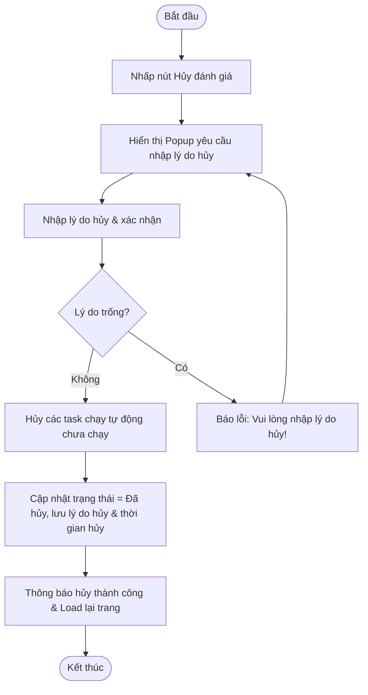
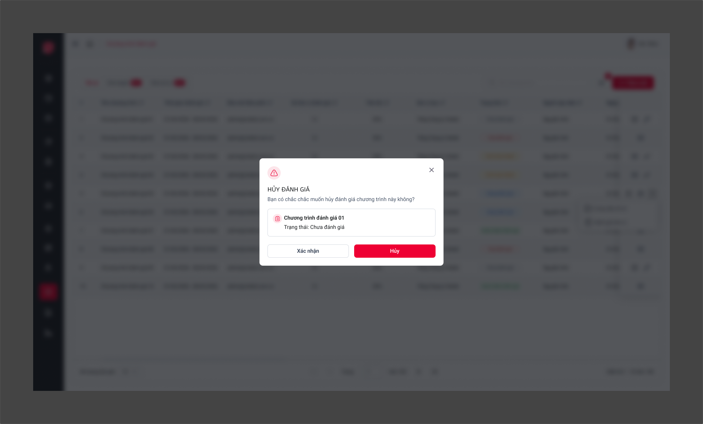

# ĐẶC TẢ YÊU CẦU PHẦN MỀM (SRS) - CHỨC NĂNG: Hủy đánh giá chương trình

---

## 1. Thông tin chức năng

| Thuộc tính | Mô tả chi tiết |
| :--- | :--- |
| **Tên chức năng** | Hủy đánh giá chương trình |
| **Mô tả** | Cho phép hủy ngang chương trình đánh giá đang chạy, dừng các tác vụ tự động chưa thực thi và khóa các thao tác nộp sở cứ hay chấm điểm. |
| **Tác nhân** | Admin, Đầu mối điều phối |
| **Tiền điều kiện** | Chương trình ở trạng thái Đang đánh giá. |
| **Hậu điều kiện** | Chương trình chuyển sang trạng thái Đã hủy. Dừng toàn bộ hoạt động nghiệp vụ. |
| **Ngoại lệ** | Chương trình không ở trạng thái Đang đánh giá. |
| **Yêu cầu nghiệp vụ** | - Yêu cầu người dùng nhập lý do hủy chương trình. - Hủy tất cả các task chạy tự động chưa thực thi của Auto Usecase. - Khóa các chức năng nộp sở cứ và chấm điểm đối với chương trình bị hủy. |

### Luồng sự kiện chính

---

## 2. Mô tả chi tiết màn hình (Sườn khung giao diện)

### Giao diện thiết kế (Figma UI Export)

### Đặc tả các thành phần giao diện
*Ghi chú: Mô tả chi tiết các trường thông tin và thuộc tính điều khiển trên giao diện màn hình chức năng.*

| STT | Thành phần | Kiểu dữ liệu | I/O | Giá trị khởi tạo | Mô tả chi tiết (Mapping CSDL & Thao tác Button) |
| :---: | :--- | :--- | :---: | :--- | :--- |
| 1 | **Nút Hủy đánh giá** | Button | INPUT | Enable/Disable | Chỉ hiển thị khi chương trình ở trạng thái Đang đánh giá |
| 2 | **Popup Yêu cầu nhập lý do hủy** | Popup | OUTPUT | Ẩn | Tiêu đề: Hủy đánh giá chương trình. Yêu cầu nhập lý do hủy. |
| 3 | **Lý do hủy** | Textbox | INPUT | Null | Bắt buộc nhập lý do hủy. Maxlength 500 ký tự. Placeholder: Nhập lý do hủy chương trình |
| 4 | **Nút Xác nhận hủy** | Button | INPUT | Enable | Click để tiến hành hủy và đóng popup |
| 5 | **Nút Quay lại** | Button | INPUT | Enable | Click để đóng popup và giữ nguyên trạng thái chương trình |
