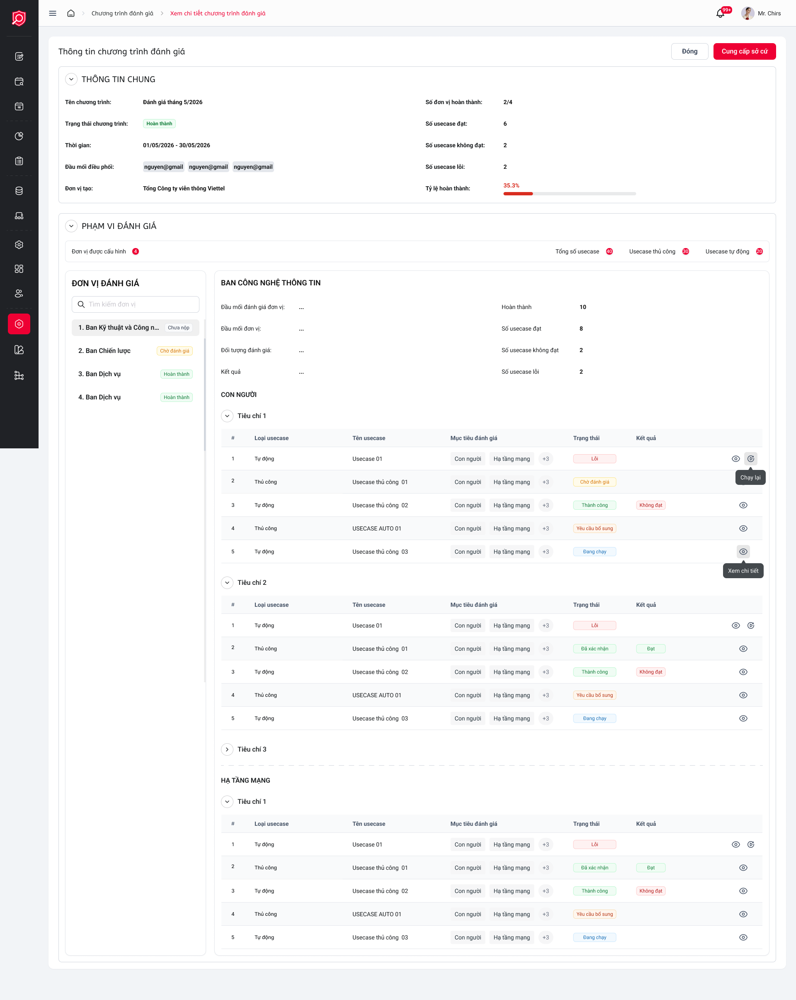

# ĐẶC TẢ YÊU CẦU PHẦN MỀM (SRS) - CHỨC NĂNG: Xem chi tiết chương trình đánh giá

---

## 1. Thông tin chức năng

| Thuộc tính | Mô tả chi tiết |
| :--- | :--- |
| **Tên chức năng** | Xem chi tiết chương trình đánh giá |
| **Mô tả** | Hiển thị thông tin chi tiết của chương trình, bao gồm thông tin chung, danh sách đơn vị, đối tượng, tiêu chí, và usecase. Hỗ trợ tra cứu và xóa thành phần. |
| **Tác nhân** | Admin, Đầu mối đơn vị, Đầu mối điều phối, Đầu mối đánh giá |

---

## 2. Mô tả chi tiết màn hình (Sườn khung giao diện)

### Giao diện thiết kế (Figma UI Export)

### Đặc tả các thành phần giao diện
*Ghi chú: Mô tả chi tiết các trường thông tin và thuộc tính điều khiển trên giao diện màn hình chức năng.*

| STT | Thành phần | Kiểu dữ liệu | I/O | Giá trị khởi tạo | Mô tả chi tiết (Mapping CSDL & Thao tác Button) |
| :---: | :--- | :--- | :---: | :--- | :--- |
| 1 | **Tên chương trình** | Label | OUTPUT | DB | Mapping: `evaluation_program.name`. |
| 2 | **Trạng thái** | Badge | OUTPUT | DB | Mapping: `evaluation_program.status` (Đang đánh giá, Hoàn thành...). |
| 3 | **Cây cấu trúc (Đơn vị > Đối tượng > Tiêu chí > UC)** | Tree/Accordion | OUTPUT | DB | Lấy dữ liệu từ cấu trúc join `program_department_mapping` -> `department_object_mapping` -> `object_criteria_mapping` -> `criteria_usecase_mapping`. |
| 4 | **Trạng thái UC thủ công** | Label | OUTPUT | DB | Mapping: `usecase_manual_review_mapping.status` (Chờ đánh giá, Đã nộp sở cứ, Hoàn thành). |
| 5 | **Kết quả UC Tự động** | Label | OUTPUT | DB | Mapping: `rule_run.result` (Đạt/Không đạt/Lỗi). |
| 6 | **Tiến độ đơn vị** | Progress Bar | OUTPUT | Tính toán | Công thức: (Số UC hoàn thành / Tổng số UC) * 100%. Lấy dữ liệu từ count bản ghi trong `usecase_manual_review_mapping`. |
| 7 | **Nút Xóa thành phần** | Icon Button | INPUT | Enable | Rule: Mở popup xác nhận xóa. Mapping: Delete trong `criteria_usecase_mapping` hoặc `object_criteria_mapping`. |
