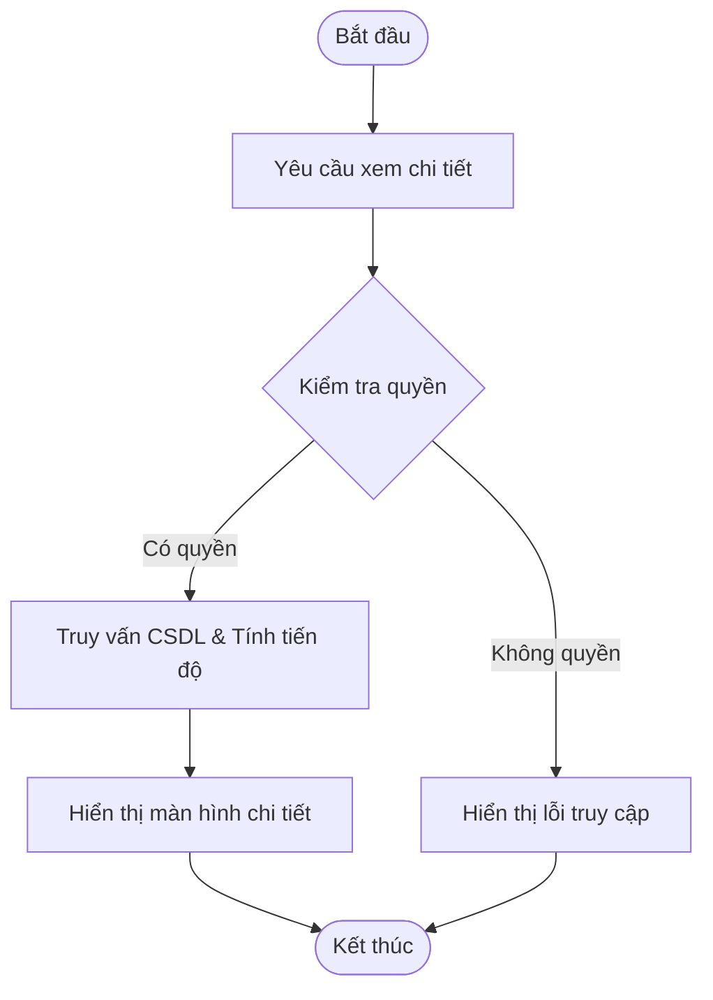

# ĐẶC TẢ YÊU CẦU PHẦN MỀM (SRS) - CHỨC NĂNG: Xem chi tiết chương trình đánh giá

---

## 1. Thông tin chức năng

| Thuộc tính | Mô tả chi tiết |
| :--- | :--- |
| **Tên chức năng** | Xem chi tiết chương trình đánh giá |
| **Mô tả** | Cho phép người dùng theo dõi tiến độ tổng thể của chương trình đánh giá, xem trạng thái đánh giá thủ công/tự động của từng đơn vị, danh sách đối tượng, tiêu chí, usecase và kết quả chi tiết. |
| **Tác nhân** | Admin, Đầu mối điều phối, Đầu mối đơn vị, Đầu mối đánh giá |
| **Tiền điều kiện** | Chương trình đã ở trạng thái Đang đánh giá, Đã hoàn thành hoặc Đã hủy. |
| **Hậu điều kiện** | Hệ thống hiển thị đầy đủ thông tin chi tiết và tiến trình chạy của chương trình. |
| **Ngoại lệ** | Không tìm thấy chương trình đánh giá hoặc tài khoản không có quyền truy cập. |
| **Yêu cầu nghiệp vụ** | - Hiển thị thông tin chung của chương trình. - Tính toán tiến độ tổng thể của chương trình. - Hiển thị danh sách các đơn vị được phân bổ. - Cho phép chọn đơn vị để xem chi tiết danh sách Đối tượng > Tiêu chí > Usecase. - Hỗ trợ tải xuống file sở cứ. |

### Luồng sự kiện chính

---

## 2. Mô tả chi tiết màn hình (Sườn khung giao diện)

*Ghi chú: Mô tả chi tiết các trường thông tin và thuộc tính điều khiển trên giao diện màn hình chức năng.*

| STT | Thành phần | Kiểu dữ liệu | I/O | Giá trị khởi tạo | Mô tả chi tiết (Mapping CSDL & Thao tác Button) |
| :---: | :--- | :--- | :---: | :--- | :--- |
| 1 | **Tiêu đề trang** | Label | OUTPUT | Xem chi tiết chương trình | Hiển thị tiêu đề màn hình |
| 2 | **Tên chương trình** | Label | OUTPUT | Lấy từ DB | Mapping DB: `evaluation_program.name` |
| 3 | **Thời gian hoạt động** | Label | OUTPUT | Lấy từ DB | Format: dd/mm/yyyy - dd/mm/yyyy. Mapping DB: `evaluation_program.start_date` - `evaluation_program.end_date` |
| 4 | **Tiến độ tổng thể** | Label | OUTPUT | Tính toán tự động | Công thức: (Số UC hoàn thành / Tổng số UC) * 100% |
| 5 | **Bảng danh sách đơn vị** | Table | OUTPUT | Danh sách đơn vị | Hiển thị danh sách các đơn vị và trạng thái |
| 6 | **Nút Quay lại** | Button | INPUT | Enable | Click để quay lại màn hình danh sách và giữ nguyên bộ lọc lọc cũ |
