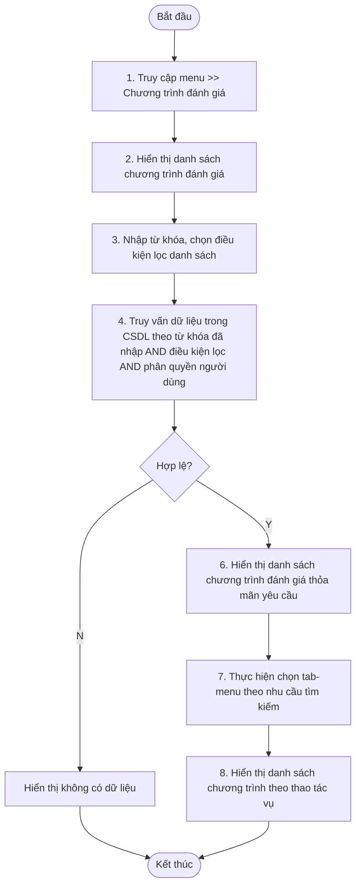

# ĐẶC TẢ YÊU CẦU PHẦN MỀM (SRS) - CHỨC NĂNG: TÌM KIẾM/XEM DANH SÁCH CHƯƠNG TRÌNH ĐÁNH GIÁ

**DỰ ÁN: NỀN TẢNG QUẢN LÝ TUÂN THỦ AN TOÀN THÔNG TIN (ISAAP)**
**PHÂN HỆ: QUẢN LÝ & CHẠY CHƯƠNG TRÌNH ĐÁNH GIÁ**

---

### Hà Nội, 06 - 2026

---

## BẢNG GHI NHẬN THAY ĐỔI

| Ngày thay đổi | Vị trí thay đổi | A/M/D (*) | Nguồn gốc | Phiên bản cũ | Mô tả thay đổi | Phiên bản mới |
| :--- | :--- | :---: | :--- | :--- | :--- | :--- |
| 05/06/2026 | Toàn bộ tài liệu | M | Yêu cầu người dùng | V1.0 | Cập nhật cấu trúc tài liệu theo mẫu SRS_TEMPLATE mới, bổ sung các luồng nghiệp vụ chi tiết và loại bỏ các quy tắc cũ bị gạch ngang. | V2.0 |

*Ghi chú ký hiệu (\*):*
- **A\***: Add (Tạo mới)
- **M**: Modify (Sửa đổi)
- **D**: Delete (Xóa bỏ)


### 3.1.1. Thông tin chung & Phân quyền
- **Tên chức năng cha**: Chương trình đánh giá
- **Mục đích**: Cho phép người dùng tìm kiếm, thêm mới, chỉnh sửa, xem chi tiết, bắt đầu đánh giá, hủy đánh giá, cung cấp sở cứ, đánh giá đơn vị, hoàn thành chương trình đánh giá trong hệ thống.
- **Tác nhân**: Admin nghiệp vụ, nhân sự phụ trách ATTT của các đơn vị trong Tập đoàn. Chú ý, admin hệ thống có quyền thực hiện mọi hành động trong hệ thống nhưng không tham gia trực tiếp vào quy trình nghiệp vụ.
- **Phân quyền**: Người dùng được gán nhóm quyền với Mã chức năng và Mã thao tác như bảng dưới:

| Tên chức năng | Thao tác | Mã chức năng | Mã thao tác |
| :--- | :--- | :--- | :--- |
| Chương trình đánh giá | Tìm kiếm | EVALUATION_PROGRAM_MANAGEMENT | SEARCH |
| Chương trình đánh giá | Thêm mới | EVALUATION_PROGRAM_MANAGEMENT | CREATE |
| Chương trình đánh giá | Chỉnh sửa | EVALUATION_PROGRAM_MANAGEMENT | EDIT |
| Chương trình đánh giá | Xóa chương trình | EVALUATION_PROGRAM_MANAGEMENT | DELETE |
| Chương trình đánh giá | Xem chi tiết chương trình | EVALUATION_PROGRAM_MANAGEMENT | VIEW |
| Chương trình đánh giá | Bắt đầu đánh giá | EVALUATION_PROGRAM_MANAGEMENT | START |
| Chương trình đánh giá | Hủy đánh giá | EVALUATION_PROGRAM_MANAGEMENT | CANCEL |
| Chương trình đánh giá | Xử lý lỗi | EVALUATION_PROGRAM_MANAGEMENT | RESOLVE_ERROR |
| Chương trình đánh giá | Hoàn thành đánh giá | EVALUATION_PROGRAM_MANAGEMENT | COMPLETE |
| Chương trình đánh giá | Cung cấp sở cứ | EVALUATION_PROGRAM_MANAGEMENT | SEND |
| Chương trình đánh giá | Đánh giá đơn vị | EVALUATION_PROGRAM_MANAGEMENT | REVIEW |

---

### 3.1.2. Tìm kiếm chương trình

#### 3.1.2.1. Thông tin chung

| Thuộc tính | Mô tả chi tiết |
| :--- | :--- |
| **Tên chức năng** | Tìm kiếm chương trình đánh giá tuân thủ ATTT |
| **Mô tả** | Cho phép tìm kiếm danh sách chương trình đánh giá đang có trong hệ thống theo quyền của người dùng và theo điều kiện tìm kiếm nhập trên form. |
| **Tác nhân** | Admin nghiệp vụ, nhân sự phụ trách ATTT của các đơn vị trong Tập đoàn.<br>(admin hệ thống có quyền thực hiện mọi hành động trong hệ thống nhưng không tham gia trực tiếp vào quy trình nghiệp vụ) |
| **Điều kiện trước** | - Người dùng thuộc nhóm quyền admin hệ thống.<br>hoặc<br>- Người dùng khác nhóm quyền admin hệ thống nhưng được gán quyền chức năng Tìm kiếm chương trình trong Chương trình đánh giá. |
| **Điều kiện sau** | Hiển thị danh sách chương trình đánh giá theo điều kiện lọc người dùng đã nhập và theo quyền của người dùng. |
| **Ngoại lệ** | Thông báo lỗi. |
| **Các yêu cầu đặc biệt** | Không |

**Sơ đồ luồng xử lý chức năng:**



#### 3.1.2.2. Màn hình
- **Tab Tất cả**:
  
- **Danh sách chương trình đánh giá full**:
  
- **Bộ lọc danh sách (Popover)**:
  
- **Tab Cần duyệt**:
  
- **Danh sách chờ duyệt**:
  
- **Tab Cần xử lý**:
  
- **Cung cấp sở cứ**:
  
- **Menu action chương trình**:
  

#### 3.1.2.3. Mô tả chi tiết màn hình

| TT | Tên | Kiểu dữ liệu [Max length] | Input/ Output | Giá trị khởi tạo | Mô tả (Mapping với CSDL nếu có) |
| :---: | :--- | :--- | :---: | :--- | :--- |
| **I. Filter chính** | | | | | |
| 1 | Tên chương trình đánh giá | Textbox | Input | Null | - Hint text: Tên chương trình đánh giá<br>- Nhập freetext, không giới hạn max length<br>- Giá trị mặc định: Trống<br>- Tìm kiếm tương đối theo Tên chương trình đánh giá (nếu có nhập). Có icon [x] để cho phép xóa nhanh ký tự đã nhập trong ô Tìm kiếm theo tên chương trình đánh giá<br>- Không bắt buộc nhập<br>- Mapping CSDL: `evaluation_program.name` |
| **II. Filter trong Bộ lọc** | | | | | |
| 2 | Thời gian bắt đầu đánh giá | Datepicker | Input | Null | - Hint text: Từ ngày -> Đến ngày<br>- Giá trị mặc định: không chọn giá trị nào<br>- Không bắt buộc chọn<br>- Có thể nhập 1 trong 2 thông tin hoặc cả 2 mốc thời gian<br>- Tìm kiếm theo thông tin "Từ ngày" của thuộc tính [Thời gian đánh giá] chương trình<br>- Có icon x cho phép xóa nhanh giá trị đã nhập<br>- Mapping CSDL: `evaluation_program.start_date` |
| 3 | Thời gian kết thúc đánh giá | Datepicker | Input | Null | - Hint text: Từ ngày -> Đến ngày<br>- Giá trị mặc định: không chọn giá trị nào<br>- Không bắt buộc chọn<br>- Có thể nhập 1 trong 2 thông tin hoặc cả 2 mốc thời gian<br>- Tìm kiếm theo thông tin "Đến ngày" của thuộc tính [Thời gian đánh giá] chương trình<br>- Có icon x cho phép xóa nhanh giá trị đã nhập<br>- Mapping CSDL: `evaluation_program.end_date` |
| 4 | Đối tượng đánh giá | Combobox | Input | Null | *(Nội dung mô tả cũ đã được loại bỏ)* |
| 5 | Trạng thái | Multi select box | N/A | N/A | - Hint text: Trạng thái<br>- Danh sách giá trị trong cbb gồm: Áp dụng, Hủy áp dụng.<br>- Không bắt buộc chọn<br>- Giá trị mặc định: không chọn giá trị nào<br>- Cho phép chọn 1 hoặc nhiều trạng thái<br>- Cho phép nhập keyword và auto suggestion<br>- Có icon x để xóa nhanh giá trị trong cbb<br>- Mapping CSDL: `evaluation_program.status` |
| | Đơn vị tạo | Multi select box | N/A | N/A | *(Nội dung mô tả cũ đã được loại bỏ)* |
| 6 | Tìm kiếm | N/A | N/A | N/A | - Khi có sự kiện kích hoạt tính năng tìm kiếm thì hệ thống thực hiện query vào DB lấy danh sách chương trình đánh giá theo quyền của tác nhân đang tìm kiếm và theo các điều kiện filter đã nhập trên form; hiển thị kết quả tìm kiếm ở grid danh sách tiêu chí đánh giá. Chi tiết mô tả trong luồng nghiệp vụ chức năng Tìm kiếm chương trình đánh giá. |
| 7 | Thêm mới | Button | N/A | N/A | - Chỉ enable khi người dùng thuộc nhóm quyền admin hệ thống, hoặc không thuộc nhóm quyền admin hệ thống nhưng được gán quyền chức năng Thêm mới chương trình.<br>- Click vào nút [Thêm mới] thì mở popup Thêm mới chương trình đánh giá |
| **II. Grid Danh sách chương trình đánh giá** | | | | | |
| | Tab-menu danh sách chương trình | Tab-menu | Input/Output | "Tất cả" | - Hiển thị tab-menu<br>- Tab "tất cả": luôn luôn hiển thị<br>- Tab "chờ duyệt"/"chờ sở cứ" hiển thị khi tab có ít nhất 1 bản ghi thỏa mãn điều kiện, phân quyền<br>- Giá trị: Tất cả, Chờ duyệt, Chờ sở cứ<br>- Click tab-menu:<br>  + Tất cả: hiển thị toàn bộ danh sách chương trình đánh giá theo phân quyền<br>  + Chờ duyệt: hiển thị toàn bộ danh sách chương trình đánh giá cần điều phối, đánh giá đơn vị + số lượng bản ghi<br>  + Chờ sở cứ: hiển thị toàn bộ danh sách chương trình đánh giá cần cung cấp sở cứ + số lượng bản ghi |
| 8 | Grid danh sách chương trình đánh giá | Grid | Output | Null | - Hiển thị danh sách các bản ghi chương trình đánh giá gồm các cột: #, Tên chương trình, Thời gian đánh giá, Đối tượng đánh giá, Số đơn vị đánh giá, Tiến độ (%), Đầu mối điều phối, Đơn vị tạo, Trạng thái, Người cập nhật, Thời gian cập nhật, nhóm thao tác bản ghi theo phân quyền và theo tình trạng hợp/trạng thái bản ghi icon Chỉnh sửa, icon Bắt đầu đánh giá, các cột [Đối tượng đánh giá], Dữ liệu cột [Trạng thái] hiển thị dạng tag.<br>- Trong danh sách chương trình đánh giá:<br>  + Với mỗi bản ghi, nếu giá trị của 1 cell dữ liệu dài hơn độ rộng của cột chứa cell đó thì hiển thị 3 chấm, hover vào thì hiển thị đầy đủ giá trị của cell đó.<br>  + Nếu tổng độ rộng các cột trong danh sách > độ rộng của danh sách thì hiển thị scroll ngang. Khi scroll cần cố định 3 cột đầu tiên ở bên trái danh sách (trừ cột thứ tự) và cột icon thao tác chức năng ở bên phải danh sách.<br>  + Trong danh sách chương trình đánh giá: có tính năng cho phép sắp xếp dữ liệu tăng dần/giảm dần ở đầu các cột trong danh sách: Tên chương trình, Thời gian đánh giá, Số đơn vị đánh giá, Tiến độ (%). Đầu mối điều phối, Đơn vị tạo, Trạng thái, Người cập nhật, Thời gian cập nhật.<br>  * Click lần đầu vào icon sắp xếp của cột X: sắp xếp danh sách theo cột X tăng dần, icon mũi tên lên hiển thị màu đỏ.<br>  * Click lần thứ 2 vào icon sắp xếp của cột X: sắp xếp danh sách theo cột X giảm dần, icon mũi tên xuống hiển thị màu đỏ.<br>  * Click lần thứ 3 vào icon sắp xếp của cột X: danh sách về trạng thái mặc định khi chưa nhân sắp xếp. |
| 9 | Chỉnh sửa | Icon chức năng | N/A | N/A | - Tooltip: Chỉnh sửa<br>- Chỉ enable icon Chỉnh sửa khi thỏa mãn:<br>  + Người dùng thuộc nhóm quyền admin hệ thống<br>  hoặc<br>  + Người dùng khác nhóm quyền admin hệ thống và người dùng là người tạo mới chương trình hoặc là đầu mối điều phối của chương trình.<br>- SQL check quyền:<br>```sql\nWITH\nuser_info AS (\nSELECT\nu.id AS user_id,\nu.dept_id AS user_dept,\nu.blocked,\nbool_or(lower(r.code) IN ('system_admin', 'business_admin')) AS is_admin\nFROM "user" u\nLEFT JOIN role r ON r.id = ANY(string_to_array(u.role_id, ',')::int[])\nWHERE lower(u.email) = lower(:email_nguoi_dung)\nGROUP BY u.id, u.dept_id, u.blocked\n),\nevaluation_program_info AS (\nSELECT\nep.id AS evaluation_program_id,\nep.dept_id AS evaluation_program_dept,\nep.status AS program_status,\nep.created_by,\nep.program_auditor,\nd.status AS dept_status\nFROM evaluation_program ep\nLEFT JOIN department d ON d.id = ep.dept_id\nWHERE ep.id = :evaluation_program_id\n)\nSELECT\nCASE\nWHEN ui.user_id IS NULL OR ui.blocked != 1 THEN 'Người dùng không tồn tại hoặc bị khóa'\nWHEN epi.evaluation_program_id IS NULL THEN 'Chương trình không tồn tại'\nWHEN epi.dept_status != 1 THEN 'Chương trình thuộc đơn vị đã ngừng hoạt động'\n-- Admin -> có quyền\nWHEN ui.is_admin IS TRUE THEN NULL\n-- Không phải admin + là người tạo hoặc đầu mối điều phối -> có quyền\nWHEN ui.user_id = epi.created_by OR ui.user_id = epi.program_auditor THEN NULL\nELSE 'Bạn không có quyền chỉnh sửa'\nEND AS error_msg\nFROM (SELECT 1) dummy\nLEFT JOIN user_info ui ON TRUE\nLEFT JOIN evaluation_program_info epi ON TRUE;\n```<br>- Click icon [Chỉnh sửa] thì mở popup chỉnh sửa chương trình đánh giá |
| 10 | Bắt đầu đánh giá | Icon chức năng | N/A | N/A | - Enable khi thỏa mãn điều kiện sau:<br>  + Chương trình đánh giá ở trạng thái "Chưa đánh giá"<br>  + Người dùng thuộc nhóm quyền admin hệ thống hoặc khác quyền admin hệ thống nhưng là đầu mối điều phối của chương trình.<br>  + Người dùng có quyền thao tác "Bắt đầu đánh giá"<br>- Click icon [Bắt đầu đánh giá] thì mở popup xác nhận bắt đầu chương trình<br>- Mapping CSDL:<br>  + Trạng thái chương trình: `evaluation_program.status` = 0<br>  + Quyền thao tác: `feature.code` = "EVALUATION_PROGRAM_MANAGEMENT" AND `action.code` = "START"<br>  + Role: {id người dùng} = `evaluation_program.program_auditor` |
| | Xóa chương trình | Icon chức năng | N/A | N/A | - Enable khi thỏa mãn điều kiện sau:<br>  + Chương trình đánh giá ở trạng thái "Chưa đánh giá"<br>  + Người dùng là đầu mối điều phối chương trình.<br>  + Người dùng có quyền thao tác "Xóa chương trình"<br>- Click icon [Xóa] thì mở popup xác nhận xóa chương trình<br>- Mapping CSDL:<br>  + Trạng thái chương trình: `evaluation_program.status` = 0<br>  + Quyền thao tác: `feature.code` = "EVALUATION_PROGRAM_MANAGEMENT" AND `action.code` = "DELETE" |
| | Xem chi tiết chương trình | Icon chức năng | N/A | N/A | - Enable khi thỏa mãn điều kiện sau:<br>  + Chương trình đánh giá các trạng thái khác "Chưa đánh giá"<br>  + Người dùng thuộc nhóm quyền admin hệ thống hoặc khác quyền admin hệ thống nhưng là đầu mối điều phối chương trình, đầu mối đánh giá hoặc đầu mối đơn vị của 1 đơn vị trong chương trình.<br>  + Người dùng có quyền thao tác "Xem chi tiết chương trình"<br>- Click icon [Xem chi tiết] thì mở màn hình xem chi tiết chương trình<br>- Mapping CSDL:<br>  + Quyền thao tác: `feature.code` = "EVALUATION_PROGRAM_MANAGEMENT" AND `action.code` = "VIEW" |
| | Hủy đánh giá | Icon chức năng | N/A | N/A | - Enable khi thỏa mãn điều kiện sau:<br>  + Chương trình đánh giá ở trạng thái "Đang đánh giá"<br>  + Người dùng thuộc nhóm quyền admin hệ thống hoặc khác quyền admin hệ thống nhưng là đầu mối điều phối chương trình.<br>  + Người dùng có quyền thao tác "Hủy đánh giá"<br>- Click icon [Hủy đánh giá chương trình] thì mở popup xác nhận hủy chương trình<br>- Mapping CSDL:<br>  + Trạng thái chương trình: `evaluation_program.status` = 1<br>  + Quyền thao tác: `feature.code` = "EVALUATION_PROGRAM_MANAGEMENT" AND `action.code` = "CANCEL"<br>  + Role: {id người dùng} = `evaluation_program.program_auditor` |
| | Xử lý lỗi | Icon chức năng | N/A | N/A | - Enable khi thỏa mãn điều kiện sau:<br>  + Chương trình đánh giá ở trạng thái "Đang đánh giá"<br>  + Có ít nhất 1 đơn vị trong chương trình có trạng thái đánh giá thủ công "Lỗi"<br>  + Người dùng là đầu mối điều phối chương trình<br>  + Người dùng có quyền thao tác "Xử lý lỗi"<br>- Click icon [Xử lý lỗi] thì mở popup xử lý lỗi chương trình |
| | Hoàn thành đánh giá | Icon chức năng | N/A | N/A | - Enable khi thỏa mãn điều kiện sau:<br>  + Chương trình thuộc nhóm quyền admin hệ thống hoặc khác quyền admin hệ thống nhưng đang ở trạng thái "Đang đánh giá"<br>  + Người dùng thuộc nhóm quyền admin hệ thống hoặc khác quyền admin hệ thống nhưng là đầu mối điều phối chương trình<br>  + Các đơn vị trong chương trình có trạng thái "Chờ hoàn thành"<br>  + Người dùng có quyền thao tác "Hoàn thành đánh giá"<br>- Click icon [Hoàn thành đánh giá] thì mở popup Hoàn thành đánh giá<br>- Mapping CSDL:<br>  + Trạng thái chương trình: `evaluation_program.status` = 4<br>  + Quyền thao tác: `feature.code` = "EVALUATION_PROGRAM_MANAGEMENT" AND `action.code` = "COMPLETE"<br>  + Role: Người dùng thuộc nhóm quyền admin hệ thống hoặc khác quyền admin hệ thống nhưng {id người dùng} = `evaluation_program.program_auditor` |
| | Đánh giá đơn vị | Icon chức năng | N/A | N/A | - Enable khi thỏa mãn điều kiện sau:<br>  + Chương trình đánh giá ở trạng thái "Đang đánh giá"<br>  + Có ít nhất 1 đơn vị có trạng thái đánh giá thủ công "Chờ đánh giá" hoặc "Chờ đánh giá lại"<br>  + Người dùng thuộc nhóm quyền admin hệ thống hoặc khác quyền admin hệ thống nhưng là đầu mối đánh giá<br>  + Người dùng có quyền thao tác "đánh giá đơn vị"<br>- Click icon [Đánh giá đơn vị] thì mở popup Đánh giá đơn vị (nếu đơn vị ở trạng thái thủ công "Chờ đánh giá") hoặc Đánh giá bổ sung (nếu đơn vị ở trạng thái thủ công "Chờ đánh giá lại")<br>- Mapping CSDL:<br>  + Trạng thái chương trình: `evaluation_program.status` = 1<br>  + Trạng thái đơn vị: `program_department_mapping.manual_review_status` = 1 hoặc `program_department_mapping.manual_review_status` = 2<br>  + Quyền thao tác: `feature.code` = "EVALUATION_PROGRAM_MANAGEMENT" AND `action.code` = "REVIEW"<br>  + Role: thuộc nhóm admin hệ thống hoặc {id người dùng} = `program_department_mapping.reviewer_id` |
| | Cung cấp sở cứ | Icon chức năng | N/A | N/A | - Enable khi thỏa mãn điều kiện sau:<br>  + Chương trình đánh giá ở trạng thái "Đang đánh giá"<br>  + Có ít nhất 1 đơn vị có trạng thái đánh giá thủ công "Chưa nộp sở cứ" hoặc "Yêu cầu bổ sung"<br>  + Người dùng thuộc nhóm quyền admin hệ thống hoặc khác quyền admin hệ thống nhưng là đầu mối đơn vị<br>  + Người dùng có quyền thao tác "Cung cấp sở cứ"<br>- Click icon [Cung cấp sở cứ] thì mở popup cung cấp sở cứ (nếu ở trạng thái "Chưa nộp sở cứ") hoặc cung cấp sở cứ bổ sung (nếu ở trạng thái "Yêu cầu bổ sung")<br>- Mapping CSDL:<br>  + Trạng thái chương trình: `evaluation_program.status` = 1<br>  + Trạng thái đơn vị: `program_department_mapping.manual_review_status` = 0 hoặc `program_department_mapping.manual_review_status` = 3<br>  + Quyền thao tác: `feature.code` = "EVALUATION_PROGRAM_MANAGEMENT" AND `action.code` = "SEND"<br>  + Role: {id người dùng} = `program_department_mapping.representative_id` |

#### 3.1.2.4. Luồng nghiệp vụ
- **API**: `program/search`
- **Bước 1**: Người dùng vào menu chức năng Chương trình đánh giá
- **Bước 2**: Người dùng thực hiện tìm kiếm chương trình đánh giá theo các tiêu chí sau:
  - Tên chương trình
  - Thời gian bắt đầu đánh giá
  - Thời gian kết thúc đánh giá
  - Đối tượng đánh giá
  - Trạng thái
- **Bước 3**: Hệ thống validate các thông tin đã nhập trong màn hình tìm kiếm:
  - TH hợp lệ thì chuyển bước tiếp theo
  - TH không hợp lệ thì thông báo lỗi tương ứng cho người dùng.
- **Bước 4**: Query vào CSDL để lấy ra tất cả các tiêu chí đánh giá theo điều kiện tìm kiếm người dùng đã nhập trên form và theo quyền của người dùng. Cụ thể như sau:
  - **Ở tab-menu "tất cả"**: Lấy lên danh sách chương trình đánh giá ở mọi trạng thái
    - Nếu người dùng có quyền admin hệ thống: hiển thị tất cả các chương trình theo filter tìm kiếm
    - Nếu người dùng có quyền khác admin hệ thống:
      - Đơn vị của chương trình trùng với đơn vị của người dùng, hoặc
      - Người dùng là 1 trong các "Đầu mối đơn vị" của đơn vị được đánh giá trong chương trình, hoặc
      - Người dùng là 1 trong các "Đầu mối đánh giá" của đơn vị nào đó của chương trình, hoặc
      - Người dùng là "Đầu mối điều phối" của chương trình
  - **Ở tab-menu "Chờ duyệt"**: Lấy lên danh sách chương trình đánh giá ở từng vai trò như sau:
    - Nếu người dùng có quyền admin hệ thống: hiển thị tất cả các chương trình theo filter tìm kiếm có trạng thái "chờ hoàn thành" hoặc "đang đánh giá" và có đơn vị có trạng thái đánh giá tự động "lỗi" hoặc trạng thái đánh giá thủ công "chờ đánh giá" hoặc "chờ đánh giá lại"
    - Nếu người dùng có quyền khác admin hệ thống:
      - Người dùng là 1 trong các "Đầu mối đánh giá" của đơn vị nào đó của chương trình "đang đánh giá" và đơn vị đó có trạng thái đánh giá thủ công "chờ đánh giá" hoặc "chờ đánh giá lại"
      - Người dùng là "Đầu mối điều phối" của chương trình có trạng thái "chờ hoàn thành" hoặc "đang đánh giá" và đơn vị có trạng thái đánh giá tự động "lỗi"
  - **Ở tab-menu "Chờ sở cứ"**: Lấy lên danh sách chương trình đánh giá ở từng vai trò như sau:
    - Nếu người dùng có quyền admin hệ thống: hiển thị tất cả các chương trình theo filter tìm kiếm có trạng thái "đang đánh giá" nhưng có đơn vị có trạng thái đánh giá thủ công "chưa nộp sở cứ" hoặc "yêu cầu bổ sung sở cứ"
    - Nếu người dùng có quyền khác admin hệ thống:
      - Người dùng là "Đầu mối đơn vị" của chương trình có trạng thái "đang đánh giá" và đơn vị đó có trạng thái đánh giá thủ công "chưa nộp sở cứ" hoặc "yêu cầu bổ sung sở cứ"
- **Thực hiện đếm số lượng bản ghi chương trình thỏa mãn điều kiện ở tab-menu "chờ duyệt" và "chờ sở cứ"**
- **Tiêu chí filter đã nhập**:
  - Tìm kiếm tương đối theo Tên chương trình đánh giá
  - Tìm kiếm chính xác theo Thời gian bắt đầu đánh giá: tìm kiếm chương trình có Thời gian bắt đầu đánh giá nằm trong khoảng Từ ngày – Đến ngày bắt đầu đánh giá.
  - Tìm kiếm chính xác theo Thời gian kết thúc: tìm kiếm chương trình có Thời gian kết thúc đánh giá nằm trong khoảng Từ ngày – Đến ngày kết thúc đánh giá.
  - Tìm kiếm theo Đối tượng đánh giá: tìm kiếm theo danh sách giá trị, hệ thống sẽ trả về tất cả chương trình có đối tượng đánh giá thuộc một trong các giá trị đã chọn.
  - Tìm kiếm chính xác theo Trạng thái: tìm kiếm theo danh sách giá trị, hệ thống sẽ trả về tất cả chương trình có trạng thái chương trình thuộc một trong các giá trị đã chọn (0: Chưa đánh giá, 1: Đang đánh giá, 2: Hoàn thành đánh giá, 3: Hủy áp dụng, 4: Chờ hoàn thành).

**SQL tham khảo:**
```sql
SELECT
    ep.id AS evaluation_program_id,
    ep.name,
    (SELECT COUNT(*)
     FROM program_department_mapping pdm
     WHERE pdm.program_id = ep.id) AS so_don_vi_danh_gia,
    NULL AS percentage_completed,
    ep.program_auditor,
    ep.dept_id,
    ep.status,
    CASE
        WHEN ep.status = 0 THEN 'Nháp'
        WHEN ep.status = 1 THEN 'Đang đánh giá'
        WHEN ep.status = 2 THEN 'Hoàn thành đánh giá'
        WHEN ep.status = 3 THEN 'Hủy đánh giá'
        ELSE ep.status::text
    END AS trang_thai,
    ep.start_date,
    ep.end_date,
    ep.created_at,
    ep.updated_at,
    ep.updated_by
FROM evaluation_program ep
WHERE
    (:evaluation_program_name IS NULL OR LOWER(ep.name) LIKE '%' || LOWER(:evaluation_program_name) || '%')
    AND (:start_date_from IS NULL OR ep.start_date >= :start_date_from)
    AND (:start_date_to IS NULL OR ep.start_date <= :start_date_to)
    AND (:end_date_from IS NULL OR ep.end_date >= :end_date_from)
    AND (:end_date_to IS NULL OR ep.end_date <= :end_date_to)
    AND (:evaluation_program_status IS NULL OR ep.status = ANY(:evaluation_program_status))
ORDER BY ep.created_at DESC;
```

- **Bước 5**: Hiển thị kết quả tìm kiếm trong Danh sách chương trình đánh giá
  - Nếu không có dữ liệu thỏa mãn thì hiển thị: Không có dữ liệu
  - Nếu có dữ liệu, hiển thị thông tin danh sách chương trình như sau:
    - Tên chương trình đánh giá: `evaluation_program.name`
    - Thời gian đánh giá: `evaluation_program.start_date`, `evaluation_program.end_date`
    - Số đơn vị đánh giá: `program_department_mapping.id` (thông qua count)
    - Tiến độ (%): Tổng [usecase_manual_review_mapping.status=2] + Tổng [rule_run.status=0 mới nhất theo criteria_usecase_id]
    - Đầu mối điều phối: `evaluation_program.program_auditor`
    - Đơn vị tạo: `evaluation_program.dept_id`
    - Trạng thái: `evaluation_program.status`
    - Người cập nhật: `evaluation_program.updated_by`
    - Thời gian cập nhật: `evaluation_program.updated_at`

#### 3.1.2.5. Đặc tả API

- **Url**: `/api/program`
- **Method**: `POST`
- **Mô tả**: Tìm kiếm và phân trang danh sách chương trình đánh giá.

**Request:**

| STT | Tên trường | Kiểu dữ liệu | Ý nghĩa |
| :---: | :--- | :--- | :--- |
| 1 | evaluation_program_name | String | Tên chương trình đánh giá cần tìm kiếm |
| 2 | start_date_from | Date | Thời gian bắt đầu từ ngày |
| 3 | start_date_to | Date | Thời gian bắt đầu đến ngày |
| 4 | end_date_from | Date | Thời gian kết thúc từ ngày |
| 5 | end_date_to | Date | Thời gian kết thúc đến ngày |
| 6 | evaluation_program_status | Array[Integer] | Danh sách các trạng thái chương trình cần lọc |
| 7 | limit | Integer | Số lượng bản ghi giới hạn trên một trang |
| 8 | offset | Integer | Điểm bắt đầu lấy dữ liệu phân trang |

**Response:**

| STT | Tên trường | Kiểu dữ liệu | Ý nghĩa |
| :---: | :--- | :--- | :--- |
| 1 | code | String | Mã kết quả (SUCCESS / ERROR) |
| 2 | message | String | Thông điệp phản hồi |
| 3 | data | Object | Dữ liệu phản hồi chi tiết |
| 4 | data.content | Array | Danh sách kết quả chương trình tìm thấy |
| 5 | data.totalElements | Long | Tổng số lượng bản ghi thỏa mãn điều kiện lọc |

--------

