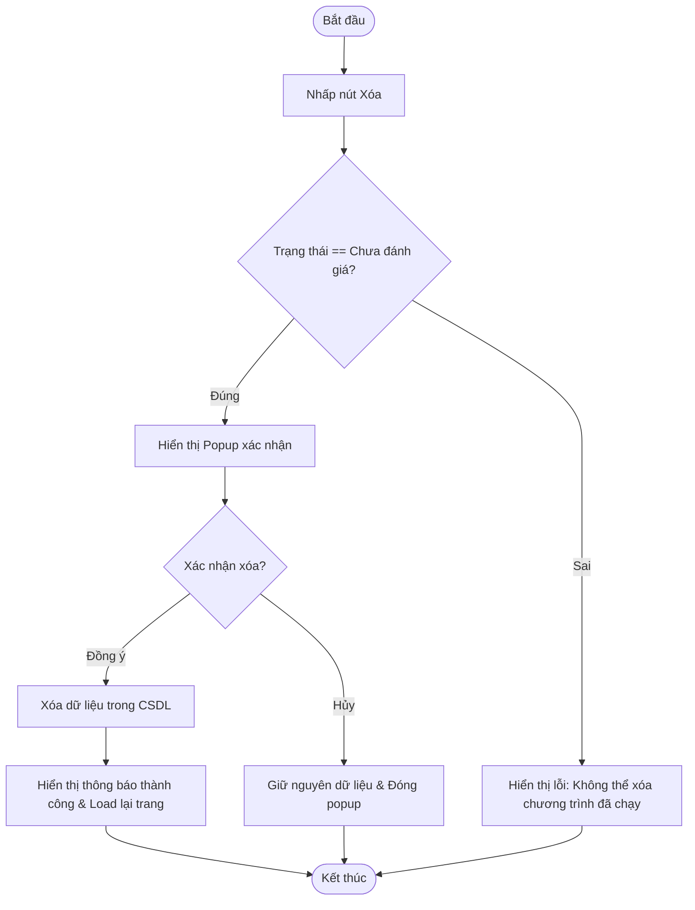

# ĐẶC TẢ YÊU CẦU PHẦN MỀM (SRS) - CHỨC NĂNG: Xóa chương trình đánh giá

---

## 1. Thông tin chức năng

| Thuộc tính | Mô tả chi tiết |
| :--- | :--- |
| **Tên chức năng** | Xóa chương trình đánh giá |
| **Mô tả** | Cho phép Admin xóa vĩnh viễn một chương trình đánh giá khỏi hệ thống khi chương trình đó chưa bắt đầu đánh giá. |
| **Tác nhân** | Admin |
| **Tiền điều kiện** | Chương trình đánh giá ở trạng thái Chưa đánh giá (status = 0). |
| **Hậu điều kiện** | Chương trình và các bản ghi liên quan bị xóa vĩnh viễn khỏi CSDL hoặc cập nhật trạng thái xóa. |
| **Ngoại lệ** | Chương trình đã bắt đầu đánh giá hoặc không tìm thấy chương trình. |
| **Yêu cầu nghiệp vụ** | - Chỉ hiển thị nút Xóa đối với tài khoản Admin. - Chỉ cho phép xóa khi trạng thái chương trình là Chưa đánh giá. - Hiển thị popup xác nhận trước khi thực hiện xóa. |

### Luồng sự kiện chính

---

## 2. Mô tả chi tiết màn hình (Sườn khung giao diện)

### Giao diện thiết kế (Figma UI Export)
*Chưa có hình ảnh giao diện Figma được kết xuất cho màn hình này.*

### Đặc tả các thành phần giao diện
*Ghi chú: Mô tả chi tiết các trường thông tin và thuộc tính điều khiển trên giao diện màn hình chức năng.*

| STT | Thành phần | Kiểu dữ liệu | I/O | Giá trị khởi tạo | Mô tả chi tiết (Mapping CSDL & Thao tác Button) |
| :---: | :--- | :--- | :---: | :--- | :--- |
| 1 | **Nút Xóa** | Button | INPUT | Enable/Disable | Hiển thị tại màn hình danh sách chương trình. Chỉ Enable khi status = Chưa đánh giá |
| 2 | **Popup Xác nhận xóa** | Popup | OUTPUT | Ẩn | Tiêu đề: Xác nhận xóa chương trình đánh giá. Nội dung: Bạn có chắc chắn muốn xóa chương trình này? Hành động này không thể hoàn tác. |
| 3 | **Nút Xác nhận** | Button | INPUT | Enable | Click để thực hiện xóa chương trình và đóng popup |
| 4 | **Nút Hủy** | Button | INPUT | Enable | Click để đóng popup và giữ nguyên chương trình |
