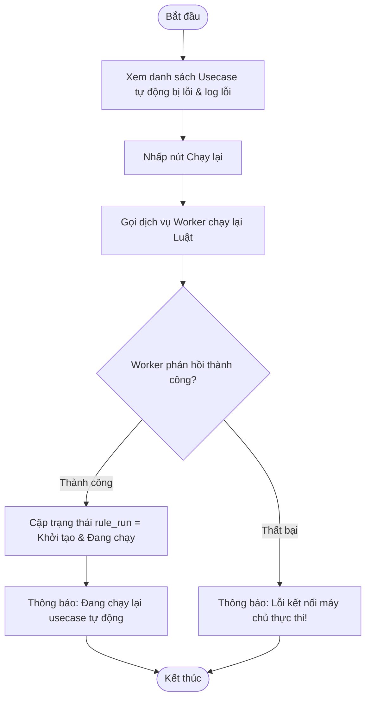

# ĐẶC TẢ YÊU CẦU PHẦN MỀM (SRS) - CHỨC NĂNG: Xử lý lỗi hệ thống (Chạy lại Usecase tự động)

---

## 1. Thông tin chức năng

| Thuộc tính | Mô tả chi tiết |
| :--- | :--- |
| **Tên chức năng** | Xử lý lỗi hệ thống (Chạy lại Usecase tự động) |
| **Mô tả** | Cho phép Đầu mối điều phối kích hoạt chạy lại các usecase tự động (Auto Usecase) bị lỗi hệ thống trong quá trình thực thi chương trình. |
| **Tác nhân** | Admin, Đầu mối điều phối |
| **Tiền điều kiện** | Chương trình đang chạy. Có ít nhất một usecase tự động có trạng thái phiên chạy gần nhất bị lỗi (status = 3 trong program_department_mapping hoặc error trong rule_run khác null). |
| **Hậu điều kiện** | Hệ thống tái khởi động phiên chạy tự động cho usecase lỗi. Trạng thái được cập nhật theo tiến trình chạy mới. |
| **Ngoại lệ** | Không có usecase nào bị lỗi hoặc hệ thống mất kết nối dịch vụ worker thực thi. |
| **Yêu cầu nghiệp vụ** | - Hiển thị danh sách các usecase tự động bị lỗi và chi tiết log lỗi. - Cung cấp nút Chạy lại (Rerun) đối với từng usecase lỗi hoặc chạy lại tất cả usecase lỗi của đơn vị. - Cập nhật trạng thái rule_run thành Khởi tạo/Đang chạy và gọi worker thực thi lại. |

### Luồng sự kiện chính

---

## 2. Giao diện người dùng (UI)

*Chi tiết thiết kế và thành phần giao diện màn hình xem tại:*
*   [Tài liệu thiết kế giao diện: UI_XU_LY_LOI_HE_THONG.md](file:///Users/whis/Anh/ISAAP/UI/UI_XU_LY_LOI_HE_THONG.md)
