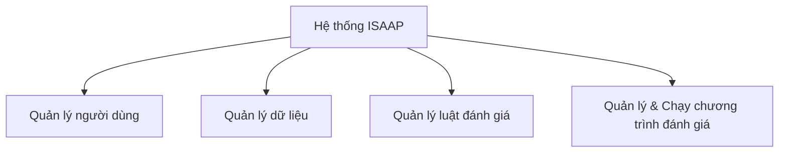

# TÀI LIỆU THIẾT KẾ CHI TIẾT / ĐẶC TẢ YÊU CẦU PHẦN MỀM (SRS)

<!--
HƯỚNG DẪN SỬ DỤNG TEMPLATE:
1. Các phần trong dấu [...] hoặc ghi chú dưới dạng HTML Comment (như block này) là hướng dẫn, hãy điền thông tin thực tế của dự án và xóa phần hướng dẫn đi.
2. Template này được chuẩn hóa từ file tài liệu chính thức của dự án ISAAP.
-->

**DỰ ÁN: NỀN TẢNG QUẢN LÝ TUÂN THỦ AN TOÀN THÔNG TIN (ISAAP)**
**PHÂN HỆ: [Tên Phân Hệ - ví dụ: Quản lý & Chạy chương trình đánh giá]**

---

### Hà Nội, [Tháng MM - Năm YYYY]

---

## BẢNG GHI NHẬN THAY ĐỔI

| Ngày thay đổi | Vị trí thay đổi | A/M/D (*) | Nguồn gốc | Phiên bản cũ | Mô tả thay đổi | Phiên bản mới |
| :--- | :--- | :---: | :--- | :--- | :--- | :--- |
| DD/MM/YYYY | [Tên mục - ví dụ: 3.1.2] | A* | PYC-XXXX | N/A hoặc V1.0 | [Mô tả chi tiết nội dung thay đổi] | V1.1 |

*Ghi chú ký hiệu (\*):*
- **A\***: Add (Tạo mới)
- **M**: Modify (Sửa đổi)
- **D**: Delete (Xóa bỏ)

---

## TRANG KÝ

| Vai trò | Chức danh - Bộ phận | Họ và tên | Chữ ký | Ngày ký |
| :--- | :--- | :--- | :---: | :--- |
| **Người lập** | Chuyên viên chính Phân tích nghiệp vụ dữ liệu | [Họ và tên] | | DD/MM/YYYY |
| **Người xem xét** | Kỹ sư phát triển ứng dụng dữ liệu | [Họ và tên] | | DD/MM/YYYY |
| **Người phê duyệt** | Phó phòng Giải pháp Quản trị dữ liệu | [Họ và tên] | | DD/MM/YYYY |

---

# I. GIỚI THIỆU

## 1.1. Mục đích
Tài liệu Thiết kế chi tiết này trình bày chi tiết về các yêu cầu chức năng, phi chức năng, mô tả giao diện, luồng xử lý dữ liệu và đặc tả API của phân hệ **[Tên Phân hệ]** thuộc hệ thống **ISAAP** (Information Security Assessment & Audit Platform).
Tài liệu được sử dụng bởi đội ngũ phát triển (Developers), kiểm thử (Testers) và các bên liên quan để thực hiện xây dựng và nghiệm thu hệ thống.

## 1.2. Phạm vi
Giới thiệu và mô tả chi tiết các module tính năng của hệ thống ISAAP trong phạm vi phân hệ **[Tên Phân hệ]**.

## 1.3. Khái niệm, thuật ngữ

| Thuật ngữ | Định nghĩa | Ghi chú |
| :--- | :--- | :--- |
| ATTT | An toàn thông tin | |
| PTYC | Phân tích yêu cầu | |
| TKCT | Thiết kế chi tiết | |
| ISAAP | Information Security Assessment & Audit Platform | Nền tảng quản lý tuân thủ an toàn thông tin |
| [Thuật ngữ khác] | [Định nghĩa thuật ngữ] | |

## 1.4. Tài liệu tham khảo

| Tên tài liệu | Ngày phát hành | Nguồn | Ghi chú |
| :--- | :--- | :--- | :--- |
| PTYC_ISAAP | DD/MM/YYYY | Đội ngũ BA | Tài liệu phân tích yêu cầu nghiệp vụ |
| TKCSDL_ISAAP | DD/MM/YYYY | Đội ngũ Thiết kế CSDL | Tài liệu thiết kế cơ sở dữ liệu chi tiết |

## 1.5. Mô tả tài liệu
Tài liệu bao gồm các phần chính được tổ chức như sau:
- **Phần 1: Giới thiệu**: Trình bày về mục đích, phạm vi, thuật ngữ và tài liệu tham khảo.
- **Phần 2: Tổng quan giải pháp**: Trình bày cái nhìn tổng quan về kiến trúc chức năng và mô hình tương tác hệ thống.
- **Phần 3: Thiết kế chi tiết**: Trình bày chi tiết giao diện màn hình, đặc tả trường dữ liệu, luồng xử lý nghiệp vụ và đặc tả API của từng chức năng.
- **Phần 4: Thiết kế dùng chung và tái sử dụng**.
- **Phần 5: Thiết kế tuân thủ tiêu chuẩn quản trị dữ liệu**.
- **Phần 6: Phụ lục**.

---

# II. TỔNG QUAN GIẢI PHÁP

## 2.1. Tổng quan chức năng
[Mô tả tổng quan các nhóm chức năng lớn trong phân hệ]

```
[Nhúng sơ đồ kiến trúc chức năng / Functional Tree ở đây dưới dạng ảnh hoặc sơ đồ Mermaid]
Ví dụ sơ đồ Mermaid:
```


## 2.2. Mô hình giao tiếp với hệ thống/Module chức năng khác
[Vẽ sơ đồ mô tả cách phân hệ tương tác với Frontend, Backend, Database và các hệ thống bên ngoài khác như SSO, vOffice, Viettel Lakehouse Platform...]

```
[Nhúng sơ đồ giao tiếp hệ thống ở đây]
```

---

# III. THIẾT KẾ CHI TIẾT

## 3.1. [Tên Nhóm Chức Năng Cha - Ví dụ: Chương trình đánh giá]

### 3.1.1. Thông tin chung
- **Tên chức năng**: [Ví dụ: Chương trình đánh giá]
- **Mục đích**: [Ví dụ: Cho phép người dùng tìm kiếm, thêm mới, chỉnh sửa, xem chi tiết, bắt đầu đánh giá, hủy đánh giá...]
- **Tác nhân**: [Ví dụ: Admin nghiệp vụ, nhân sự phụ trách ATTT của các đơn vị...]
- **Phân quyền**: Người dùng được gán nhóm quyền với Mã chức năng và Mã thao tác như bảng dưới:

| Tên chức năng | Thao tác | Mã chức năng | Mã thao tác |
| :--- | :--- | :--- | :--- |
| Chương trình đánh giá | Tìm kiếm | EVALUATION_PROGRAM_MANAGEMENT | SEARCH |
| Chương trình đánh giá | Thêm mới | EVALUATION_PROGRAM_MANAGEMENT | CREATE |
| Chương trình đánh giá | Chỉnh sửa | EVALUATION_PROGRAM_MANAGEMENT | EDIT |
| Chương trình đánh giá | Xóa chương trình | EVALUATION_PROGRAM_MANAGEMENT | DELETE |
| Chương trình đánh giá | Bắt đầu đánh giá | EVALUATION_PROGRAM_MANAGEMENT | START |
| Chương trình đánh giá | Hủy đánh giá | EVALUATION_PROGRAM_MANAGEMENT | CANCEL |
| Chương trình đánh giá | Hoàn thành đánh giá | EVALUATION_PROGRAM_MANAGEMENT | COMPLETE |
| Chương trình đánh giá | Đánh giá đơn vị | EVALUATION_PROGRAM_MANAGEMENT | REVIEW |
| Chương trình đánh giá | Cung cấp sở cứ | EVALUATION_PROGRAM_MANAGEMENT | SEND |

---

### 3.1.2. Chức năng: [Tên chức năng con 1 - Ví dụ: Tìm kiếm chương trình đánh giá]

#### 3.1.2.1. Thông tin chung

| Thuộc tính | Nội dung mô tả |
| :--- | :--- |
| **Tên chức năng** | Tìm kiếm chương trình đánh giá tuân thủ ATTT |
| **Mô tả** | Cho phép tìm kiếm danh sách chương trình đánh giá theo quyền của người dùng và điều kiện lọc. |
| **Tác nhân** | Admin nghiệp vụ, nhân sự phụ trách ATTT của các đơn vị... |
| **Điều kiện trước** | Người dùng đăng nhập thành công và có quyền `SEARCH` trên module `EVALUATION_PROGRAM_MANAGEMENT`. |
| **Điều kiện sau** | Hiển thị danh sách chương trình đánh giá lọc theo điều kiện và phạm vi phân quyền. |
| **Ngoại lệ** | Hệ thống mất kết nối CSDL -> Hiển thị thông báo lỗi hệ thống. |
| **Yêu cầu đặc biệt** | Tốc độ phản hồi tìm kiếm < 1s cho dữ liệu dưới 100,000 dòng. |

**Sơ đồ luồng xử lý chức năng (Activity Diagram):**
[Nhúng hình vẽ sơ đồ Activity Diagram phân chia rõ luồng Người dùng vs Hệ thống]

#### 3.1.2.2. Màn hình thiết kế (UI Layout)
[Nhúng các hình ảnh thiết kế giao diện Figma tại đây]
- Ảnh màn hình chính:
  ``
- Ảnh popover bộ lọc:
  ``

#### 3.1.2.3. Đặc tả chi tiết các thành phần giao diện

| TT | Tên thành phần | Kiểu dữ liệu | Input/Output | Giá trị khởi tạo | Mô tả (Mapping CSDL & Hành động Button) |
| :---: | :--- | :--- | :---: | :--- | :--- |
| **I. Bộ lọc chính** | | | | | |
| 1 | Tên chương trình | Textbox | INPUT | Rỗng | - Hint text: Nhập tên chương trình...<br>- Nhập freetext, không giới hạn ký tự nhập.<br>- Mapping CSDL: `evaluation_program.name` |
| **II. Bộ lọc nâng cao (Popover)** | | | | | |
| 2 | Thời gian bắt đầu | Datepicker | INPUT | Rỗng | - Hint text: Từ ngày -> Đến ngày<br>- Định dạng DD/MM/YYYY<br>- Mapping CSDL: `evaluation_program.start_date` |
| 3 | Trạng thái | Multi-select box | INPUT | Rỗng | - Cho phép chọn 1 hoặc nhiều trạng thái.<br>- Các giá trị trong combobox: Áp dụng, Hủy áp dụng, Chờ hoàn thành...<br>- Mapping CSDL: `evaluation_program.status` |
| 4 | Nút Áp dụng | Button | INPUT | Enable | - Khi click: thực hiện tìm kiếm và đóng popover. |
| **III. Danh sách kết quả (Grid)** | | | | | |
| 5 | Tab-menu | Tab-menu | Input/Output | "Tất cả" | - Danh sách các tab: Tất cả, Chờ duyệt, Chờ sở cứ.<br>- Hiển thị số lượng bản ghi kèm theo tiêu đề mỗi tab. |
| 6 | Grid kết quả | Grid | OUTPUT | N/A | - Hiển thị danh sách bản ghi gồm các cột: STT, Tên chương trình, Thời gian đánh giá, Tiến độ (%), Người cập nhật, Trạng thái, Thao tác...<br>- Nếu không có dữ liệu, hiển thị "Không có dữ liệu". |
| 7 | Icon Chỉnh sửa | Icon | INPUT | Enable/Disable | - Chỉ hiển thị và Enable khi bản ghi ở trạng thái "Chưa đánh giá" (`status` = 0) và người dùng là người tạo/admin.<br>- Click mở màn hình Chỉnh sửa. |

#### 3.1.2.4. Luồng nghiệp vụ (Business Flow)
- **API tương ứng**: `POST /api/program/search`
- **Các bước xử lý**:
  - **Bước 1**: Người dùng truy cập menu hoặc nhập các điều kiện lọc và click nút Tìm kiếm.
  - **Bước 2**: Hệ thống validate định dạng dữ liệu lọc đầu vào (ví dụ: ngày bắt đầu <= ngày kết thúc). Nếu sai, báo lỗi.
  - **Bước 3**: Hệ thống kiểm tra quyền của người dùng để xác định phạm vi lấy dữ liệu:
    - Nếu là *Admin hệ thống*: Hiển thị tất cả bản ghi.
    - Nếu là *Đầu mối đơn vị*: Chỉ hiển thị các chương trình thuộc đơn vị của người dùng quản lý hoặc người dùng tham gia đánh giá.
  - **Bước 4**: Thực hiện câu lệnh SQL truy vấn Database để lấy danh sách.
  
**SQL Query tham khảo:**
```sql
-- Query lấy danh sách chương trình đánh giá phân trang và lọc quyền
SELECT 
    ep.id AS evaluation_program_id,
    ep.name AS program_name,
    ep.status AS program_status,
    ep.start_date,
    ep.end_date,
    (SELECT COUNT(*) FROM program_department_mapping WHERE program_id = ep.id) AS total_departments
FROM evaluation_program ep
WHERE 
    (:program_name IS NULL OR ep.name ILIKE CONCAT('%', :program_name, '%'))
    AND (:status IS NULL OR ep.status = :status)
ORDER BY ep.created_at DESC
LIMIT :limit OFFSET :offset;
```

#### 3.1.2.5. Đặc tả API

- **Endpoint**: `POST /api/program/search`
- **Method**: `POST`
- **Mô tả**: Tìm kiếm và phân trang danh sách chương trình đánh giá.

**Request Body Structure:**

| STT | Tên trường | Kiểu dữ liệu | Bắt buộc | Mô tả / Giá trị mẫu |
| :---: | :--- | :--- | :---: | :--- |
| 1 | name | String | Không | Tên chương trình đánh giá cần tìm kiếm |
| 2 | status | Integer | Không | Trạng thái của chương trình (0: Nháp, 1: Đang đánh giá, 2: Hoàn thành) |
| 3 | page | Integer | Có | Trang hiện tại (1-indexed) |
| 4 | size | Integer | Có | Số lượng bản ghi trên một trang (mặc định 10) |

**Response Body Structure:**

| STT | Tên trường | Kiểu dữ liệu | Mô tả / Định dạng |
| :---: | :--- | :--- | :--- |
| 1 | code | String | Mã kết quả (ví dụ: "SUCCESS", "ERROR") |
| 2 | message | String | Thông điệp kết quả |
| 3 | data.content | Array | Danh sách kết quả chương trình tìm thấy |
| 4 | data.totalElements | Long | Tổng số lượng bản ghi thỏa mãn điều kiện lọc |

---

### 3.1.3. Chức năng: [Tên chức năng con 2 - Ví dụ: Thêm mới và Chỉnh sửa chương trình đánh giá]

#### 3.1.3.1. Màn hình thiết kế
[Nhúng các hình ảnh thiết kế giao diện Figma cho màn hình Thêm mới/Chỉnh sửa và các popup đính kèm]
- Ảnh màn hình Thêm mới:
  ``
- Ảnh popup thêm đơn vị:
  ``

#### 3.1.3.2. Thông tin chung

| Thuộc tính | Nội dung mô tả |
| :--- | :--- |
| **Tên chức năng** | Thêm mới và Chỉnh sửa chương trình đánh giá |
| **Mô tả** | Cho phép người dùng tạo mới hoặc cập nhật thông tin chi tiết một chương trình đánh giá. |
| **Tác nhân** | Admin nghiệp vụ, Đầu mối điều phối... |
| **Điều kiện trước** | Có quyền `CREATE` hoặc `EDIT` trên module `EVALUATION_PROGRAM_MANAGEMENT`. |
| **Điều kiện sau** | Bản ghi được lưu thành công vào CSDL. Chương trình ở trạng thái "Nháp" (nếu là tạo mới). |
| **Ngoại lệ** | Dữ liệu trùng lặp hoặc thiếu trường bắt buộc -> Hiển thị cảnh báo lỗi tương ứng trên giao diện. |

#### 3.1.3.3. Đặc tả chi tiết các thành phần giao diện

| TT | Tên thành phần | Kiểu dữ liệu | Input/Output | Giá trị khởi tạo | Mô tả (Mapping CSDL & Hành động Button) |
| :---: | :--- | :--- | :---: | :--- | :--- |
| 1 | Tên chương trình | Textbox | INPUT | Rỗng | - Bắt buộc nhập.<br>- Tối đa 250 ký tự.<br>- Mapping CSDL: `evaluation_program.name` |
| 2 | Mô tả | Textarea | INPUT | Rỗng | - Tùy chọn nhập.<br>- Tối đa 500 ký tự.<br>- Mapping CSDL: `evaluation_program.description` |
| 3 | Thời gian đánh giá | Datepicker | INPUT | Ngày hiện tại | - Bắt buộc nhập cả Từ ngày và Đến ngày.<br>- Kiểm tra ràng buộc: Từ ngày <= Đến ngày.<br>- Mapping CSDL: `evaluation_program.start_date`, `evaluation_program.end_date` |
| 4 | Nút Lưu | Button | INPUT | Enable | - Validate dữ liệu đầu vào phía Client.<br>- Gửi request lưu dữ liệu xuống BE.<br>- Hiển thị thông báo thành công và quay lại màn hình danh sách. |

#### 3.1.3.4. Luồng nghiệp vụ (Business Flow)

##### A. Thêm mới chương trình
- **Bước 1**: Người dùng click nút [Thêm mới] tại màn hình danh sách. Hệ thống hiển thị form thêm mới trống.
- **Bước 2**: Người dùng điền thông tin và click [Lưu].
- **Bước 3**: Validate dữ liệu phía Client (FE) & Server (BE):
  - Tên chương trình không được trùng lặp.
  - Không trùng lặp Tiêu chí trong cùng Đối tượng đánh giá.
  - Không trùng lặp Usecase trong cùng Tiêu chí đánh giá.
- **Bước 4**: Thực hiện các thao tác insert CSDL tuần tự như sau:
  1. Thêm mới 1 bản ghi vào bảng `evaluation_program` (`status` = 0).
  2. Thêm mới $N$ bản ghi đơn vị tham gia vào bảng `program_department_mapping`.
  3. Thêm mới $X$ bản ghi đầu mối đánh giá vào bảng `department_reviewer_mapping`.
  4. Thêm mới $Y$ bản ghi đầu mối đơn vị vào bảng `department_representative_mapping`.
  5. Thêm mới $M$ bản ghi đối tượng đánh giá vào bảng `department_object_mapping`.
  6. Thêm mới $Z$ bản ghi tiêu chí đánh giá vào bảng `object_criteria_mapping`.
  7. Thêm mới $T$ bản ghi cấu hình usecase vào bảng `criteria_usecase_mapping`.

##### B. Chỉnh sửa chương trình
- **Bước 1**: Người dùng click icon Chỉnh sửa trên bản ghi có trạng thái "Nháp". Hệ thống hiển thị màn hình chỉnh sửa với dữ liệu cũ đã load sẵn lên form.
- **Bước 2**: Người dùng sửa đổi thông tin và click [Lưu].
- **Bước 3**: Validate nghiệp vụ tương tự Thêm mới.
- **Bước 4**: Đồng bộ thay đổi xuống CSDL:
  - Cập nhật thông tin chung ở `evaluation_program`.
  - Đồng bộ danh sách đơn vị tham gia: Thêm mới đơn vị được chọn thêm, Xóa các đơn vị bị loại bỏ (chú ý cascade delete các bảng reference tương ứng).
  - Đồng bộ cấu hình Đối tượng > Tiêu chí > Usecase tương ứng.

#### 3.1.3.5. Đặc tả API
- **API Thêm mới**: `POST /api/program/create`
- **API Chỉnh sửa**: `PUT /api/program/update`

*(Cấu trúc bảng Request/Response chi tiết trình bày tương tự như mục 3.1.2.5)*

---

# IV. THIẾT KẾ DÙNG CHUNG VÀ TÁI SỬ DỤNG
[Mô tả các thành phần dùng chung như: Thư viện xử lý ngày tháng, Component hiển thị cây đơn vị, các Class Exception dùng chung...]
*N/A nếu không có thiết kế dùng chung đặc thù nào.*

---

# V. THIẾT KẾ ĐẢM BẢO TUÂN THỦ TIÊU CHUẨN QUẢN TRỊ DỮ LIỆU

*(Lưu ý: Phần này áp dụng cho thiết kế tổng thể hệ thống hoặc khi chức năng có phát sinh đối tượng dữ liệu mới cần quản trị.)*

## 5.1. Quản trị dữ liệu

| STT | Tên trường dữ liệu | Mô tả | Bảng dữ liệu | Trường dữ liệu | Loại dữ liệu | Chủ sở hữu dữ liệu |
| :---: | :--- | :--- | :--- | :--- | :--- | :--- |
| 1 | Tên chương trình | Tên của chương trình đánh giá tuân thủ | `evaluation_program` | `name` | Varchar | Bộ phận quản trị ATTT |
| 2 | Trạng thái chương trình | Trạng thái chạy chương trình | `evaluation_program` | `status` | Integer | Bộ phận quản trị ATTT |

## 5.2. Bảo mật dữ liệu

| Hệ CSDL (DB) | Phân loại quyền truy cập (APP / BI / SOC / ...) | Mô tả chi tiết phân quyền truy cập |
| :--- | :--- | :--- |
| Postgres | APP | User app được toàn quyền CRUD dữ liệu cấu hình chương trình. |
| Postgres | BI | Chỉ có quyền SELECT trên các bảng kết quả đánh giá để vẽ biểu đồ báo cáo. |

## 5.3. Chất lượng dữ liệu

| STT | Luật kiểm tra (Luật check) | Đối tượng check | Loại tiêu chuẩn | Mô tả chi tiết luật đánh giá | Đầu vào cần cung cấp |
| :---: | :--- | :--- | :--- | :--- | :--- |
| 1 | Check trùng thời gian | `evaluation_program` | Nghiệp vụ | Không được tồn tại 2 chương trình cùng đối tượng đánh giá có khoảng thời gian đè lên nhau. | start_date, end_date |

## 5.4. Quản lý siêu dữ liệu (Metadata Management)

### 5.4.1. Thông tin đối tượng dữ liệu

| TT | Tên đối tượng | Mô tả | Loại đối tượng | Thông tin liên quan | Kiểu dữ liệu | Thời gian tạo | Thời gian chỉnh sửa cuối | Cấp độ bảo mật | Dữ liệu trọng yếu | Đơn vị chủ trì dữ liệu | Đầu mối quản lý dữ liệu | Đơn vị chủ sở hữu | Đầu mối quản lý kỹ thuật |
| :---: | :--- | :--- | :--- | :--- | :--- | :--- | :--- | :--- | :--- | :--- | :--- | :--- | :--- |
| 1 | `evaluation_program` | Bảng lưu chương trình đánh giá | Table | | N/A | DD/MM/YYYY | DD/MM/YYYY | Nội bộ | Có | Bộ phận ATTT | Admin | [Đơn vị] | [Tên Dev/PM] |

### 5.4.2. Thông tin hệ thống

| STT | Tên ứng dụng | Mô tả | Phiên bản | Đơn vị chủ sở hữu hệ thống | Đầu mối quản lý kỹ thuật |
| :---: | :--- | :--- | :--- | :--- | :--- |
| 1 | ISAAP | Nền tảng quản lý tuân thủ ATTT | V2.0 | Tập đoàn | Trung tâm Giải pháp Dữ liệu |

### 5.4.3. Thông tin luồng dữ liệu

| STT | Tên luồng dữ liệu | Mô tả | Lệnh tổng hợp | Đầu mối quản lý | Hệ thống/nghiệp vụ sử dụng luồng |
| :---: | :--- | :--- | :--- | :--- | :--- |
| 1 | Sync_Evaluation_Data | Luồng đồng bộ kết quả chạy tự động về DB | Rule-Engine Engine | Đội vận hành ISAAP | Phân hệ Báo cáo ATTT |

### 5.4.4. Thông tin thuật ngữ nghiệp vụ

| STT | Tên thuật ngữ | Tên viết tắt / tên gợi nhớ | Định nghĩa | Quy nghiệp vụ/công thức tính | Đơn vị nghĩa ngữ | Các thuật ngữ liên quan | Trường dữ liệu liên kết | Thời điểm tạo | Lịch sử chỉnh sửa |
| :---: | :--- | :--- | :--- | :--- | :--- | :--- | :--- | :--- | :--- |
| 1 | Tiến độ chương trình | `progress` | % hoàn thành của chương trình | $\frac{\text{UC\_Manual\_Review\_Done} + \text{UC\_Auto\_Done}}{\text{Total\_Usecase}} \times 100$ | % | Usecase | `evaluation_program.progress` | DD/MM/YYYY | Khởi tạo V1.0 |

## 5.5. Lưu trữ và vận hành

| STT | Dữ liệu | Mô tả | Đối tượng dữ liệu | Thời gian lưu tầng hiệu năng cao | Thời gian lưu hạ tầng trung bình | Thời gian lưu trữ offline (backup) | Tần suất backup |
| :---: | :--- | :--- | :--- | :--- | :--- | :--- | :--- |
| 1 | Kết quả đánh giá | Chi tiết kết quả kiểm tra | Table `rule_run_result` | 1 năm | 3 năm | 5 năm | Hàng ngày (Daily) |

---

# VI. PHỤ LỤC
[Mô tả các phụ lục đính kèm, các trường hợp nghiệp vụ biên đặc biệt, danh sách mã lỗi chi tiết...]
- **Mã lỗi hệ thống thường gặp**:
  - `ERR_001`: Trùng lặp tên chương trình.
  - `ERR_002`: Đơn vị được chọn không còn hoạt động trên hệ thống.
  - `ERR_003`: Usecase tự động cấu hình sai phiên bản luật.
